# Generation of structured meshes in multiply connected surfaces using submapping

E. Ruiz-Gironés, J. Sarrate *

Laboratori de Càlcul Numèric (LaCàN), Departament de Matemàtica Aplicada III, Universitat Politècnica de Catalunya, Jordi Girona 1-3, E–08034 Barcelona, Spain

# a r t i c l e i n f o

Article history:

Received 3 July 2008

Accepted 28 June 2009

Available online 24 July 2009

Keywords:

Finite element method

Mesh generation

Submapping

Structured quadrilaterals

Linear programming

Transfinite interpolation

Multiply connected geometries

# a b s t r a c t

The submapping method is one of the most widely used techniques to generate structured quadrilateral meshes. This method splits the geometry into pieces logically equivalent to a quadrilateral. Then, it meshes each piece keeping the mesh compatibility between them by solving an integer linear problem. The main limitation of submapping algorithms is that it can only be applied to geometries in which the angle between two consecutive edges is, approximately, an integer multiple of $\pi / 2$ . In addition, special procedures are required in order to apply it to multiply connected domains. This article presents two original modifications to mitigate these shortcomings. Finally, it presents several numerical examples that show the applicability of the developed algorithms.

$\circledcirc$ 2009 Elsevier Ltd. All rights reserved.

# 1. Introduction

Structured meshes are still used in a wide range of simulations where a strict alignment of elements can be required by the analysis, i.e. boundary layers in computational fluid dynamics or composites in solid mechanics. The submapping method is one of the most powerful algorithms to generate structured quadrilateral meshes [1,2]. This method decomposes the geometry into patches and then meshes each patch separately keeping the mesh compatibility by solving a linear integer problem. In our implementation we have used the transfinite interpolation method (TFI) to mesh each patch, see [3] for details. Although the submapping method generates high quality meshes, this method is not general in the sense that not every geometry can be meshed by this algorithm. The major limitation of the submapping algorithm is that it can only mesh geometries such that the angles between two consecutive edges of its boundary are, approximately, an integer multiple of $\pi / 2$ . In addition, special algorithms are required in order to generate meshes in multiply connected volumes using the submapping method.

In this work, we present two algorithms in order to improve the applicability of the submapping method. First, we deduce a new algorithm to classify the vertices that define the geometry. In this way, we mitigate the ‘ $\cdot \pi / 2$ limitation”. Therefore, the improved algorithm can be applied to geometries where the standard algorithm fails. In addition, we present an automatic algorithm to

convert a multiply connected geometry into simply connected. Therefore, we extend the applicability of the submapping method to geometries that contain several holes.

The structure of the article is as follows. In Section 2 we briefly review the basis of the submapping algorithm. From this recapitulation, in Section 3 we present a new automatic algorithm to compute a valid classification of the geometry vertices. In Section 4 we focus on the discretization of multiply connected surfaces. Finally, we present several examples to illustrate the applicability of the proposed algorithms.

# 2. The submapping method

In order to generate a structured mesh over a given surface, and according to [1,2], we assume that there exists a representation of the geometry where every edge is horizontal or vertical. We define this representation as the computational domain, whereas the original geometry is defined as the physical domain.

# 2.1. Vertex and edge classification

Vertex classification is a crucial step of the submapping algorithm, since subsequent steps rely on this classification. In this section we introduce the basis of the classical classification of vertices. However, given a non-blocky geometry this procedure may lead to an invalid classification of the vertices. In Section 3, we will describe an algorithm to detect incorrect classifications and compute a new one that allows to generate a structured mesh.

The vertices of the geometry are classified according to the angle defined by their adjacent edges. Since these angles are,

approximately, an integer multiple of $\pi / 2$ , a vertex can be classified as: side (the angle is 0), end (angle $\pi / 2$ ), reversal (angle $- \pi$ ) or corner (angle $- \pi / 2$ ).

The edges of the geometry are classified according to their direction in the computational domain. Since, by construction, the edges in the computational domain are horizontal or vertical, they are classified as $+ I$ (horizontal going from left to right), $- I$ (horizontal going from right to left), $+ J$ (vertical going upwards) or $- J$ (vertical going downwards), see [1,2] for details. Fig. 1 shows a simple geometry with its vertices and edges properly classified.

# 2.2. Boundary discretization

In order to generate a structured mesh, it is necessary to compute the number of elements over each edge of the geometry. To this end, Ref. [4] proposes to solve the following integer linear problem

minimize

constrained to : e2I þ

$$
\sum_ {e \in J ^ {+}} n _ {e} = \sum_ {e \in J ^ {-}} n _ {e}, \tag {1}
$$

$\begin{array} { l l l } { { { \cal M } \geqslant \displaystyle \frac { n _ { e } } { N _ { e } } , } } & { { \mathrm { f o r ~ e v e r y ~ e d g e ~ } e , } } \\ { { } } & { { } } \\ { { n _ { e } \geqslant N _ { e } , } } & { { \mathrm { f o r ~ e v e r y ~ e d g e ~ } e , } } \end{array}$ M P N ;

where $n _ { e }$ is the number of divisions of edge e, $N _ { e }$ is a lower bound for $n _ { e }$ , and $\omega _ { e }$ is a weight that controls the cost of adding or subtracting elements on each edge. We define this weight as $\omega _ { e } = 1 / l ( e )$ , where lðeÞ is the length of edge e. Variable M is defined as

$$
M = \max  _ {e} \frac {n _ {e}}{N _ {e}}
$$

and it controls the distribution of the number of divisions among the edges.

Problem (1) is a linear integer problem that can be solved using the branch and bound method, see [5] for details. In our implementation, we use the lp_solve library [6] to solve this problem. The solution of (1) provides a discretization of the boundary that accepts a structured quadrilateral mesh in the interior of the domain. Once the problem is solved, we can construct the computational space. Recall that we know the direction of each edge. Hence, we only need to determine the length of these edges. According to [1], we define the length of an edge in the computational space as its number of intervals (i.e. the length of an element in the computational space is the unity).

Note that the solution of the integer linear problem (1) induces a computational space in which the boundary is closed. However, for a given geometry (assuming a correct vertex classification) if

the prescribed lower bounds, $N _ { e }$ , are not properly set, then the boundary of the computational space can be folded. Thus, it is impossible to generate an acceptable mesh for these cases.

# 2.3. Geometry decomposition

The standard procedure to decompose a domain is using cutting edges. Cutting edges are determined in the computational domain, and have to start at vertices classified as corner or reversal. In addition, cutting edges are horizontal or vertical in the computational domain. Among the possible cutting edges, the shortest one is selected. When the geometry is decomposed into two parts, the procedure is iterated recursively in both parts until there are no corner or reversal vertices. Such a patch is logically equivalent to a quadrilateral. Therefore, it can be meshed using a standard mapping algorithm. In our implementation, we use the transfinite interpolation method.

# 3. Vertex classification algorithm

It is usual that the boundary of the surface is defined by edges such that the angles between two adjacent edges are not exactly equal to an integer multiple of $\pi / 2$ (fuzzy angles). In these cases the classical classification of vertices may lead to unacceptable results. To overcome this drawback, several implementations allow the users to set the vertex classification manually. This alternative reduces the automatization of the algorithm. In order to mitigate this constraint we propose an algorithm to automatically modify the initial classification and extend the applicability of the submapping method.

Let $\theta _ { i }$ be the angle defined by the two adjacent edges at vertex i in the computational domain, defined between $- \pi \leqslant \theta _ { i } < \pi$ . If the vertices have been properly classified, then the angles verify

$$
\sum_ {i = 1} ^ {N _ {\text {v e r t i c e s}}} \theta_ {i} = 2 \pi .
$$

Dividing last equation by $\pi / 2$ we obtain

$$
\sum_ {i = 1} ^ {N _ {\text {v e r t i c e s}}} \bar {\alpha} _ {i} = 4, \tag {2}
$$

where

$$
\bar {\sigma_ {i}} = \theta_ {i} / (\pi / 2). \tag {3}
$$

According to the classical classification of vertices, the value of $\overline { { \alpha _ { i } } }$ is:

$$
\overline {{\alpha_ {i}}} = \left\{ \begin{array}{l l} 0 & \text {f o r s i d e v e r t i c e s ,} \\ 1 & \text {f o r e n d v e r t i c e s ,} \\ - 2 & \text {f o r r e v e r s a l v e r t i c e s ,} \\ - 1 & \text {f o r c o r n e r v e r t i c e s .} \end{array} \right.
$$

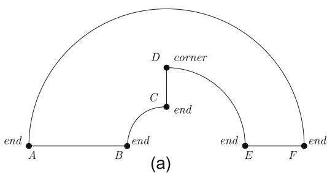

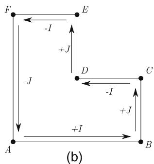  
Fig. 1. Vertex and edge classification of a simple geometry. (a) Vertex classification in the physical domain. (b) Edge classification in the computational domain.

Taking into account these values, we can rewrite Eq. (2) as:

$$
\sum_ {i = 1} ^ {N _ {\text {v e r t i c e s}}} \overline {{\alpha_ {i}}} = (0 \cdot S) + (1 \cdot E) - (2 \cdot R) - (1 \cdot C) = 4,
$$

where S; E; R and C are the number of vertices classified as side, end, reversal and corner, respectively. Therefore, a correct classification of the vertices has to verify

$$
E - C - 2 R = 4. \tag {4}
$$

The basic idea of the new algorithm is to slightly modify the initial classification of vertices in such a way that Eq. (2), or condition (4), is verified. Hence, we will solve the following problem to generate a valid classification:

$\begin{array} { l l } { \displaystyle \mathrm { m i n i m i z e } } & { \displaystyle \sum _ { i = 1 } ^ { N _ { v e r t i c e s } } | \alpha _ { i } - \overline { { \alpha _ { i } } } | , } \\ { \displaystyle \mathrm { c o n s t r a i n e d ~ t o : } } & { \displaystyle \sum _ { i = 1 } ^ { N _ { v e r t i c e s } } \alpha _ { i } = 4 , } \end{array}$ $\begin{array} { l } { { \displaystyle \sum _ { i = 1 } ^ { N _ { v e r i c e s } } | \alpha _ { i } - \overline { { \alpha _ { i } } } | } , } \\ { { \displaystyle \sum _ { i = 1 } ^ { N _ { v e r i c e s } } \alpha _ { i } = 4 } , } \end{array}$ Nvertices ð5Þ

Nvertices

where $\overline { { \alpha _ { i } } }$ is the initial detected classification of vertex i, see Eq. (3), and $\alpha _ { i }$ is the resulting classification. Note that $\overline { { \alpha _ { i } } }$ can be a real value whereas $\alpha _ { i }$ is always an integer value. Although Eq. (5) is not a linear integer problem we can modify it in order to obtain a linear integer problem. Each absolute value is decomposed in the sum of two variables, $D _ { i }$ and $d _ { i }$ , and two new equations are introduced. In this way,

$$
\left| \alpha_ {i} - \bar {\alpha} _ {i} \right| = D _ {i} + d _ {i}, \quad i = 1, \dots , N _ {\text {v e r t i c e s}},
$$

$$
D _ {i} \geqslant \alpha_ {i} - \bar {\alpha_ {i}}, \quad i = 1, \dots , N _ {\text {v e r t i c e s}},
$$

$$
d _ {i} \geqslant \overline {{\alpha_ {i}}} - \alpha_ {i}, \quad i = 1, \dots , N _ {\text {v e r t i c e s}},
$$

$$
D _ {i}, d _ {i} \geqslant 0, \quad i = 1, \dots , N _ {\text {v e r t i c e s}}.
$$

The new objective function to minimize is

$$
\sum_ {i = 1} ^ {N _ {\text {v e r t i c e s}}} \rho_ {i} D _ {i} + \omega_ {i} d _ {i}, \tag {6}
$$

where $\rho _ { i }$ and $\omega _ { i }$ are two positive weights that control the cost of increasing or decreasing the classification of vertex i. It is straightforward to verify that if $\alpha _ { i } - \overline { { \alpha _ { i } } } > 0$ , then $D _ { i } = \alpha _ { i } - \overline { { \alpha _ { i } } }$ and $d _ { i } = 0$ . Conversely, if $\alpha _ { i } - \overline { { \alpha _ { i } } } < 0$ , then $D _ { i } = 0$ and $d _ { i } = \overline { { \alpha _ { i } } } - \alpha _ { i }$ . Finally, in order to limit the variation of the solution (the classification of vertices) we impose that

$$
D _ {i} + d _ {i} \leqslant 1, \quad i = 1, \dots , N _ {\text {v e r t i c e s}}. \tag {7}
$$

Eq. (7) are equivalent to

$$
\left| \alpha_ {i} - \bar {\alpha} _ {i} \right| \leqslant 1, \quad i = 1, \dots , N _ {\text {v e r t i c e s}}.
$$

Therefore, the new problem to solve is

Nvertices minimize M

Nv constrained to : ð8Þ

$$
D _ {i} \geqslant \alpha_ {i} - \bar {\alpha_ {i}}, \quad i = 1, \dots , N _ {\text {v e r t i c e s}},
$$

$$
d _ {i} \geqslant \bar {\alpha_ {i}} - \alpha_ {i}, \quad i = 1, \dots , N _ {\text {v e r t i c e s}},
$$

$$
D _ {i} + d _ {i} \leqslant 1, \quad i = 1, \dots , N _ {\text {v e r t i c e s}},
$$

$$
D _ {i}, d _ {i} \geqslant 0, \quad i = 1, \dots , N _ {\text {v e r t i c e s}}.
$$

Note that the minimization of the objective function (6) provides a new vertex classification that globally is not far from the initial classification since it takes into account the total differences between the classical, $\overline { { \alpha _ { i } } }$ , and the new, $\alpha _ { i }$ , classifications. In addition, constraints (7) ensure that locally, at each vertex, the

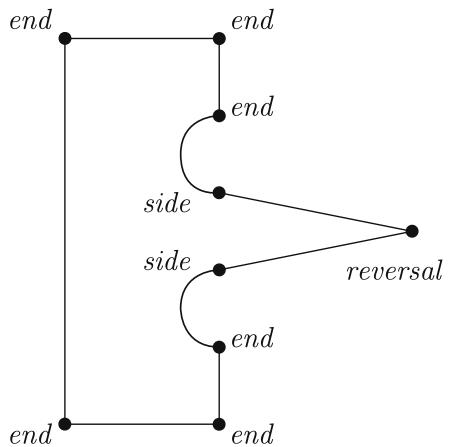  
Fig. 2. A geometry with an invalid classification of its vertices.

variation of the solution is bounded (a vertex initially classified as end could be classified as side, end or reversal but not as corner). The definition of the parameters $\rho _ { i }$ and $\omega _ { i }$ is described in the Appendix.

It is worth to notice that Eq. (4) is only a necessary condition to obtain a valid vertex classification. However, the reciprocal is not sufficient. For this reason, there exist geometries such that the classification of its vertices verifies Eq. (4) and leads to an invalid discretization. Fig. 2 presents the vertex classification of a given geometry. This classification verifies Eq. (4) although it leads to an invalid mesh.

The proposed algorithm flow for simply connected domains is: first, we compute a provisional vertices classification as detailed in Section 2.1. Second, if this classification is not valid, we solve the linear problem (8). Third, the submapping algorithm continues as defined in Section 2.

# 4. Multiply connected surfaces

Special procedures are required in order to apply the algorithms detailed in Sections 2 and 3 to multiply connected surfaces. Multiply connected surfaces are defined by one outer loop of edges and several inner loops of edges.

Ref. [1] proposes a procedure to mesh multiply connected domains using submapping. This procedure assumes that it is possible to generate a structured mesh taking into account only the outer boundary. In order to avoid this constraint we propose to convert the surface into simply connected by connecting the outer boundary with inner boundaries by means of virtual edges. Fig. 3 shows a multiply connected geometry converted into simply connected using a virtual edge.

To compute virtual edges, we first generate the mesh of the boundary using the same element size that has been prescribed to the submapping method. Using the boundary mesh, we generate a constrained Delaunay triangulation (CDT) of the interior of the geometry. The edges of the CDT will be the candidate virtual edges. In our implementation, the CDT is generated using the Triangle library [7]. Fig. 4a shows a CDT of a multiply connected domain. The conversion of a geometry into simply connected is performed in four steps:

(i) We select the outer boundary.   
(ii) Among the edges of the CDT that connect the outer boundary with an inner boundary, we select the one that provides the best angles (i.e. the angles between the edge and the boundaries are approximately an integer multiple of $\pi / 2$ ). If there is more than one edge with the same angles, we choose the shortest one.

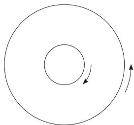  
(a)

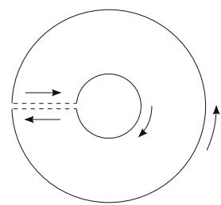  
(b)

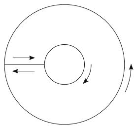  
（c)

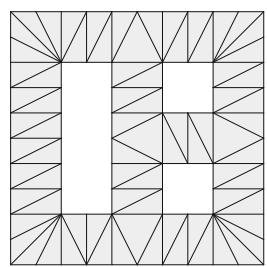  
Fig. 3. Multiply connected surface converted into simply connected using a virtual edge. (a) Multiply connected surface. (b) Virtual edge. (c) Simply connected surface.

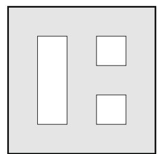

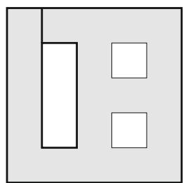  
（c）

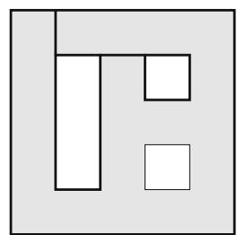

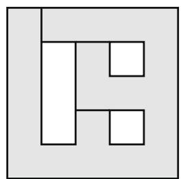

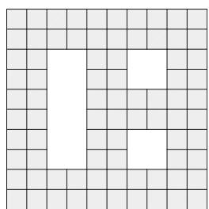  
(f)   
Fig. 4. Multiply connected surface converted into simply connected. (a) Constrained Delaunay triangulation. (b) First step: outer boundary. (c) Second step: union of the outer boundary with the first inner boundary. (d) Third step: union of the outer boundary with the second inner boundary. (e) Fourth step: union of the outer boundary with the third inner boundary. (f) Final mesh.

(iii) If the chosen edge cuts a geometric edge, the geometric edge is split in two parts.   
(iv) The outer boundary is updated by adding the virtual edge and the edges of the connected inner boundary. Steps (ii)– (iv) are repeated until all inner boundaries are connected to the outer boundary.

Fig. 4b–e illustrate the proposed algorithm to transform a multiply connected surface into a simply connected surface. In each figure the current outer boundary is marked using a thick line. Once an inner boundary is connected, the new outer boundary is the union of: (1) the previous outer boundary, (2) the virtual edge, and (3) the connected inner boundary. Note that in Fig. 4c the virtual edge splits the upper boundary edge in two parts, according to the third step of the proposed algorithm to convert a multiply connected surface into simply connected. It is important to point out that in our application the edges of the outer boundary are counter clockwise oriented, whereas the edges of the inner boundaries are clockwise oriented. Therefore, when an inner boundary is connected to the outer boundary, the order of the edges is respected and the inner part of the domain is univocally defined. Finally, Fig. 4f shows the obtained mesh.

Four remarks on the proposed algorithm have to be made. First, although a virtual edge in the physical space is traveled twice in opposite directions, this is not true in the computational space. Fig. 5a shows a geometry with a virtual edge. In the physical

domain, this virtual edge is traveled twice in opposite directions. However, in the computational domain, the virtual edge is traveled two times in the same direction, see Fig. 5b.

Second, note that virtual edges do not belong to the surface boundary. Therefore, they can be moved if a smoothing algorithm is used to improve the quality of the final mesh.

Third, it is worth to notice that Eq. (4) has to be modified when dealing with multiply connected geometries. It is straightforward to prove that in these cases the new condition is

$$
E - C - 2 R = 4 (1 - H), \tag {9}
$$

where H is the number of holes of the geometry. This way, the new linear problem to solve in order to classify the vertices of the geometry is defined as

Nvertices minimize >

Nvertices constrained to : ð10Þ

$$
\begin{array}{l} D _ {i} \geqslant \alpha_ {i} - \bar {\alpha_ {i}}, \quad i = 1, \dots , N _ {\text {v e r t i c e s}}, \\ d _ {i} \geqslant \bar {\alpha_ {i}} - \alpha_ {i}, \quad i = 1, \dots , N _ {\text {v e r t i c e s}}, \\ D _ {i} + d _ {i} \leqslant 1, \quad i = 1, \dots , N _ {\text {v e r t i c e s}}, \\ D _ {i}, d _ {i} \geqslant 0, \quad i = 1, \dots , N _ {\text {v e r t i c e s}}. \\ \end{array}
$$

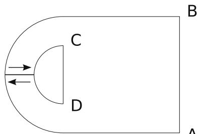

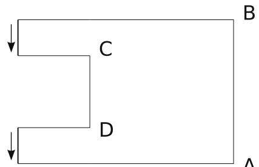  
  
Fig. 5. Virtual edges for a multiply connected geometry. (a) Physical domain. (b) Computational domain.

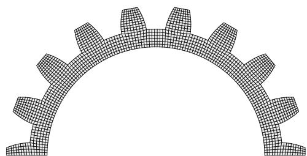  
(a)

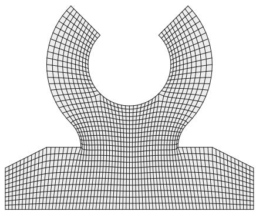  
(b)

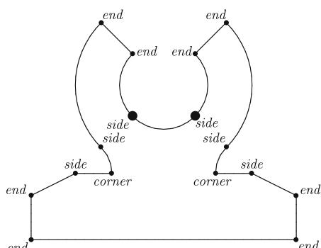  
Fig. 6. Meshes generated in the geometries of the first and second example using the submapping method. (a) Mesh generated in a mechanical piece. (b) Mesh generated in a mechanical support.

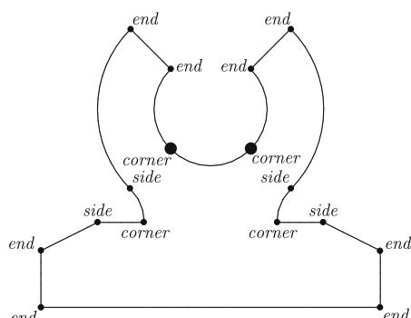  
(b)   
Fig. 7. Vertex classification for a mechanical support. (a) Classical vertex classification. (b) Corrected vertex classification.

Fourth, note that there is a single variable in the integer linear problem (10) for each virtual edge, although the virtual edges are traveled twice.

The final program flow for multiply connected domains is:

(i) Classify the vertices as detailed in Section 2.1.   
(ii) If vertex classification is not correct, compute a valid classification by solving problem (10).   
(iii) If the geometry is multiply connected, convert it into simply connected using the algorithm explained in this section.   
(iv) At this point, the submapping method proceeds as usual.

# 5. Numerical examples

In this section, we present six examples of meshes generated using the submapping method. The user assigns an element size

and the algorithm automatically determines a correct vertex classification and convert, if necessary, the geometry into simply connected. Then, the submapping method is applied in order to generate the mesh.

The objective of the first example is to show that the proposed algorithm is able to mesh geometries that can be meshed using the original submapping algorithm. That is, simply connected geometries such that vertex classification is correctly detected by the standard algorithm. To this end, Fig. 6a shows a mesh generated for a half of a gear. In this case, the geometry is simply connected and the vertex classification is correctly detected.

The second example presents a simply connected geometry in which the classical classification of vertices is incorrect, and the geometry cannot be automatically meshed using the submapping method. To this end, we consider the mechanical piece presented in Fig. 6b. The classical classification of vertices is presented in Fig. 7a. Since this classification does not verify Eq. (9), it is

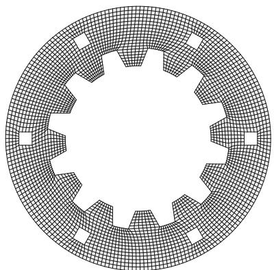  
Fig. 8. Discretization of an inner gear using the submapping method.

impossible to generate a valid mesh. Therefore, it is necessary to solve the proposed linear problem (10) in order to compute a valid classification of the vertices. Fig. 7b shows the corrected classification of vertices. Fig. 6b presents the mesh generated using the submapping method.

The third example is devoted to the discretization of geometries with several holes. Therefore, we need to apply the algorithm presented in Section 4. To this end, we consider the geometry presented in Fig. 8. Note that in this geometry, vertex classification

obtained using the original algorithm is valid. Therefore, it is not necessary to solve problem (10) to obtain a valid classification. Fig. 8 presents a mesh generated for this geometry using the submapping method.

In the fourth example we couple the proposed algorithm for submapping with a sweeping algorithm in order to mesh 3D geometries. More specifically, the fourth example presents a mechanical piece that is meshed with hexahedral elements obtained by sweeping a submapping mesh. The base profile consists of a multiply connected domain where the vertex classification is not correctly detected by the classical algorithms. Hence, we have to obtain a valid classification of the vertices by solving Eq. (10). Then, we apply the algorithm to convert the geometry into simply connected in order to generate a mesh using the submapping method. Fig. 9a shows the mesh generated in the base profile. Afterwards, we sweep the surface mesh in order to obtain the solid mesh. Figs. 9b–d show three views of the hexahedral mesh.

In the fifth example we present an application of the proposed algorithms to the discretization of a set of connected curved surfaces. In particular, we show a mesh generated on an engine of a DLR F6 aircraft. This geometry is composed of several connected surfaces. For this reason, the algorithm automatically generates a conformal mesh over common edges. In order to properly reproduce the details of the geometry in the final mesh, we prescribe different numbers of intervals on the edges that define the front and the rear parts of the engine. More specifically, we prescribe

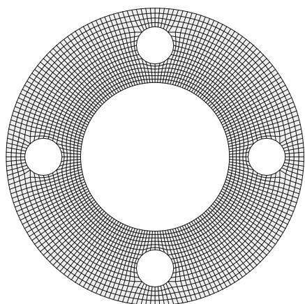

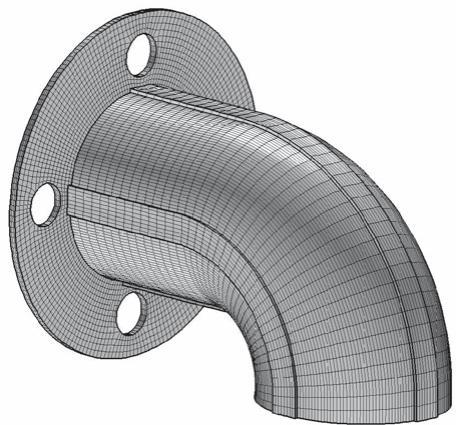

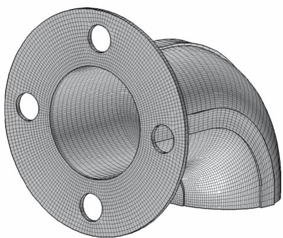  
(c)

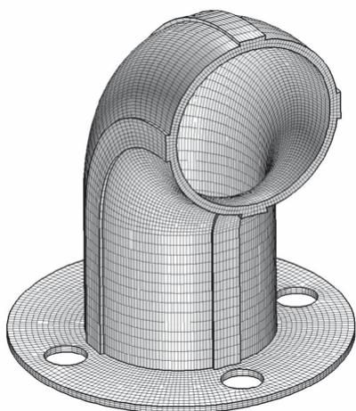  
  
Fig. 9. Mesh generated in the geometry presented in example four. (a) Bidimensional mesh generated using the submapping algorithm. (b–d) Views of the generated mesh.

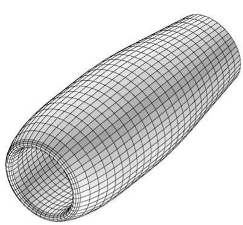  
（a)

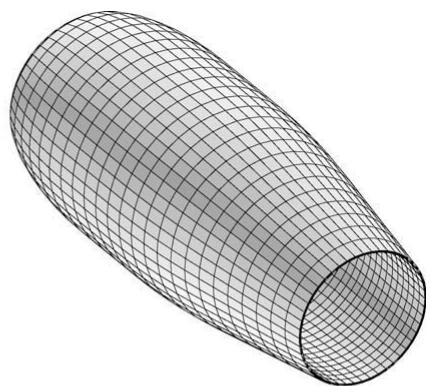

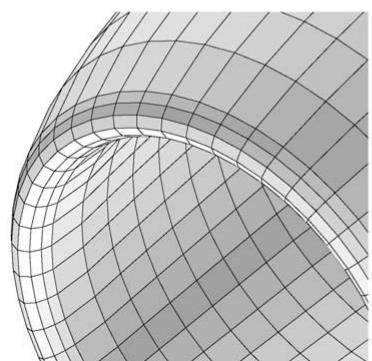

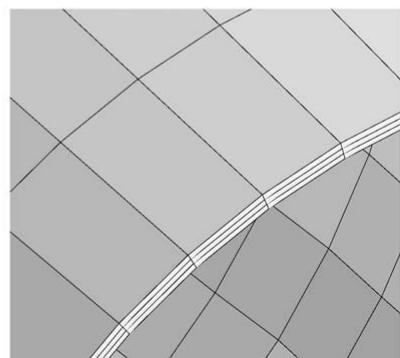  
  
Fig. 10. Mesh generated over an engine of a DLR F6 aircraft. (a) Front view. (b) Rear view. (c) Detail of the front part of the mesh. (d) Detail of the rear part of the mesh.

six intervals in the front part and three intervals in the rear zone. In this case, each surface is simply connected and the vertex classification is correctly detected. Thus, we do not need to compute an alternative vertex classification, and we do not need to convert the surfaces into simply connected. Fig. 10a and b present two general views of the final mesh. Fig. 10c and d show a detail of the final mesh in the front and rear part of the engine, respectively.

Finally, the sixth example presents the discretization of the fluid around a cross section of the engine of a DLR F6 aircraft. It is defined by a multiply connected geometry in which the vertex classification is not valid (Fig. 11a). Hence, we need to apply the algorithm presented in Section 3 to compute a valid classification, and the algorithm detailed in Section 4 to convert the geometry into simply connected. The proposed submapping algorithm is applied in conjunction with a procedure that generates fifteen boundary layers around the profile of the engine. Fig. 11b shows a global view of the coarse mesh generated using the submapping method. Fig. 11c shows a detail of the mesh in the front of the profile, while Fig. 11d shows a detail of the mesh in the rear zone.

# 6. Conclusions

The submapping method imposes that the angles defined between two consecutive edges of the boundary have to be, approximately, an integer multiple of $\pi / 2$ . Furthermore, the vertices of the geometry have to be classified in such a way that they define a closed domain in the computational space. These two conditions are the major constraints of the applicability of the submapping method. In addition, special algorithms have to be developed in order to mesh multiply connected domains. Therefore, in this work, we presented two original contributions in order to improve the applicability of the submapping method.

The first one is focused on vertex classification. Given a geometry, multiply connected or not, we propose a necessary condition

that has to be verified by a valid vertex classification. This condition states that if a geometry is to be meshed using a submapping method, then the summation of the outer angles derived from the vertex classification should equal to $2 \pi$ . If an invalid classification of the vertices is found, then the method automatically generates a new one that verifies the proposed condition by solving a linear integer problem. Although the proposed algorithm extends the applicability of the submapping method, we have pointed out that there still exists geometries that can not be meshed using it. The basic reason is that we have proposed a necessary condition. Therefore, it is possible to find a vertex classification that verifies it and leads to an invalid discretization.

The second contribution deals with the conversion of multiply connected geometries into simply connected. To this end, the proposed procedure automatically connects inner boundaries with the outer boundary using virtual edges. Virtual edges are computed using an auxiliary constrained Delaunay triangulation of the surface. Once the geometry is simply connected, the submapping method proceeds according to the proposed algorithm for simply connected domains. Note that, opposite to the standard procedures to convert multiply connected geometries into simply connected, the new procedure does not impose any condition on the outer boundary of the geometry. Therefore, additional geometries can be meshed using the proposed procedure.

Additional research is needed in order to extend the applicability of the submapping method. On the one hand, it will be of the major importance to deduce a sufficient condition to be verified by vertex classification in order to obtain a valid mesh. On the other hand, the robustness of the interval assignment has to be improved. For instance, the solution of the integer linear problem always provides a number of intervals such that the boundary of the computational space is closed. However, the boundary of the computational space can be folded. Thus, it is impossible to generate an acceptable mesh. Additional equations should be included in the

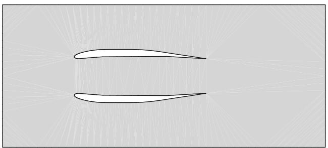  
(a)

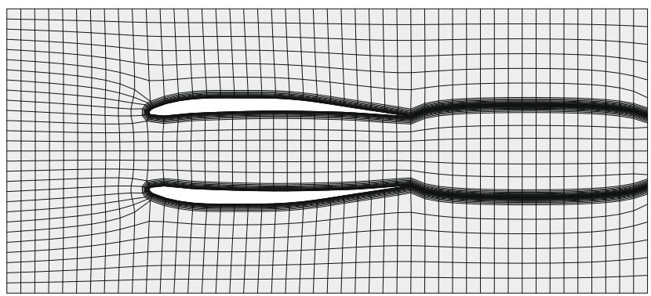  
(b)

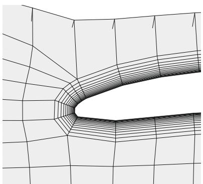  
（c）

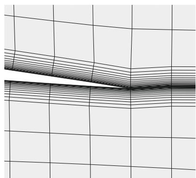  
  
Fig. 11. Mesh generated in the surface presented in example six. (a) Geometry of the sixth example. (b) Generated mesh. (c) Frontal detail of the mesh. (d) Rear detail of the mesh.

integer linear problem in order to avoid folded geometries in the computational space.

Finally, it is worth to notice that the standard submapping method, and the new contributions presented in this article are successfully implemented in the ez4u meshing environment [8].

# Acknowledgements

The authors wish to thank Xevi Roca for his advice during the implementation of the algorithms in the ez4u environment. This work was partially sponsored by the Spanish Ministerio de Ciencia e Innovación under Grants DPI2007-62395, BIA2007-66965 and CGL2008-06003-C03-02/CLI.

# Appendix A

In this appendix we detail how to compute the $\rho _ { i }$ and $\omega _ { i }$ parameters that appear in the integer linear problem (8). This computation is performed in two steps:

(i) Let $W _ { i }$ be

$$
W _ {i} = 1 - 2 \left(\left| \overline {{\alpha}} _ {i} - \left[ \overline {{\alpha}} _ {i} \right] \right|\right),
$$

where $\overline { { \alpha _ { i } } }$ is computed according to Eq. (3), and ½x denotes the nearest integer greater than or equal to x. Note that the maxima of the $W _ { i }$ function are located on the integer values of $\overline { { \alpha _ { i } } }$ . (ii) Let $\mathbf { t } _ { 1 }$ and $\mathbf { t } _ { 2 }$ be the tangent vectors of the adjacent edges at vertex i. In addition, let ${ \bf n _ { 1 } }$ and $\mathbf { n } _ { 2 }$ be second derivative vectors of the adjacent edges at vertex i. We compute $d _ { 1 } =$ $\operatorname* { d e t } ( \mathbf { t } _ { 1 } , \mathbf { n } _ { 1 } ) , \ d _ { 2 } = \operatorname* { d e t } ( \mathbf { t } _ { 2 } , \mathbf { n } _ { 2 } )$ , and $d = ( d _ { 1 } + d _ { 2 } ) / 2$ . Finally, we define:

$$
\left\{ \begin{array}{l l} \rho_ {i} = 5 / 8 W _ {i}, & \omega_ {i} = 3 / 8 W _ {i}, \quad \text {i f} d > 0, \\ \rho_ {i} = 3 / 8 W _ {i}, & \omega_ {i} = 5 / 8 W _ {i}, \quad \text {i f} d <   0, \\ \rho_ {i} = W _ {i}, & \omega_ {i} = W _ {i}, \quad \text {i f} d = 0. \end{array} \right.
$$

# References

[1] White D. Automatic quadrilateral and hexahedral meshing of pseudo-cartesian geometries using virtual subdivision. Master thesis, Brigham Young University; 1996.

[2] Whiteley M, White D, Benzley S, Blacker T. Two and three-quarter dimensional meshing facilitators. Eng Comput 1996;12:144–54.   
[3] Thompson JF, Soni B, Weatherill N. Handbook of grid generation. CRC Press; 1999.   
[4] Mitchell SA. High fidelity interval assignment. In: Proceedings, 6th international meshing roundtable, vol. 33, Park City (Utah); 1997. p. 44.   
[5] Schrijver A. Theory of linear and integer programming. John Wiley and Sons; 1998.

[6] http://sourceforge.net/projects/lpsolve.   
[7] Shewchuk JR. A two-dimensional quality mesh generator and Delaunay triangulator. <http://www.cs.cmu.edu/quake/triangle.html>.   
[8] Roca X, Sarrate J, Ruiz-Gironés E. A graphical modeling and mesh generation environment for simulations based on boundary representation data. In: Congresso de métodos numéricos em engenharia, Porto, Portugal; 2007.