# Simple and Fast Interval Assignment Using Nonlinear and Piecewise Linear Objectives

Scott A. Mitchell

Sandia National Laboratories, Albuquerque, NM, USA samitch@sandia.gov

Interval Assignment (IA) is the problem of assigning an integer Summary.number of mesh edges, intervals, to each curve so that the assigned value is close to the goal value, and all containing surfaces and volumes may be meshed independently and compatibly. Sum-even constraints are modeled by an integer variable with no goal. My new method NLIA solves IA more quickly than the prior lexicographic min-max approach. A problem with one thousand faces and ten thousand curves can be solved in one second. I still achieve good compromises when the assigned intervals must deviate a large amount from their goals. The constraints are the same as in prior approaches, but I define a new objective function, the sum of cubes of the weighted deviations from the goals. I solve the relaxed (non-integer) problem with this cubic objective. I adaptively bend the objective into a piecewise linear function, which has a nearby mostly-integer optimum. I randomize and rescale weights. For variables stuck at non-integer values, I tilt their objective. As a last resort, I introduce wave-like nonlinear constraints to force integrality. In short, I relax, bend, tilt, and wave.

# 1 Introduction

# 1.1 Problem Definition

Interval Assignment (IA) for quad and hex meshing is the problem of assigning to each curve the number of mesh edges (intervals) it should be subdivided into, so that every containing surface and volume can be meshed according to its scheme. Different meshing algorithms have different requirements. For example, map-meshing a rectangular surface with quadrilaterals requires that curves on opposite sides contain exactly the same number of edges. Interval assignment is important for automation and meshing independence, and also for mesh quality. Given a global IA solution, each surface and volume containing a curve can be meshed independently. (This ignores the geometric

spacing of the edges. Issues like skew control may be addressed using interval assignment over virtual geometry [12].) IA for triangular and tet meshes is trivial because and each curve may be assigned intervals independently.

IA in some form is required for all quad and hex meshing. The problem is surprisingly difficult. The requirements are easily described locally, but surfaces sharing common curves create dependencies that make IA a global problem. A good algorithm is important. A greedy strategy of assigning intervals for one surface, then for another surface, can fail by “painting yourself into a corner.” Solving the global problem using standard optimization techniques is difficult because IA requires an integer number of intervals. That is, mesh nodes are discrete quantities dividing curves into a discrete number of mesh edges. Half of an edge makes no sense.

# Optimization and Linear Constraints

General global integer optimization is a difficult and slow problem, and any effective IA algorithm must exploit the problem structure. A key feature of all the constraints is that they can be described using a linear equation; that is, if $x _ { i }$ is the number of intervals assigned to the $i$ th curve (or virtual curve, xi ietc.), then the equation describing the constraint only contains $x _ { i }$ raised to the first power, with no $x _ { i } ^ { 2 }$ xiterms, etc. Linear constraints are the simplest in optimization. We write $A x = b$ ; equality and inequality constraints are equiv-Ax balent using standard conversions, such as slack variables, or requiring both $A x \geq b$ and $A x \leq b$ . Every variable has upper and lower bounds, perhaps Ax b Ax binfinite. Interval variables must be integer and positive, in the natural numbers $\mathbb { N }$ . Integer variables are identified by an indicator set $I$ . There may be Iadditional variables, perhaps for computing intermediate quantities not apparent in the model; for conciseness we also denote these by $x$ . An important xexample of this is for unstructured quad meshing schemes, such as paving, where the sum of intervals around any set of bounding curves must be even. We constrain $\begin{array} { r } { 2 x _ { j } = \sum _ { b \in \mathrm { b d y } } x _ { b } } \end{array}$ , and require $x _ { j }$ to be an integer. Any assignxj b xb xjment satisfying these constraints is feasible. Removing the requirements for integrality defines the relaxed problem. A feasible solution to it is a useful step towards an integer solution.

We have an idea of the number of intervals we would like for each curve, the goals. These may come from a sizing function: e.g. edges about length 4, so a curve of length 10 has a goal of 2.5 intervals. Or the user may specify the number directly, such as “at least ten edges through the thickness for accuracy in weld simulations.” We assume goals are constant throughout IA. There may be no feasible solution satisfying all the goals. We measure the deviation of the achieved interval $x _ { i }$ from its goal $g _ { i }$ . We have some objective function $f ( x , g )$ xiof the deviations, where $f ( x ) = 0$ if all the deviations are zero, and $f ( x ) > 0$ f xotherwise. IA in standard form is

$$
\min f (x)
$$

$$
\text {s . t .} A x = b \tag {1}
$$

$$
x _ {I} \in \mathbb {N}
$$

$$
l \leq x \leq u.
$$

The best choice of optimization algorithm depends on the objective. The easiest case of $f ( x )$ is a linear function, which leads to Linear Programs LP. f xThe next step up is Quadratic Programs QP with a quadratic objective. The most general is a Non-Linear Program NLP. A nice case is when the objectives and constraints are all convex, because local optimization is efficient and leads to a global optimum. The relaxed IA problem is convex, but general integer problems are not.

One way to search for integer (or other non-convex) solutions is branch and bound: if $x _ { i } = 4 . 5$ branch and create two subproblems, one with constraint $x _ { i } \ \geq \ 5$ xi . and one with $x _ { i } \ \leq \ 4$ . Solve these recursively, terminating early if xi xithe objective value is worse than that of some previously found integer solution. Each branching doubles the problem, leading to exponential complexity. Outer approximations [6] can improve the efficiency of searching for integer solutions within branch and bound, but the complexity is still exponential.

Here I have the additional freedom to change the objective function. I take care to finesse most of the integer constraints using a convex objective, and keep the problem convex as long as possible. Non-convex constraints are introduced at the very end as a last resort. My test examples use linear memory and have sub-quadratic run-time.

# 1.2 Interval Assignment Background

Interval assignment was first described as an optimization problem by Tam and Armstrong in 1993 [23]. A key contribution is expressing the constraints as linear programming constraints. The objective function is linear, the weighted sum of deviations. The weights are inversely proportional to the goals. Achieved intervals are bounded below by the goals, and unbounded above. The main advantage of this formulation is that the solution is naturally integer, provided the weights are unique and the goals are integer and the model does not have certain global structure such as Figure 2. By “naturally integer,” I mean that an optimal solution occurs at integer values, and simplex solvers will find it without explicitly constraining the solution to integers.

The one potential disadvantage of Tam and Armstrong’s [23] objective function is that if large deviations are required, all the deviation could be concentrated on one curve rather than spread out amongst several curves. This is because the objective is linear in the deviations. The conventional wisdom is that $L _ { 1 }$ minimization leads to sparsity in the solution [7, 10].

Whether this actually occurs depends on the specifics of the geometry and constraints; Cecil Armstrong said he does not observe drastic deviations. M¨ohring et al. [18] formulated interval assignment as a network flow problem in 1997. Equality constraints are modeled as mass-preserving flows. Matthias M¨uller-Hannemann said he did not observe drastic deviations for automobile sheet metal models.

“High Fidelity Interval Assignment” (LexIA) [17] sought to distribute the potential concentration using a lexicographic min-max weighted deviation objective: minimize the maximum weighted deviation; then minimize the second largest deviation subject to not increasing the first; etc. It was solved by a succession of min-max linear programs. In each the worst interval-variable is rounded to a nearby integer value, made constant, and removed from the problem. (Often several variables are fixed at once.) The sum-even constraints were solved in a second pass, using standard branch and bound in a local neighborhood, which may take exponential time. If it took too long to find a feasible solution, the neighborhood was widened and the search restarted. The disadvantage of LexIA is that getting integer values is difficult and time consuming; there are complications arising from identifying the worst interval-variable, and determining if fixing it makes the remaining problem infeasible. The run-time grows at least quadratically in the number of variables.

Tam and Armstrong [23] was 1993, LexIA was in the IMR in 1997 [16], and M¨ohring et al. [18] also appeared in 1997.

In the roughly 15 years since these three variations, the finite element meshing community did not changed the problem structure very much. But, for new meshing schemes, it was quite common to describe its interval requirements using linear constraints. New constraints were developed for midpoint subdivision [13] sweep volumes [21, 22] and submapping [20]. IA was used as a component of automatic schemes selection; infeasible IA meant the mapping corners [15] or schemes were globally incompatible with one another [26].

LexIA was implemented in CUBIT in 1996–1997, and is still run for every CUBIT quad mesh today. The solver library (lp solve [1]) and problem setup has remained largely unchanged.

At the 2011 IMR in Paris, Timothy Tautges and I discussed making a modern, open, and freely available version of IA for MeshKit [11]. I first considered defining the same objective as LexIA, but solving it using modern techniques. There has been a lot of progress on the general problem of multiobjective optimization [14], but less progress on lex min-max. The typical approach remains to solve a series of optimization problems, i.e. basically what I implemented in LexIA in 1997. What is new is that lex min-max may be reformulated as a single, giant optimization problem. This is sometimes simpler, but solving lex min-max remains expensive [19].

# 1.3 My Contribution

Instead I reformulated the objective into a nonlinear function of the deviations; see Figure 1. While the constraints are standard and necessary, the objective is a matter of mesh quality and is flexible.

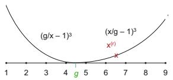

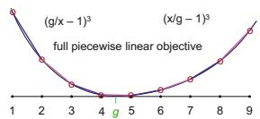

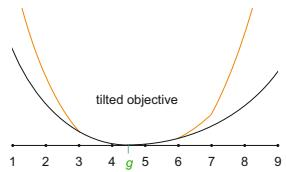  
Fig. 1 Left, the nonlinear objective function $f ( x , g )$ for each interval variable $_ { x }$ with constant goal $g$ f. A potential relaxed solution $x ^ { ( r ) }$ is shown as a red “ $\mathbf { X }$ x.” Center, g xthe fully linearized objective function through the integer points. Right, a tilted objective: a negative tilt at 2, and positive tilts at 7 and 8. The slope is about doubled at the tilt point and beyond. These plots are notional; the actual slopes are more extreme.

I have four solution phases: relax, bend, tilt, and wave. In the relaxed phase the objective is the sum of cubes of the weighted deviations. This is solved using nonlinear optimization, yielding a (likely) non-integer solution. The next three phases seek a nearby integer solution. The bends replace the smooth nonlinear objective with a piecewise linear one; see Figure 1. I linearize the objective in a neighborhood of the non-integer solution. If the solution to the new problem goes beyond the neighborhood, I flatten farther and resolve. The tilts increase the slope of the linear objective function locally, while maintaining overall convexity, so that a non-integer variable is encouraged towards a nearby integer value; see Figure 1. The waves constrain any stubbornly non-integer variables by a nonlinear function. The only feasible points are the integers; see Figure 2.

NLIA revisits the prior phases adaptively. The algorithm bends until no more bends are needed, then bends and tilts until the tilts succeed or are stuck. As a last resort waves are added and the algorithm bends, tilts, and waves until no more waves are needed. Bends, tilts, and waves are done for each variable that needs it simultaneously, aiding runtime.

The piecewise linear problems tend to have a natural optimum at integer values, just as Tam and Armstrong’s. I take advantage of the feature that $L _ { 1 }$ minimization leads to sparsity in the solution to get integer values, turn-Ling this potential drawback into an advantage. Spreading out the deviation is achieved by making the objective piecewise over short intervals, with increasing slope away from the goal. What can go wrong? There may be optima at non-integer values if the weights are non-unique, or the constraints conspire as in the radish (Figure 2) or as in sum-even constraints. Since I use an interior point method, when weights are equal (degenerate) it does not gravitate to the integer corners, unlike the simplex method. Re-weighting the

objective coefficients with bends, tilts, scalings, and randomizations tends to migrate variables to integer values, but I have no provable guarantees. The waves ensure the only feasible solutions are integer, but since it changes the constraints from convex to non-convex, the optimization problem becomes global, with no convergence guarantees.

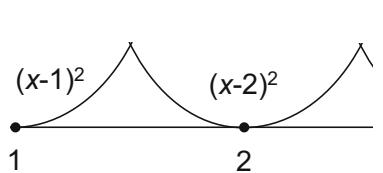

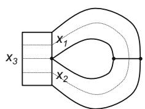

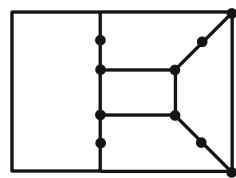  
Fig. 2 Left, wave integer constraints. Center & right, the global structure can conspire to produce an effective coefficient larger than one: $x _ { 3 } = x _ { 1 } + x _ { 2 } = \ O ^ { \cdot } 2 x _ { 1 }$ The bend strategy can get stuck with $x _ { 3 }$ integer (e.g. 5) and $x _ { 1 } = x _ { 2 }$ x x .half-integer x(e.g. 2.5). Tilting to increase the objective weight of $x _ { 1 }$ and $x _ { 2 }$ x xmay overcome this, or a wave-constraint can force $x _ { 1 } , x _ { 2 }$ xto an integer value.

The status is that we have an initial NLIA implementation in MeshKit [11]. It is very fast. It has been tested on large and difficult problems, albeit artificial ones. Not all types of scheme constraints have been implemented yet, e.g. midpoint subdivision. Bending and tilting for sum-even variables has not yet been implemented as of July 2013; just waves. Fixed-interval (a.k.a. hard-set, constant) curves have not been implemented.

# Graphics Quad Meshing with Mixed-integer Optimization

Quadrilateral meshing has recently become popular in the Graphics community [3]. Graphic’s objectives and types of surfaces are slightly different, but the opposite-sides-equal constraints are universal for structured quad patches. The models are typically smooth closed surfaces, divided into structured patches. David Bommes has a series of papers, and a Best Thesis Award at Eurographics 2013, exploring quad-meshing using mixed-integer optimization problems with linear constraints and a quadratic objective, MIQP.

Bommes et al. [4] creates quadrilateral meshes of surfaces for graphics modeling using two MIQPs. The meshes are based on the semi-structured patches that result from defining quad-dual curves: a.k.a. loops in Spatial Twist Continuum terminology. This has some similarities to midpoint subdivision and fluid flow templates, except that the templates are not fixed, but are the solution to a MIQP. The first MIQP fixes the number and position of irregular vertices, the corners of the patches. Let us call this the corner-phase. The second MIQP sets the structure of the patches, connects the dual loops, and assign intervals. Let us call this the patch-phase.

The input is the graphics triangulation of a surface model. Sharp angles define curves; these often do not form primal loops, and the location and

structure of additional curves to close them is part of the solution. The goals are good quad angles; orientation of the loops with respect to curvature and sharp features, the cross field; and especially the number and placement of irregular mesh vertices, i.e. those with edge valence different than four, singularities in the cross-fields; plus any other user-specified or modeling or animation objectives. The loops (templates) are not fixed a-priori, instead they follow from the irregular vertices. The patch-phase problem is always feasible, and successively rounding non-integer variables to integer values and resolving always leads to an integer solution, because it comes from the solution to the corner-phase. Branch and bound, and other standard integerization techniques that do not exploit the problem structure, have proven to be too slow in the Graphics meshing context. In meshing terminology, these two phases solve surface scheme selection and interval assignment.

Moreover, the linear constraint matrix lends itself to dependent variable elimination, i.e. Gaussian elimination. We can identify the effectively non-one coefficients, and order the elimination to avoid getting stuck at a non-integer. E.g. in Figure 2, $x _ { 3 }$ is eliminated first, then $x _ { 2 }$ , and their integralities are xensured by the remaining variable $x _ { 1 }$ .

xBommes’s system is both robust and efficient [5]. Part of the efficiency is because the solver is not black box, and in successive rounding the prior solution can be quickly updated for the remaining problem. In earlier versions, some feasible solutions to the MIQP do not correspond to a quad mesh, especially when searching for coarse meshes. Degeneracies in the map were possible, e.g. mapping all space to a single point, or a triangle to a line, etc. Bommes’s latest work overcomes these kinds of problems [2].

# 2 NLIA Algorithm Details

# 2.1 Subdivide into Independent Subproblems

I divide the global problem into independent subproblems having no variables or constraints in common. For example, when submapping a volume, there are three independent subproblems, one for each loop direction. Since the running time of optimization solvers is nonlinear, this speeds up the overall problem.

I define a dependency graph over the global problem: each variable points to all of the constraints it is in, and each constraint points to every variable it contains. To build a subproblem I do a depth-first graph search, recursively alternating over constraints and variables.

# 2.2 MeshKit Architecture

Goals and interval solutions are attributes attached to geometry entities. Mesh sizes are converted to scalar goals. Constraints are specified in the

Simple and Fast Interval Assignment   
procedure NONLINEAR INTERVAL ASSIGNMENT NLIA(x,g,c,e)  
subdivide into independent subproblems  
for all subproblems do  
solve Relaxed Problem $(x^{(r)},g,c)$ solve Integer Problem $(x^{(e)},x^{(r)},g,c,e)$ , finding $x^{(i)}$ then $x^{(e)}$ return $x^{(e)}$ end for  
end procedure  
procedure RELAXED PROBLEM(x,g,c)  
define NLP linear constraints $c$ , from mapping, submapping, paving, etc.  
define NLP objective, the sum of cubes of weighted deviations, $f(x,g)$ solve the NLP min $f$ s.t. constraints, using IPOPT  
return relaxed solution $x^{(r)}$ end procedure  
procedure INTEGER PROBLEM $(x^{(\mathrm{new})},x,g,c,e)$ bend: decompose $x$ into deltas, near $x = x^{(r)}$ repeat  
repeat $x^{(\mathrm{old})} = x$ scale and randomize delta weights  
define the piecewise linear objective, a weighted sum of deltas  
solve NLP using IPOPT, initialized at $x^{(\mathrm{old})}$ , returning $x$ return failure for infeasible or infinite loops or ...  
// bend  
for all $\delta >1$ do  
add more deltas: enough that $x$ decomposes into $\delta \leq 1$ end for  
until all $\delta \leq 1$ // $x = x^{(i)}$ integer, except perhaps for sum-even and Figure 2  
// tilt  
for all non-integer $0 < \delta < 1$ do  
tilt the objective weight for $\delta$ by about $2\times$ apply the tilt to all farther $\delta$ to maintain convexity  
end for  
until all $\delta \in \{0,1\}$ or give up  
// $x^{(i)} = x^{(\mathrm{new})}$ is integer, unless we gave up  
once: add sum-even variables with $g$ and $\delta$ otherwise: add integer wave constraints for any $x_{I}\notin \mathbb{N}$ until no variables or wave constraints or deltas or tilts were added  
// $x^{(e)} = x$ is integer, and sum-even constraints are satisfied  
return solution $x^{(\mathrm{new})} = x$ end procedure

scheme implementations. Constraints and attributes are passed from MeshKit to NLIA through its API. Intervals are passed back by assigning them to attributes.

# 2.3 IPOPT Optimization Solver

I use the optimization library IPOPT [24, 25], which handles general nonlinear objectives and constraints. It requires a linear algebra library; I use MA27 [8].

IPOPT software is C++ with a well defined API. Unlike using an optimization language such as AMPL [9], coupling a code to IPOPT requires some API programming and callback functions. The developer must program not only function values, but also gradients and Hessians for particular Lagrange multipliers. IPOPT requires that the size and structure of the problem remain constant throughout the process. A library that could dynamically add variables (bends) or change the objective (tilts) might be more efficient.

# 2.4 Constraint Equations

My constraint equations are standard for IA. IPOPT treats constraints much like objectives. The left hand side of a constraint is evaluated as a function, and then internally compared against feasibility bounds, to help determine the next optimization step. I write the $i$ th equality constraint $b _ { i } = a _ { i } x$ as a function $c _ { i } ( x ) = a _ { i } x$ i, and set constant upper $u _ { i }$ and lower $l _ { i }$ bi aixbounds to $b _ { i }$ ci x aix ui li. Inequality is expressed by differing upper and lower bounds. For exambiple, some paving-like algorithms require that there are at least four intervals around every loop; for these I enforce a lower bound of two for all sum-even variables, even in the relaxed phase.

IPOPT needs the derivative and Hessian of the constraint functions. This is easy because they are linear with no cross terms: $c _ { i } ^ { \prime } ( x ) = a _ { i }$ and $c _ { i } ^ { \prime \prime } ( x ) = 0$

# 2.5 Interval Goals and Cubic Objective

I measure the relative difference between a goal $g$ and achieved intervals $x$ :

$$
F (x > g) = \frac {x - g}{g} = \frac {x}{g} - 1, \mathrm {a n d} F (x <   g) = \frac {| x - g |}{x} = \frac {g}{x} - 1.
$$

I denote the relaxed objective function by $f ( x )$ . It is the cube of the individual $F$ , i.e. $f ( x ) = F ^ { 3 } ( x )$ f xIPOPT requires derivative and Hessian information. $f ^ { \prime } = 3 F ^ { 2 } F ^ { \prime }$ F, where

$$
F ^ {\prime} (x > g) = \frac {1}{g}, \mathrm {a n d} F ^ {\prime} (x <   g) = \frac {- g}{x ^ {2}}.
$$

$$
f ^ {\prime \prime} = 6 F \left(F ^ {\prime}\right) ^ {2} + 3 F ^ {2} F ^ {\prime \prime}, \text {w h e r e}
$$

$$
F ^ {\prime \prime} (x > g) = 0, \text {a n d} F ^ {\prime \prime} (x <   g) = \frac {2 g}{x ^ {3}}.
$$

Since the objective function is separable, there are no cross terms in the gradient and Hessian. In the Hessian only the diagonal is non-zero. $F ( x = g ) = 0$ is continuous, giving $f ^ { \prime } ( x = g ) = 0$ and $f ^ { \prime \prime } ( x = g ) = 0$ , F x galso continuous.

# Discussion

$F ( x > g )$ is the same as used in “High Fidelity Interval Assignment.” My $F ( x < g )$ is different because it is a nonlinear function of $x$ . It more accurately F x < g xcaptures the ratio of the achieved edge length to the desired edge length.

I chose $f = F ^ { 3 }$ rather than some other power purely experimentally, as f Fa way to come close to the lexicographic min-max solution. A quadratic will concentrate the deviations more than my cubic, but if one wanted to use a quadratic program solver rather than a general nonlinear solver, then $f = F ^ { 2 }$ might be adequate. Other forms of $f$ might also work, and be simpler to differentiate: e.g. $\begin{array} { r } { f ( x > g ) = \left( \frac { x } { g } \right) ^ { 3 } - 1 } \end{array}$ , and $\begin{array} { r } { f ( x < g ) = \left( \frac { g } { x } \right) ^ { 3 } - 1 } \end{array}$ .

# 3 Relaxed Problem and Solution

IPOPT finds the relaxed solution $x ^ { ( r ) }$ . IPOPT starts the optimization process xfrom an input point. For the relaxed problem, I start with all variables equal to the goals, $x = g$ , which is probably not feasible. For the other problems, I x gstart with all variables equal to the prior problem’s solution, which is feasible.

# 4 Integer Problem and Solution

For pseudocode see Algorithm 1. Recall the main ideas are to bend and linearize the cubic objective function at integer points, tilt the objective for optimality at integers, and add non-convex wave constraints as a last resort. A guiding principle for efficiency is to only adapt where it is needed.

# 4.1 Bend to Linearizing the Objective

The objective function evaluated at integer values, $f ( x \in \mathbb { N } )$ , defines discrete points. I replace $f$ f xwith a piecewise linear function, interpolation between fthese points and extrapolation; see Figure 1. It is possible to do this in IPOPT without defining any additional variables, hiding the bends inside black-box call-back functions. However, IPOPT performs poorly with this approach.

Instead I decompose $x$ into the signed sum of delta variables. There is xone delta for each piece of the piecewise linear objective. To avoid adding too many variables that are never used, I add delta variables as the solution migrates; see Figure 3 and 4. I start with one delta $\delta _ { p 1 }$ spanning the interval containing $x ^ { ( r ) }$ , one delta $\delta _ { m 1 }$ δpbelow it and one delta $\delta _ { p 2 }$ above it. The obx δmjective is piecewise linear over the $x$ intervals $( 1 , \lfloor x ^ { ( r ) } \rfloor )$ p, $( \lfloor x ^ { ( r ) } \rfloor , \lceil x ^ { ( r ) } \rceil )$ , and $( \lceil x ^ { ( r ) } \rceil , \infty )$ .

x ,For each $x _ { i \in I }$ , define constant $x l = \lfloor x ^ { ( r ) } \rfloor$ and equality constraint $x =$ $x l + \sum \delta _ { p } - \sum \delta _ { m } .$ Initially $M = 1$ xl and $P = 2$ . In general there are $P$ xpositive xl δp δmdelta variables, and $M$ M P Pminus delta variables. All the pieces are length 1 Mexcept for the two ends, so all the deltas are in $[ 0 , 1 ]$ except the last ones. In theory the $P$ th positive delta is in $[ 0 , \infty )$ , and the $M$ th negative delta is Pbetween 0 and whatever value makes $x = 1$ M. In practice I bound them by smaller values, at most 4.5.

I remove $f ( x )$ from IPOPT’s objective function. Instead I use a sum of f xlinear objective functions of each delta; see Figure 1. I set the derivative of $f ( \delta )$ to be the slope of the line through $f ( \delta \ : = \ : 0 )$ and $f ( \delta = 1 )$ . For the f δinterval containing $g$ f δ f δ, to avoid a near-zero slope I set the slope to the larger of $f ( 0 )$ or $f ( 1 )$ gOnly the derivative matters, the constant offset does not, so f f .I just set those to zero. See also Section 4.2 for scaling and randomizing the slopes. Because each delta contributes a positive amount to the objective, either the positive or minus deltas will be non-zero, but not both. Further, the increasing slope by delta index will ensure that $\delta _ { i < k } = 1$ and $\delta _ { i > k } = 0$ for some $k$ .

kI solve the NLP, returning $\boldsymbol { x } ^ { ( i ) }$ and the delta variable decomposition. If any $P$ th or $M$ xth delta value is greater than 1, then I increase $P$ or $M$ and resolve. P MThe exact amount to increase $P$ or $M$ P Mis an art; as long as I increase it by at P Mleast one I will make progress towards a better and integer solution. Currently I increase the number of deltas so that $\boldsymbol { x } ^ { ( i ) }$ decomposes into delta values that xare less than one, i.e. increase by the floor of the $M$ th (or $P$ th) delta value. M PBut I limit the number of deltas to only about double. For memory and perhaps time efficiency, I am tempted to discard inactive deltas; but the potential drawback is worse convergence.

Having at least one bend to either side of $x ^ { ( r ) }$ helps avoid unbounded solutions. Figure 4 shows how $P = 1$ xcan lead to trouble. For two variables in Ptension, their cubic objective function slopes are equal at the relaxed solution, by definition of optimality. Their linearized slopes around the relaxed solution will be close together, and the net slope may lead to an unbounded solution for $P = 1$ . Unbounded problems can arise in other situations. To handle these the $P$ th delta value is bounded above by the number of positive deltas plus P4.5, and the $M$ th delta value is analogously bounded.

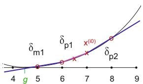

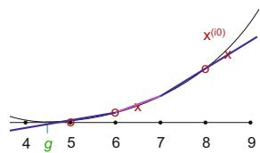

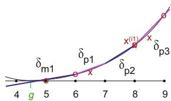  
Fig. 3 Adaptive deltas. Left, I start with three deltas, $\delta _ { m 1 } \in [ 0 , 5 ]$ and $\delta _ { p 1 } \in [ 0 , 1 ]$ and $\delta _ { p 2 } \in [ 0 , \infty ]$ δ ,. These are centered around the relaxed solution $x ^ { ( r ) } = 6 . 6$ ,The δ , xbest and usual case is when solving the integer optimization problem yields $x ^ { ( i 0 ) }$ at a nearby integer value, 7. Middle and right, another case is that $x ^ { ( i 0 ) }$ xis farther away, around 8.4, with $\delta _ { p 2 } > 1$ . Because $\delta _ { p 2 } > 1$ xI adapt the piecewise linear function δ > δ >with more deltas, enough to span the interval around $x ^ { ( i 0 ) }$ ; here I just need one, $\delta _ { p 3 }$ . I resolve; the new solution $x ^ { ( i 1 ) } = 8$ is integer.

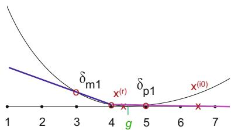

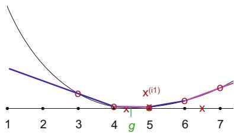  
Fig. 4 Adaptive deltas, another scenario. Left, I start with two deltas, centered around $x ^ { ( r ) } = 4 . 3$ Solving leads to $x ^ { ( i 0 ) } = 6 . 5$ , with $\delta _ { p 1 } = 2 . 5$ . Right, I add two x . . x .more positive deltas and resolve. The new solution is $x ^ { ( i 1 ) } = 5$ . an integer.

# Numerical Issues

The $x$ and delta values will rarely be truly integer, due to numerical issues and xconvergence tolerances in IPOPT. As such I always round $x$ to the nearest xinteger value before checking whether the solution is integer and feasible.

# 4.2 Uniquifying Weights

If the constraints are structured so that increasing one variable causes just one other variable to change, then a sufficient condition for the solution to be naturally integer is for all the objective function weights of the deltas (the derivatives of $f$ ) to be non-zero and unique, because in that case the fobjective is optimized when each delta is at its minimum (0) or maximum (1). This is not sufficient to guarantee integer solutions for models structured as in Figure 2 right or for sum-even variables. Still, unique weights are a good start. The base weight for a delta is the slope of the linearized objective function, as described before. I sort the weights, then rescale them to be in the same order. The scaled weights are between 1 and 1e6. The scaling includes a random perturbation. Consecutive weights are different from each

other by at least 0.01, even if the unscaled weights were the same. The 1–1e6 scaling helps IPOPT’s numerics.

# 4.3 Tilt to Encourage Integrality

If a variable is stubbornly non-integer, I increase the slope of the objective in the interval it is stuck in. In order to maintain convexity, I increase the slope of the objective by the same addition for all farther intervals; see Figure 1. If $x > g$ , then I increase the slope for all intervals greater than the current x > gone. The amount I increase the slope is about a factor of two more than the current slope of the stuck interval. I increase it more if $x$ is near to $\lceil x \rceil$ . I x xinclude a random perturbation to make degenerate weights less likely. The case of $x < g$ is a mirror of the $x > g$ case.

# 4.4 Adding Sum-Even Goals, Tilts and Bends

The sum-even constraints are curious. In principle they contribute nothing to the objective, because I do not prefer one even value over another. They contribute many non-convex constraints: a sum must be either 4, or 6, etc. In that sense they have a lot of freedom, but that freedom is spread out and difficult to explore. After the bends and tilts have succeeded for the interval variables, the sum-even variables are added and the process repeated. I assign a goal equal to the nearest integer value for each sum-even variable. (Recall the variable is half the number of loop intervals.) These are then treated as other integer values, except that I scale their delta weights to be larger than those of the other variables.

# 4.5 Wave Constraints for Enforcing Integrality

My last-resort is to add a wave-like constraints for each non-integer variable $x _ { i }$ ; see Figure 2. Constraint $c _ { i }$ is zero at integer values and grows as $x _ { i } ^ { 2 }$ nearby. xiSpecifically, $c _ { i } ( x _ { i } ) = \left( x _ { i } - \lfloor x _ { i } + 0 . 5 \rfloor \right) ^ { 2 }$ xiand is bounded above by 0.01. (I do ci xi xi xi .not bound it to exactly 0 for numerical and IPOPT tolerance reasons.) Note $c$ is continuous, but $c ^ { \prime }$ is discontinuous at half integers, and $c ^ { \prime \prime } = 2$ .

c cThe wave works well at snapping a variable to the nearest integer value. IPOPT has some global optimization capabilities. If the nearest wave trough is not feasible, IPOPT can jump to another trough. Unfortunately, it may jump over several troughs. Because of this snapping and jumping, it is better to bend and tilt first. The approach works well when several sum-even variables are intertwined through other constraints. The other objectives and constraints work to distribute the change and maintain integrality.

# 5 Results

All tests were done on a circa 2010 Mac workstation, 3.33 GHz 6-Core Intel Xeon CPU and 16 GB of 1333 MHz DDR3 RAM, compiled using Xcode 4.0.2.

# 5.1 Quality and Robustness

Figure 5a and Table 5b shows the compromises made between two sides of a mapping face. The deviations might be more concentrated in larger domains. E.g. one curve may have worse intervals if that allows many other curves to have better intervals. This compromise may arise through a chain of linked surfaces. The magnitude of the compromise is controlled by the polynomial degree of $f$ , cubic; the smaller the power the more concentrated fthe deviations. For the complex radish of Figure 2 right, I contrived some difficult weights, and NLIA still found an integer solution after two tilt phases affecting four variables each.

Table 1 Compromises for a two-curve and three-curve mapping constraint   

<table><tr><td colspan="3">two opposite curves</td><td colspan="6">one curve opposite two</td></tr><tr><td>gl</td><td>gh</td><td>x_l = x_h</td><td>gl</td><td>ga</td><td>gb</td><td>x_l = x_a+</td><td>xb</td><td></td></tr><tr><td>1</td><td>2</td><td>2</td><td>10</td><td>10</td><td>10</td><td>15</td><td>7</td><td>8</td></tr><tr><td>1</td><td>3</td><td>2</td><td>10</td><td>9</td><td>9</td><td>14</td><td>7</td><td>7</td></tr><tr><td>1</td><td>4</td><td>2</td><td>10</td><td>8</td><td>6</td><td>12</td><td>7</td><td>5</td></tr><tr><td>1</td><td>5</td><td>2</td><td>10</td><td>7</td><td>2</td><td>9</td><td>7</td><td>2</td></tr><tr><td>1</td><td>6</td><td>3</td><td>10</td><td>5</td><td>1</td><td>8</td><td>7</td><td>1</td></tr><tr><td>10</td><td>20</td><td>14</td><td>10</td><td>15</td><td>3</td><td>14</td><td>11</td><td>3</td></tr><tr><td>10</td><td>30</td><td>17</td><td>10</td><td>20</td><td>4</td><td>16</td><td>13</td><td>3</td></tr><tr><td>10</td><td>40</td><td>20</td><td>10</td><td>20</td><td>10</td><td>19</td><td>12</td><td>7</td></tr><tr><td>10</td><td>100</td><td>32</td><td>10</td><td>40</td><td>20</td><td>27</td><td>17</td><td>20</td></tr><tr><td>10</td><td>1000</td><td>100</td><td>10</td><td>100</td><td>50</td><td>42</td><td>27</td><td>15</td></tr></table>

# 5.2 Scaling

There are specific constraints for each meshing algorithm, for example two for mapping and one sum-even for paving. There is one constraint for each interval variable, to enforce the delta decomposition. The number of variables is not known a priori, since the delta decomposition is adaptive, but is typically a small constant (four) times the number of curves.

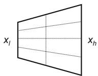  
(a) Two curves.

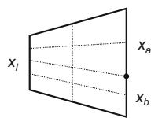  
(b) Three curves.

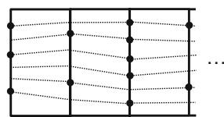  
(c) Scaling by: faces and . . .

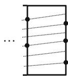

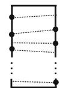  
(d) by curves.   
Fig. 5 Test surfaces

# Scaling by Faces

I studied the scaling by the number of constraints; see Table 2. I create a long chain of mapping faces sharing one common side; see Figure 5c. I created a random number of curves per side (averaging 6.6), and random goals (averaging 20) for each curve. I ran four variants, increasing the number of faces by a factor of about $\sqrt { 1 0 }$ each time. At around 100,000 variables and 16,000 constraints for the integer problem the linear algebra package MA27 had memory issues. HSL has better alternatives for large problems [8].

The conclusions are that NLIA solves this problem at the rate of about 1500 constraints / second for 6.5 variables / constraint; this rate decreases slightly with problem size, so the run-time is slightly worse than linear in

Table 2 NLIA scaling by number of faces for a chain of mapping faces with no sum-even constraints. Here “s” is time in seconds; “f” is $\#$ faces; and $x ^ { ( i ) } / x ^ { ( r ) }$ is x /xthe ratio of run-times for the integer bend problem and the relaxed problem.   

<table><tr><td>faces</td><td>curves</td><td>x(r) s</td><td>x(r) f/s</td><td>x(i) s</td><td>x(i) f/s</td><td>x(i)/x(r)</td><td>total s</td><td>total f/s</td></tr><tr><td>160</td><td>1,061</td><td>0.028</td><td>5700</td><td>0.061</td><td>2600</td><td>2.2</td><td>0.091</td><td>1800</td></tr><tr><td>505</td><td>3,298</td><td>0.067</td><td>7500</td><td>0.21</td><td>2400</td><td>3.1</td><td>0.27</td><td>1900</td></tr><tr><td>1,600</td><td>10,614</td><td>0.23</td><td>7000</td><td>0.74</td><td>2200</td><td>3.2</td><td>0.98</td><td>1600</td></tr><tr><td>5,050</td><td>32,793</td><td>0.80</td><td>6300</td><td>2.3</td><td>2200</td><td>2.9</td><td>3.2</td><td>1600</td></tr></table>

Table 3 NLIA scaling by number of curves for a single mapping face. Here “s” is time in seconds; and “c” is the number of curves = variables.   

<table><tr><td>curves</td><td>x(r) s</td><td>x(r) c/s</td><td>x(i) s</td><td>x(i) c/s</td><td>x(i)/x(r) time</td><td>total s</td><td>total c/s</td></tr><tr><td>2,000</td><td>0.027</td><td>74k</td><td>0.084</td><td>24k</td><td>3</td><td>0.11</td><td>18k</td></tr><tr><td>6,324</td><td>0.051</td><td>120k</td><td>0.37</td><td>17k</td><td>7</td><td>0.43</td><td>15k</td></tr><tr><td>20,000</td><td>0.14</td><td>140k</td><td>1.9</td><td>11k</td><td>14</td><td>2.0</td><td>10k</td></tr><tr><td>63,238</td><td>0.48</td><td>130k</td><td>7.0</td><td>9k</td><td>15</td><td>7.5</td><td>8k</td></tr><tr><td>200,000</td><td>2.0</td><td>100k</td><td>50</td><td>4k</td><td>25</td><td>52</td><td>4k</td></tr><tr><td>632,378</td><td>11</td><td>57k</td><td>430</td><td>1.5k</td><td>39</td><td>444</td><td>1.4k</td></tr></table>

the number of faces. Setting up and solving a single bend optimization problem is about three times as expensive as solving the relaxed problem; this is wonderful run-time for solving an integer optimization problem. By contrast, recall that an integer solution in LexIA required solving about as many subproblems as variables, so its $x ^ { ( i ) } / x ^ { ( r ) }$ ratio is in the thousands and grows super-linearly.

Usually no bend updates were necessary. For certain random number generator seeds in large problems, some bend updates were necessary: usually only one, and the most I ever observed was five. It appears that the total $\boldsymbol { x } ^ { ( i ) }$ time is slightly worse than linear in the number of bend updates needed.

# Scaling by Curves

I studied the scaling by the number of curves; see Table 3. I create a single mapping face with many curves on each side, with random goals; see Figure 5d. I ran five variants, increasing the number of curves by a factor of $\sqrt { 1 0 }$ each time. For these problems, no bend updates were necessary.

The conclusions are that NLIA solves a one-constraint problem at the rate of about 10,000 variables / second. This rate decreases with increasing problem size: empirically the time is about $O ( v ^ { 1 . 5 } )$ for $\boldsymbol { v }$ variables. A single O v vbend optimization problem is about six times as expensive as the relaxed problem. This gets worse as the problem size increases: $t ^ { ( i ) } \approx { \cal O } ( ( t ^ { ( r ) } ) ^ { 1 . 5 } )$ t O tempirically. This is still excellent timing for an integer optimization problem.

For both studies, the time for other steps, such as constructing the subproblem or bends, was insignificant compared to the solver time.

# 6 Conclusions

I have solved the Interval Assignment (IA) problem with a new optimization function and approach (NLIA). The first contribution is defining a nonlinear objective that quickly makes the major tradeoffs between intervals. The objective function is nonlinear, but simpler and much faster to solve than lexicographic min-max. The second contribution is to bend the nonlinear objective into a piecewise linear function. The third contribution is to tilt the objective. The bending and tilting are performed adaptively. These quickly get the variables to (mostly) nearby integer values, and keeps the optimization problem convex for as long as possible. Any remaining variables stuck at non-integer values are forced to integrality by a non-convex wave constraint. Initial tests show that NLIA produces good quality intervals, and very quickly. The runtime scaling is far superior to the standard approach of successive rounding for integer solutions. The software has an API, interfaces with MeshKit, and is part of the MeshKit open-source code repository.

# 6.1 Future Work and Alternatives

In the future, I would like to fill out the breadth of the implementation. Bending and tilting for sum-even variables needs to be implemented. I would like to add more types of scheme constraints. Fixed-interval curves need to be implemented. Fixed-intervals make the problem more constrained, and may lead to infeasibility, so the algorithms may need to be modified to handle this gracefully.

NLIA is fast but could be made more efficient when modifying and restarting the optimization problems. Since the modifications are small, we could reuse a lot of state information beyond just the prior solution. This would involve cracking open the solver and not treating it as a black box. Bommes et al. is also intrusive to the solver for efficiency.

The wave phase is somewhat unsatisfying to me, and IPOPT’s global search may move far from the prior solution. Given the partial bend and tilt solution, a variety of prior approaches could be used to finish off the problem instead [16]. A systematic exploration of nearby integer values might be better. Branch and bound is overkill because I do not need an optimal solution. Perhaps even the Ford heuristic for sum-even constraints, iteratively increasing the largest remaining odd-interval curve by one, could be adapted.

There are some choices for those wishing to re-implement the NLIA strategy in other contexts. IPOPT works well and is freely available. MA27 requires license negotiations for commercial use. It is possible to follow the NLIA strategy with only a linear optimization library: skip the relaxed phase and use only the piecewise linear objective from the integer phases. Adapting the objective function should still get one to the same final solution, just slower, depending on how far the optimal solution deviates from the goals.

Acknowledgements. Thanks to Tim Tautges for initiating and supporting this project, and his helpful feedback. Thanks to Tim Tautges and Rajeev Jain for MeshKit integration. Thanks to David Bommes for explaining his work to me and his helpful suggestions. Thanks to Carl Laird for explaining IPOPT.

This work was funded under the auspices of the Nuclear Energy Advanced Modeling and Simulation (NEAMS) program of the U.S. Department of Energy Office of Nuclear Energy, U.S. Department of Energy. Partial support for this work was provided through Scientific Discovery through Advanced Computing (SciDAC) program funded by U.S. Department of Energy, Office of Science, Advanced Scientific Computing Research. Sandia National Laboratories is a multi-program laboratory managed and operated by Sandia Corporation, a wholly owned subsidiary of Lockheed Martin Corporation, for the U.S. Department of Energy’s National Nuclear Security Administration under contract DE-AC04-94AL85000.

# References

1. Berkelaar, M.: lp solve software. version 2.0, circa (1996), http://lpsolve.sourceforge.net/   
2. Bommes, D., Campen, M., Ebke, H.-C., Alliez, P., Kobbelt, L.: Integer-grid maps for reliable quad meshing. ACM Trans. Graph 32(4) (to appear, 2013)   
3. Bommes, D., L´evy, B., Pietroni, N., Puppo, E., Silva, C., Tarini, M., Zorin, D.: State of the art in quad meshing. In: Eurographics STARS (2012)   
4. Bommes, D., Zimmer, H., Kobbelt, L.: Mixed-integer quadrangulation. ACM Trans. Graph. (TOG) 28(3), 77:1–77:10 (2009), Commercial version in Pixologic http://pixologic.com/zbrush/features/QRemesher-retopology/   
5. Bommes, D., Zimmer, H., Kobbelt, L.: Practical mixed-integer optimization for geometry processing. In: Proceedings of Curves and Surfaces 2010, pp. 193–206 (2010)   
6. Buchheim, C., Trieu, L.: Quadratic outer approximation for convex integer programming with box constraints. In: Bonifaci, V., Demetrescu, C., Marchetti-Spaccamela, A. (eds.) SEA 2013. LNCS, vol. 7933, pp. 224–235. Springer, Heidelberg (2013)   
7. Cand`es, E.J., Wakin, M.B., Boyd, S.P.: Enhancing sparsity by reweighted $l _ { 1 }$ lminimization. Journal of Fourier Analysis and Applications 14(5), 877–905 (2007) (Special issue on sparsity)   
8. HSL (formerly the Harwell Subroutine Library). A collection of Fortran codes for large scale scientific computation (2011), http://www.hsl.rl.ac.uk, Includes MA27. IPOPT specific instructions at http://www.hsl.rl.ac.uk/ipopt/   
9. Fourer, R., Gay, D.M., Kernighan, B.W.: AMPL: a Modeling Language for Mathematical Programming. Thomson/Brooks/Cole (2003)   
10. holycrapscience! holy crap l1 minimization (2011), http://holycrapscience.tumblr.com/post/1241604136/holy-crap-l1- minimization   
11. Jain, R., Tautges, T.J., Grindeanu, I., Verma, C., Cai, S., Mitchell, S.A.: MeshKit: an open-source library for mesh generation and meshing algorithm research. In: Symposium on Trends in Unstructured Mesh Generation, 12th U.S. National Congress on Computational Mechanics (2013)   
12. Kerr, R.A., Benzley, S.E., White, D.R., Mitchell, S.A.: A method for controlling skew on linked surfaces. In: Proceedings of the 8th International Meshing Roundtable, pp. 77–87 (October 1999) (SAND99-2288)   
13. Li, T.S., McKeag, R.M., Armstrong, C.G.: Hexahedral meshing using midpoint subdivision and integer programming. Computer Methods in Applied Mechanics and Engineering 124(1-2), 171–193 (1995)   
14. Marchi, E., Oviedo, J.A.: Lexicographic optimality in the multiple objective linear programming: The nucleolar solution. European Journal of Operational Research 57(3), 355–359 (1992)   
15. Mitchell, S.A.: Choosing corners of rectangles for mapped meshing. In: Proceedings of the Thirteenth Annual Symposium on Computational Geometry, SCG 1997, pp. 87–93. ACM, New York (1997)   
16. Mitchell, S.A.: High fidelity interval assignment. In: Proc. 6th International Meshing Roundtable 1997, pp. 33–44 (1997)   
17. Mitchell, S.A.: High fidelity interval assignment. International Journal of Computational Geometry and Applications 10(4), 399–415 (2000)

18. M¨ohring, R.H., M¨uller-Hannemann, M., Wiehe, K.: Mesh refinement via bidirected flows: Modeling, complexity, and computational results. J. ACM 44(3), 395–426 (1997)   
19. Ogryczak, W., Sliwi´ ´ nski, T.: Lexicographic max-min optimization for efficient and fair bandwidth allocation. In: International Network Optimization Conference, INOC (2007)   
20. Ruiz-Giron´es, E., Sarrate, J.: Generation of structured hexahedral meshes in volumes with holes. Finite Elem. Anal. Des. 46(10), 792–804 (2010)   
21. Shepherd, J., Benzley, S., Mitchell, S.: Interval assignment for volumes with holes. International Journal for Numerical Methods in Engineering 49(1-2), 277–288 (2000)   
22. Shepherd, J.F., Mitchell, S.A., Knupp, P., White, D.R.: Methods for multisweep automation. In: Proceedings, 9th International Meshing Roundtable, Sandia National Laboratories, pp. 77–87 (October 2000)   
23. Tam, T.K.H., Armstrong, C.G.: Finite element mesh control by integer programming. International Journal for Numerical Methods in Engineering 36, 2581–2605 (1993)   
24. W¨achter, A., Biegler, L.: Line search filter methods for nonlinear programming: Local convergence. SIAM Journal on Optimization 16(1), 32–48 (2005)   
25. W¨achter, A., Laird, C.: IPOPT software, in COIN-OR (2012), https://projects.coin-or.org/Ipopt (accessed 2012)   
26. White, D.R., Tautges, T.J.: Automatic scheme selection for toolkit hex meshing. International Journal for Numerical Methods in Engineering, 49–127 (2000)