24th International Meshing Roundtable (IMR24)

# Optimizing Corner Assignment of Submap Surfaces

Shengyong Caia , Timothy J. Tautgesb

aCD-adpaco, 10800 Pecan Blvd, Suite 210, Austin, Tx, 78750, U.S.A.

bCD-adapco, 1500 Engineering Dr, Madison, WI, 53706, U.S.A.

# Abstract

Submapping is a meshing tool for generating structured meshes on non-4-sided surfaces and non-6-sided volumes. An important part of submapping is the assignment of corners in the map to vertices bounding surfaces or edges bounding volumes. In models with fillet, chamfer and round features, corner assignment is difficult, since these features remove discontinuous changes in edge/surface normal, replacing them with features having smooth changes in normal direction. Also required for submapped surfaces and volumes is that corner or edge types bounding a surface or volume sum to four or six, respectively. This paper combines the use of templates to identify surface submapped corners for a variety of common feature types, and the use of an optimization approach to guarantee satisfaction of the $s u m = 4 - 4 g$ constraint for submapped surfaces (g is the number of holes). This approach not only works well in the presence of features, but can drastically reduce the user interaction required to set up and mesh models with many features.

$\circledcirc$ 2015 The Authors. Published by Elsevier Ltd. 2015 The Authors. Published by Elsevier Ltd. This is an open access article under the CC BY-NC-ND license (http://creativecommons.org/licenses/by-nc-nd/4.0/).

Peer-review under responsibility of organizing committee of the 24th International Meshing Roundtable (IMR24)

Keywords: Vertex types, submapping, templates, structured mesh, corner assignment;

# 1. Introduction

In the industrial and academic applications, the increasing complexity of finite element analysis of structures, fluid flow and interaction problems requires high mesh quality. A large amount of boundary-flow and structural problems require meshes to be boundary structured. Generally, it is almost impossible to generate structured meshes with high quality on real, complex geometry. Hence, manual processing of CAD geometry into well-structured zone is used, which is tedious and time consuming.

Structured meshes play an important role in quad and hex meshing, not only because they align well with model features, but also because by definition the 2d boundary of any swept hexahedral mesh must be a structured quadrilateral mesh. In a typical BREP-based mesh generation process, geometric entities of lower dimension are meshed first, proceeding to higher dimensions with pre-defined boundary mesh. For models meshed using the sweeping algorithm, where mesh faces are extruded into a 3rd dimension, the surfaces on the “side” of the swept region control which

【图表信息补充开始】
图表ID: figure_30
原图路径: E:\python\research-copilot-main\storage\parsed\Optimizing\images\51d9b5c70f70d2cd82ea711902926d5b6d9a39b244d22943932fd2a771f7194c.jpg
相对路径: images/51d9b5c70f70d2cd82ea711902926d5b6d9a39b244d22943932fd2a771f7194c.jpg
原始引用: 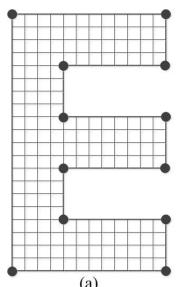

图表描述:
【图像类型】
这是一张展示 "E" 字形几何域上结构化四边形网格生成的示意图。

【详细描述】
该图片展示了一个呈大写字母 "E" 形状的二维几何域及其对应的计算网格。
1.  **几何形状与拓扑**：主体是一个具有多个分支的 "E" 形多边形。该形状包含两个明显的内凹角（re-entrant corners），位于 "E" 字形内侧的拐角处。
2.  **网格类型**：覆盖在该几何域上的是一个规则的结构化四边形网格（structured quadrilateral mesh）。网格线主要由水平和垂直线段组成，呈现出正交网格的特征。
3.  **节点分布**：图中使用黑色实心圆点标记了关键的拓扑节点（nodes/vertices）。
    *   左侧垂直边界上分布有6个节点（包括上下端点）。
    *   右侧三个水平分支的末端各有2个节点（即每个分支的右上角和右下角）。
    *   这些节点定义了网格的边界拓扑结构。
4.  **网格密度**：网格单元在垂直方向上排列较为紧密，水平方向上相对稀疏，整体呈现出均匀的矩形单元划分，未见明显的局部自适应加密（local adaptive refinement）迹象。
5.  **标签**：图片底部中央标有 "(a)"，表明这是多子图序列中的第一部分。

【可用于检索的关键词】
E-shaped domain, structured quadrilateral mesh, computational grid, re-entrant corners, node distribution, geometric topology, orthogonal grid, grid generation, boundary nodes, internal mesh, polygonal domain, mesh parameterization, corner singularities, finite element mesh
【图表信息补充结束】

【图表信息补充开始】
图表ID: figure_46
原图路径: E:\python\research-copilot-main\storage\parsed\Optimizing\images\80a0a89114cdff0f047cd99b4f52895e80cf33c1f2cd1f8c2faf0ddb4fb42e7c.jpg
相对路径: images/80a0a89114cdff0f047cd99b4f52895e80cf33c1f2cd1f8c2faf0ddb4fb42e7c.jpg
原始引用: 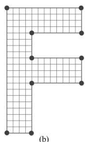

图表描述:
【图像类型】
一张展示非凸几何域（字母F形状）上结构化四边形网格划分的示意图。

【详细描述】
图片展示了一个呈大写字母 "F" 形状的二维几何区域，该区域被均匀的结构化四边形网格（structured quadrilateral mesh）完全覆盖。网格由一系列平行的水平线和垂直线交织而成，形成了规则的矩形单元（rectangular elements）。在 "F" 形状的边界关键点处，标记有黑色的实心圆点，这些点主要分布在：
1.  最左侧竖条的左上角和左下角；
2.  竖条右侧的三个内凹角（re-entrant corners）；
3.  上方和中间两个横向臂的右端点。
这些黑点可能代表了网格的节点（nodes）或用于定义网格拓扑的控制点。图片底部标有 "(b)"，表明这是系列图中的子图。整体网格呈现出明显的边界贴合（boundary-conforming）特征，且单元尺寸在整个区域内保持一致，暗示这可能是一种基于参数化映射（parameterization-based mapping）或映射网格技术（mapped meshing）生成的网格。

【可用于检索的关键词】
structured quadrilateral mesh, letter F shape, non-convex domain, re-entrant corner, uniform grid, mapped meshing, node placement, boundary-conforming mesh, rectangular elements, parameterization, computational geometry, finite element mesh, geometric domain discretization, control points
【图表信息补充结束】

  
Fig. 1. Structured quadrilateral mesh for letter “E” and “F” surface

【图表信息补充开始】
图表ID: figure_74
原图路径: E:\python\research-copilot-main\storage\parsed\Optimizing\images\d7dac49d2f600f50089ad544e4b84c2d0739082cadefcfca508136fc1c72bcbe.jpg
相对路径: images/d7dac49d2f600f50089ad544e4b84c2d0739082cadefcfca508136fc1c72bcbe.jpg
原始引用: 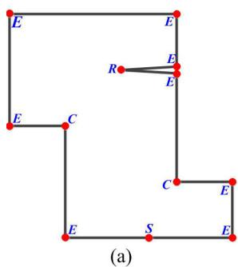

图表描述:
【图像类型】
几何边界示意图（CAD/B-rep 模型输入图）

【详细描述】
这是一张展示非凸多边形（non-convex polygon）几何边界的示意图，通常用作计算几何或网格生成算法的测试模型。
1.  **几何结构**：图形主体由黑色的粗实线勾勒出封闭的多边形轮廓。该多边形具有多个内凹角（re-entrant corners），呈现出复杂的几何形态。
2.  **顶点与标记**：
    *   图中的关键位置（顶点和边上的点）使用红色的实心圆点标记。
    *   每个红点旁都有蓝色的字母标签，用于区分点的类型或属性：
        *   **'E'**：出现在大部分顶点上（如左上角、左下角、右下角等），可能代表 "Edge"（边端点）或 "External"（外部节点）。
        *   **'C'**：明确标记在两个凹角处（左侧中部和右侧中部的拐角），可能代表 "Corner"（角点）或 "Concave"（凹点）。
        *   **'S'**：标记在底部水平边的中间位置，可能代表 "Segment"（段点）或 "Source"。
        *   **'R'**：位于右上方的一条短水平边上，指向一个点，其右侧紧邻两个标记为 'E' 的点。这可能表示一个特殊的几何特征，如裂纹尖端（crack tip）、重合点或特定的约束点。
3.  **布局**：图片底部标有 "(a)"，表明这是系列图中的第一个子图。

【可用于检索的关键词】
non-convex polygon, re-entrant corner, boundary representation, geometric model, vertex labeling, mesh generation input, CAD geometry, concave boundary, topological features, grid generation test case, complex domain, point classification, edge detection, structural analysis
【图表信息补充结束】

【图表信息补充开始】
图表ID: figure_45
原图路径: E:\python\research-copilot-main\storage\parsed\Optimizing\images\7c41e7e4130876c9186b327f756e10126cc12536c86c6540c539321e9e9bd232.jpg
相对路径: images/7c41e7e4130876c9186b327f756e10126cc12536c86c6540c539321e9e9bd232.jpg
原始引用: 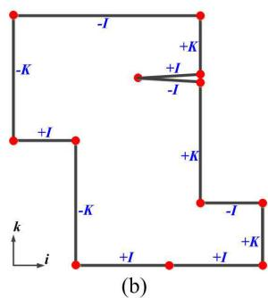

图表描述:
【图像类型】
几何拓扑与参数化方向示意图（常用于结构化网格生成或CAD边界表示）。

【详细描述】
该图片展示了一个标记为“(b)”的二维几何多边形边界示意图，主要用于说明边界参数化或拓扑连接关系。
1.  **整体结构**：图中有一个黑色的闭合多边形轮廓，其顶点处均标有红色的实心圆点。左下角绘制了一个局部坐标系，指示 $i$ 轴水平向右，$k$ 轴垂直向上。
2.  **边界标记**：多边形的各条边上标注了蓝色的方向符号，包括 `+I`、`-I`、`+K` 和 `-K`。这些标记似乎定义了边界在参数化空间中的方向或对应关系：
    *   **顶部水平边**：标记为 `-I`。
    *   **左侧垂直边**：标记为 `-K`。
    *   **中部凹口结构**：左侧有一个向内凹陷的区域。其水平边标记为 `+I`，其下方的垂直边标记为 `+I`（此处标记可能指代参数化方向而非物理方向），再下方的垂直边标记为 `-K`。
    *   **底部水平边**：主要部分标记为 `+I`，但在凹口下方的一段水平线段标记为 `-K`。
    *   **右侧突出结构（“舌头”状）**：右侧壁向左伸出一个细长的矩形突出部。其上边缘标记为 `+I`，下边缘标记为 `-I`。该突出部右端的垂直连接线标记为 `+K`。
    *   **右侧垂直边**：右上方的长垂直边标记为 `+K`，右下方的短垂直边标记为 `+K`。
    *   **其他边**：右下角的水平短边标记为 `-I`。
3.  **几何特征**：图形呈现出非凸多边形的特征，包含凹口和悬垂（或突出）结构。这种标记方式常见于结构化网格生成算法中，用于定义边界上的参数映射（Mapping）或确保相邻网格块之间的拓扑一致性（如 G1 连续性或方向匹配）。

【可用于检索的关键词】
polygonal boundary, topological marking, parameterization direction, structured mesh generation, boundary condition, vertex connectivity, edge orientation, CAD geometry, directional label, computational domain, mapped mesh, parameterization-based meshing, boundary-conforming mesh, geometric topology
【图表信息补充结束】

【图表信息补充开始】
图表ID: figure_18
原图路径: E:\python\research-copilot-main\storage\parsed\Optimizing\images\3074e2e198c82cf08fbdf79e9704c2ea04bd17f083ac990aeddb4534511589d6.jpg
相对路径: images/3074e2e198c82cf08fbdf79e9704c2ea04bd17f083ac990aeddb4534511589d6.jpg
原始引用: 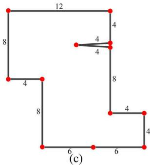

图表描述:
【图像类型】
几何模型示意图 / 计算几何测试用例

【详细描述】
图(c)展示了一个具有内部特征的二维几何域边界示意图，通常用于网格生成算法或计算几何算法的基准测试。
1.  **外部轮廓**：主体是一个不规则的多边形闭合区域，所有顶点均用红色圆点标记。
    *   顶部是一条水平线段，长度标注为 12。
    *   左侧是一条垂直线段，长度标注为 8。
    *   左下方有一个凹角结构，水平段长度标注为 4，随后垂直向下段长度标注为 8。
    *   底部是一条水平长边，被中间的节点分为两段，每段长度标注为 6（总长 12）。
    *   右侧轮廓呈阶梯状下降：首先垂直向下长度为 8，接着水平向右长度为 4，最后垂直向下长度为 4。
2.  **内部特征**：在右侧长度为 8 的垂直边上，有一个向内（向左）延伸的三角形特征，形似裂纹或切口。该三角形的两条边长度均标注为 4，汇聚于一点指向图形内部。
3.  **标注信息**：图中所有关键线段的长度均有明确的数字标注，且底部标有“(c)”，表明这是系列图中的第三张。

【可用于检索的关键词】
geometric domain, polygon boundary, internal crack, triangular notch, mesh generation benchmark, complex geometry, topological features, dimensioned sketch, vertex nodes, computational geometry test case, irregular polygon, boundary definition
【图表信息补充结束】

【图表信息补充开始】
图表ID: figure_67
原图路径: E:\python\research-copilot-main\storage\parsed\Optimizing\images\c3884b118399fed60f75ecf97403351906e013cd7ae299537737a5da76735180.jpg
相对路径: images/c3884b118399fed60f75ecf97403351906e013cd7ae299537737a5da76735180.jpg
原始引用: 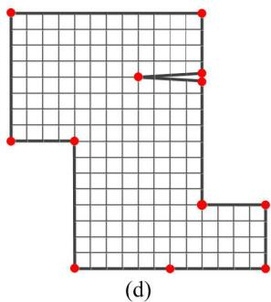

图表描述:
【图像类型】
L形区域的结构化四边形网格划分示意图（子图d）。

【详细描述】
图中展示了一个L形二维几何域的结构化网格划分结果。
- **几何形状**：主体为一个L形的平面区域，具有明显的直角边界和凹角（内角为270度）。
- **网格结构**：区域内部被规则的正方形四边形网格完全填充，网格线相互正交，呈现出典型的结构化网格（Structured Mesh）或张量积网格（Tensor-product Grid）特征。
- **节点分布**：图中用红色圆点标记了关键的网格节点。这些节点主要分布在几何边界上，同时也出现在内部。
- **局部细节**：在右侧垂直边界的中部附近，存在一个特殊的局部结构。边界上有两个相邻的红色节点，向网格内部延伸出一个红色节点，这三个点通过黑色连线构成了一个极扁的三角形结构，这可能代表了局部的网格加密、奇异点处理或特定的边界条件施加位置。
- **标签**：图片底部标有“(d)”，表明这是多子图序列中的一幅。

【可用于检索的关键词】
L-shaped domain, structured quadrilateral mesh, tensor-product grid, boundary nodes, internal nodes, mesh connectivity, geometric singularity, subfigure (d), regular grid, node placement, boundary-conforming mesh, orthogonal grid lines, local triangular feature, CAD geometry
【图表信息补充结束】

【图表信息补充开始】
图表ID: figure_75
原图路径: E:\python\research-copilot-main\storage\parsed\Optimizing\images\d7e404b3e5687c238e47e6fd7b8890395697872a440eec55baf180cbb483af54.jpg
相对路径: images/d7e404b3e5687c238e47e6fd7b8890395697872a440eec55baf180cbb483af54.jpg
原始引用: 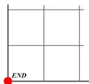

图表描述:
【图像类型】
局部结构化网格与边界标记示意图。

【详细描述】
该图片展示了一个局部的二维结构化网格结构。图中主要由正交的细灰色直线构成，包括两条垂直线和两条水平线，它们相互交叉将空间划分为四个矩形区域（quadrilateral elements）。左侧边缘和底部边缘绘制有较粗的黑色实线，可能代表计算域的边界或坐标轴。在左下角粗黑线的交点处，有一个醒目的红色实心圆点，紧邻其右侧标注有黑色大写英文单词 "END"，这通常用于标记网格生成的起点、终点或特定的几何特征点。整体呈现出规则的网格拓扑结构。

【可用于检索的关键词】
structured mesh, rectangular grid, orthogonal lines, boundary line, corner node, red marker, END label, quadrilateral elements, grid topology, local mesh structure, geometric discretization, mesh generation diagram, regular grid pattern, computational domain boundary
【图表信息补充结束】

  
Fig. 2. The work flow of submapping algorithm: (a) corner assignment(or vertex classification) where $E  E N D$ , $S  S I D E$ , C → CORNER and R → REVERS AL; (b) edge parameterization; (c) edge discretization; (d) interior node interpolation for structured quad mesh

【图表信息补充开始】
图表ID: figure_84
原图路径: E:\python\research-copilot-main\storage\parsed\Optimizing\images\edb48320b09326c21a75f81f56c100cf5a90427a6ab516a3f23f4f22f4d4392a.jpg
相对路径: images/edb48320b09326c21a75f81f56c100cf5a90427a6ab516a3f23f4f22f4d4392a.jpg
原始引用: 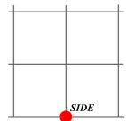

图表描述:
【图像类型】
几何/网格边界示意图

【详细描述】
图中展示了一个局部的二维正交网格结构。画面主要由细灰色的垂直线和水平线组成，线条相互垂直交叉，形成了规则的矩形网格单元（quad cells）。特别值得注意的是，图像底部有一条明显加粗的水平实线，这通常代表计算域的物理边界或几何边界。在该加粗底边的中心位置，有一个醒目的红色实心圆点，紧邻其右侧标注有黑色大写英文单词 "SIDE"。这一结构暗示了该图可能用于说明边界条件设置、网格节点定位或特定边界段的标识。整体网格呈现出高度规则的结构化特征。

【可用于检索的关键词】
structured quadrilateral mesh, orthogonal grid, boundary line, geometric boundary, red node point, SIDE label, computational domain boundary, rectangular elements, boundary-conforming mesh, grid topology, control point, mesh generation, CAD geometry, finite element mesh
【图表信息补充结束】

【图表信息补充开始】
图表ID: figure_24
原图路径: E:\python\research-copilot-main\storage\parsed\Optimizing\images\3f46591cb847f885c6d187cd7a2b0c0ca8a1fc75fc67b392cfd117a6011eb53f.jpg
相对路径: images/3f46591cb847f885c6d187cd7a2b0c0ca8a1fc75fc67b392cfd117a6011eb53f.jpg
原始引用: 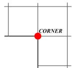

图表描述:
【图像类型】
计算几何与网格拓扑结构示意图

【详细描述】
图中展示了一个局部网格结构的示意图，主要用于说明网格节点的类型。背景由细灰色线条构成的正交网格组成，呈现出规则的矩形单元分布。画面中心有一个醒目的红色实心圆点，该点精确地位于两条加粗的黑色线条（一条水平、一条垂直）的交汇处。这两条加粗线条形成了一个直角拐角形状，暗示了边界的转折或不同区域的连接。在红点的右侧紧邻位置，标注有黑色的斜体英文单词 "CORNER"。这一图示通常用于解释在 CAD 建模或网格生成（Meshing）过程中，当边界发生 90 度转折或多个面片汇聚时形成的角点（Corner Node）拓扑特征。

【可用于检索的关键词】
corner node, mesh topology, grid intersection, boundary vertex, geometric feature, orthogonal grid, mesh generation, corner point, topological singularity, vertex classification, CAD modeling, B-rep features, structural grid, mesh refinement, geometric constraint
【图表信息补充结束】

【图表信息补充开始】
图表ID: figure_28
原图路径: E:\python\research-copilot-main\storage\parsed\Optimizing\images\4e7c3c83029fdcc20c69ab3cbaffea247e1762852ae702c3aad0c5a82e48a436.jpg
相对路径: images/4e7c3c83029fdcc20c69ab3cbaffea247e1762852ae702c3aad0c5a82e48a436.jpg
原始引用: 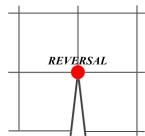

图表描述:
【图像类型】
网格结构或几何参数化过程中的异常现象示意图（Reversal）。

【详细描述】
图片展示了一个正交网格（orthogonal grid）的局部视图。在网格中心的一个节点（node）处，标记有一个红色的实心圆点，其正上方标注有大写英文单词 "REVERSAL"（反转）。从该红色节点向下延伸出两条黑色线段，汇聚成一个尖锐的倒V形或三角形结构。这通常用于说明在网格生成、参数化或变形过程中，网格单元（element）或拓扑连接发生的“反转”现象，例如单元法向量方向错误、顶点顺序颠倒（clockwise vs counter-clockwise）或几何形状的严重扭曲。

【可用于检索的关键词】
reversal, grid node, orthogonal grid, element inversion, topological anomaly, mesh distortion, singularity, geometric parameterization, vertex ordering, face normal, mesh quality, grid generation, structural grid, local refinement
【图表信息补充结束】

  
Fig. 3. Four vertex types for submapping method

direction the mesh is swept. Thus, successful application of the sweeping algorithm depends on proper definition of the structured meshes on the sides of the swept region. For complex CAD models of industrial parts, having blends, fillets, and other design features, locating the corners of the map on these surfaces can be challenging. Traditional approaches to this problem depend on angles being close to integer multiples of $\pi / 2$ , however, design features typically smooth out these abrupt changes on surfaces, usually to avoid stress concentrations or other singularities. In this work, we combine template-based identification with an optimization-based method to improve identification of corners for structured mesh surfaces.

Structured mesh regions can have four “sides”, separated from each other by so-called “corners”, and parameterized in an integer $( i , k )$ space; such meshes are referred to as “mapped” meshes. However, one can also define structured meshes with more than four sides; these are referred to as “submap” surfaces, afterwards the submapping algorithm is used to generate structured quad mesh, first described in Ref. [3]. Examples of submapped meshes are shown in Fig. 1 where any interior node is shared by exactly four quad elements. Submapping consists of four main steps shown in Fig. 2, that is, vertex classification or corner assignment (Fig. 2(a)), edge parameterization (Fig. 2(b)), edge discretization (Fig. 2(c)) and interior node interpolation (Fig. 2(b)). First, the corner assigned on each vertex should be done so that structured meshes can be embedded into geometries with high mesh quality. There are four vertex types, that is, END, SIDE, CORNER and REVERSAL. They are shared by one, two, three and four quad elements, respectively (see Fig. 3). Then edges are parameterized in the local 2D space along i and $k$ . Those geometric edges can be classified as +i, −i, $+ k$ or $- k$ . In order to make resulting meshes structured, interval assignment for boundary edges must be resolved [13], namely, the number of divisions on all the $+ i$ and $+ k$ edges should be equal to that of

all the $- i$ and $- k$ edges, respectively. After boundary mesh discretization, interior nodes are interpolated based on transfinite interpolation with those discretized boundary mesh nodes.

“Map” surface/volume meshes can be parameterized as a 2D/3D space of logical $( i , j , k )$ parameters, with various methods used to derive spatial embedding. Map meshes of $d$ dimensions always have $2 d$ logical sides $4 / 6$ for surface/volume meshes, respectively). Traversing around the boundary of a map mesh, the points where a transition is made from one side to another are referred to as “corners” in the map; corners also determine the number of quadrilaterals/hexahedra will share the vertex/edge at the corner. In contrast to map meshes, submap meshes can have more than $2 d$ logical sides. Both map and submap meshes are structured quad/hex meshes, that is, each interior node is connected to $2 d$ other nodes and $2 ^ { d }$ d-dimensional elements. For example, consider faces shaped like the block letters “E” and “F” shown in Fig. 1. These faces can be given structured meshes with more than four sides (12 for “E” and 10 for “F”). A corner of a submap mesh is any point/vertex adjacent to two different logical sides (this concept is elaborated more in the following section). Map meshes can be considered as a special case of submap meshes; subsequent discussions using the term “submap” are understood to apply equally (sometimes trivially) to map meshes as well.

Given a geometric face, e.g. from a BREP model, the steps described in Fig. 3 are required to generate submap meshes. The primary focus of this work is the first step, identification of corners for the submap. In practice, this task is not as straightforward as it is for our “E” and “F” examples described above. First, while it is obvious how many quadrilaterals should be connected to a vertex between sides meeting at 90, 180, or 270 degrees, it is less clear what to do for other angles. Furthermore, there can be multiple valid ways to resolve a vertex at a given angle; for example, 2, 3, and even 4 quadrilaterals can be connected at a 180-degree vertex, at least from the perspective of FEA 1. Previous work has shown that vertex types bounding a geometric face must meet a $s u m = 4 - 4 * g$ constraint[3,4], but for nontrivial surfaces, there are many different ways to meet that constraint depending on how corners are assigned. Finally, it has also been shown that corner assignment on faces also influences the meshability of volumes using sweeping[1,2]. Therefore, corner assignment affects not only the quality of the resulting mesh, but also the meshability of both the surface(s) and volume(s).

In previous work, Whiteley et al.[3] presented a heuristic method for submapping. First, corner assignment is done purely based on angles. For vertices with so-called “fuzzy angles”, i.e., those angles far away from integer multiple of $\pi / 2$ , the user is required to assign vertex types. The other steps in the submapping process are described as before. The limitation is that the method described by Whiteley et al.[3] requires user effort to assign vertex types at ambiguous angles. More recently, Ruiz-Girones et al.[4] presented an algorithm to improve the vertex classification during submapping. In order to overcome drawbacks of the heuristic submapping algorithm, they used optimization to improve the initial classification of surface vertices in such a way that necessary conditions were satisfied. They proposed an objective function that minimized differences between new vertex classification and heuristic angle-based vertex classification. However, they also constrained vertex type changes to no more than one in either direction. In practice, that constraint sometimes prevents convergence of the optimization problem to a feasible solution (this example is described later in this paper (Fig. 9)). The solution described in this paper uses a similar optimizationbased approach as was used by Ruiz et. al, but with the addition of templates to handle features commonly found in real-world geometric models.

This paper is structured as follows: in Section 2 provides a statement of the problem of assigning corners for the submapping problem. Our algorithm for optimal corner assignment is described in Section 3, and includes templates in Section 3.1 and vertex type adjustment based on optimization in Section 3.2. Section 4 describes edge discretization and interior node interpolation following corner determination. Finally, examples are shown in Section 5 and conclusions are made in Section 6.

【图表信息补充开始】
图表ID: figure_25
原图路径: E:\python\research-copilot-main\storage\parsed\Optimizing\images\467b90735476beac77f6e1a1898515780e8ed37a08000a83cdd43af5a0c13dda.jpg
相对路径: images/467b90735476beac77f6e1a1898515780e8ed37a08000a83cdd43af5a0c13dda.jpg
原始引用: 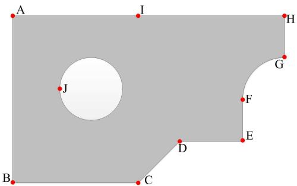

图表描述:
【图像类型】
CAD几何模型示意图 / 边界表示（B-rep）几何体

【详细描述】
图中展示了一个二维平面几何实体（灰色填充区域），其边界由直线段和圆弧组合而成，且内部包含一个圆形孔洞（白色区域）。
1.  **外部边界拓扑**：
    *   左侧边界为垂直线段 AB。
    *   顶部边界为水平线段 AH，其中点 I 位于 A 和 H 之间。
    *   底部边界从左下角 B 开始，水平向右延伸至点 C。
    *   从点 C 开始，边界变为斜线段 CD，连接至点 D。
    *   从点 D 开始，边界水平向右延伸至点 E。
    *   从点 E 开始，边界垂直向上延伸至点 F。
    *   从点 F 开始，边界是一段向外凸出的圆弧 FG，连接至点 G。
    *   从点 G 开始，边界垂直向上延伸至右上角顶点 H。
2.  **内部特征**：
    *   几何体内部左侧包含一个圆形的孔洞（白色区域）。
    *   点 J 标记为该圆孔的圆心。
3.  **标注信息**：
    *   图中使用了红色圆点标记了所有的关键几何节点（顶点、转折点、圆心等），并用大写字母 A 到 J 进行了明确标注。

【可用于检索的关键词】
circular hole, perforated plate, rounded boundary, complex geometry, boundary representation, B-rep model, non-convex polygon, geometric modeling, feature points, topological structure, straight edges, curved edges, CAD geometry, meshing domain, geometric constraints
【图表信息补充结束】

  
Fig. 4. A problematic example of corner assignment by angle-based approach

# 2. Problem Statement

The surface vertex type for submapping is defined as the classification of the topology of a vertex bounding a structured all-quadrilateral surface mesh by the number of quadrilaterals on the surface that share that vertex. Let $\theta _ { i }$ be an internal angle between two adjacent geometric edges at a vertex i bounding a surface. The traditional vertex type $\overline { { \alpha _ { i } } }$ is defined as

$$
\overline {{\alpha_ {i}}} = \left\lfloor 2 \left(1 - \frac {\theta_ {i}}{\pi}\right) \right] \tag {1}
$$

where $\lfloor * \rceil$ is an integer operator which returns the nearest integer to a real value. Then the surface vertex type can be defined as follows:

$$
\bar {\alpha_ {i}} = \left\{ \begin{array}{l l} 1 & \text {f o r E N D v e r t e x} \\ 0 & \text {f o r S I D E v e r t e x} \\ - 1 & \text {f o r C O R N E R v e r t e x} \\ - 2 & \text {f o r R E V E R S A L v e r t e x} \end{array} \right. \tag {2}
$$

For a simply-connected polygon with discrete internal vertex angles $\theta _ { i }$ , the sum of $\overline { { \alpha _ { i } } }$ must be equal to 4.

$$
0 * S + 1 * E + (- 1) * C + (- 2) * R = 4 \tag {3}
$$

where S , E, C and $R$ are the number of SIDE, END, CORNER and REVERSAL vertices. For a multiply-connected submapped surface with $g$ holes, the sum of vertex types must be $4 - 4 * g$ :

$$
\sum_ {i = 1} ^ {N} \overline {{\alpha_ {i}}} = 0 * S + 1 * E + (- 1) * C + (- 2) * R = 4 - 4 * g \tag {4}
$$

Equation (4) can be interpreted as constraints on vertex types for a surface to be submapped.

In practice, corner assignment purely based on angles may not result in a surface being submappable, because it fails to satisfy Eqn. (4). First, it is relatively common for angles between two adjacent edges on a face to not be an integer multiple of $\pi / 2$ , such as the vertex $C$ and $D$ in Fig. 4. In this case, the heuristic classification of vertices may lead to unacceptable results which do not satisfy Eqn. (4). Furthermore, real-world design models often smooth out abrupt angles at edge or face intersections, to eliminate stress concentrations and other physical singularities there. For example, discrete angles at the vertex $F$ and $G$ in Fig. 4 are smoothed out. In these cases, the geometric (continuous) angle appears to be 270 degrees, while the discrete angle appearing in the mesh at that point might be quite different, depending on the characteristic mesh size at that point. There is another point to be noted that angle-based approach for assigning corners suffers from the same problem of spreading discrete angles into continuous angles when there is a geometry with round features such as the vertex $J$ in Fig. 4.

# 3. Optimal Corner Assignment

In this section, an optimal corner assignment algorithm for submapping is demonstrated. In order to deal with those round, fillet and chamfer features on surfaces, they are relaxed and angle-based constraints are changed by

【图表信息补充开始】
图表ID: figure_1
原图路径: E:\python\research-copilot-main\storage\parsed\Optimizing\images\0381406ea5c994158035213afadfc2209fdfa72e019af2ef747d209346fd843f.jpg
相对路径: images/0381406ea5c994158035213afadfc2209fdfa72e019af2ef747d209346fd843f.jpg
原始引用: 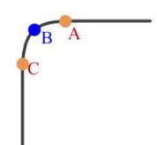

图表描述:
【图像类型】
几何结构图（展示圆角过渡区域的边界定义）

【详细描述】
该图片展示了一个二维几何边界的局部细节，主要表现了一个直角转弯处的圆角（fillet）过渡结构。
1.  **边界线条**：图中有一条黑色的粗实线轮廓。左侧为一条垂直向下的直线段，上方为一条水平向右的直线段。这两条直线段通过一段平滑的圆弧连接，形成一个内凹的圆角。
2.  **关键几何点**：
    *   **点 A**（橙色）：位于上方的水平直线上，紧邻圆弧与直线的连接处。
    *   **点 B**（蓝色）：位于中间的圆弧段上，大致处于圆弧的中间位置或切点附近。
    *   **点 C**（橙色）：位于左侧的垂直直线上，紧邻圆弧与直线的连接处。
3.  **几何关系**：这三个点（A、B、C）共同定义了该圆角区域的几何特征，可能用于指示圆角的半径、切点位置或作为网格划分时的边界控制点。

【可用于检索的关键词】
rounded boundary, arc segment, straight edge, geometric points, corner fillet, boundary contour, 2D geometry, CAD sketch, geometric feature, local refinement, mesh boundary, tangent point, geometric constraint, corner transition
【图表信息补充结束】

【图表信息补充开始】
图表ID: figure_22
原图路径: E:\python\research-copilot-main\storage\parsed\Optimizing\images\3f08c4a8b7870c7edc1e16ea1fcf42e418b03baa79aab14669a0eaab2788fdb8.jpg
相对路径: images/3f08c4a8b7870c7edc1e16ea1fcf42e418b03baa79aab14669a0eaab2788fdb8.jpg
原始引用: 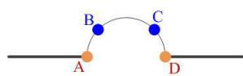

图表描述:
【图像类型】
几何示意图，展示直线与曲线上的点分布及拓扑连接关系。

【详细描述】
该图展示了一个简单的二维几何结构，主要用于说明曲线与直线的几何关系。
- 底部有一条黑色的水平直线。
- 直线上有两个橙色的实心圆点，分别标记为红色字母 "A" 和 "D"。这两个点既是直线上的点，也是上方曲线的端点。
- 从点 A 出发，有一条黑色的弧线（curved edge）向上隆起，形成一个拱形结构，最终连接到点 D。
- 在这条弧线上有两个蓝色的实心圆点，分别标记为 "B" 和 "C"。
- 点 B 位于曲线的左侧上升段（A 与顶点之间），点 C 位于曲线的右侧下降段（顶点与 D 之间）。
- 该图可能用于解释参数化曲线（如贝塞尔曲线或样条曲线）的定义，其中 A 和 D 为端点（endpoints），B 和 C 为曲线上的中间采样点或控制点。

【可用于检索的关键词】
curved edge, straight line, geometric primitives, parametric curve, endpoints, intermediate points, boundary representation, B-rep, spline approximation, node distribution, 2D geometry, arc segment, topological connectivity, geometric modeling
【图表信息补充结束】

【图表信息补充开始】
图表ID: figure_20
原图路径: E:\python\research-copilot-main\storage\parsed\Optimizing\images\33367325033a2d7923483c69a5038febf17055e919824d7d081220d7f430b9e7.jpg
相对路径: images/33367325033a2d7923483c69a5038febf17055e919824d7d081220d7f430b9e7.jpg
原始引用: 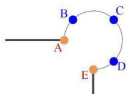

图表描述:
【图像类型】
几何拓扑示意图，展示了带有特定颜色标记的控制点及延伸线段。

【详细描述】
该图展示了一个局部的几何边界结构，主要由一条圆弧曲线和两条直线段组成。
1.  **曲线部分**：主体是一条平滑的圆弧曲线（circular arc），从左下向右上再向右下弯曲。
2.  **节点分布**：沿圆弧曲线分布着五个关键节点，按顺时针顺序依次标记为大写字母 A、B、C、D、E。
    *   **节点 A** 和 **节点 E** 显示为**橙色**实心圆点。
    *   **节点 B**、**节点 C** 和 **节点 D** 显示为**蓝色**实心圆点。
3.  **直线延伸**：
    *   从**节点 A** 处向左水平延伸出一条黑色的直线段。
    *   从**节点 E** 处垂直向下延伸出一条黑色的直线段。
这种结构通常用于定义几何模型的边界条件、网格划分的控制点序列或参数化曲线的采样点。

【可用于检索的关键词】
circular arc, boundary definition, geometric nodes, point distribution, orange nodes, blue nodes, line segment extension, topological connection, mesh generation control points, parametric curve, node labeling, boundary-conforming, geometric modeling, CAD geometry, curve sampling
【图表信息补充结束】

【图表信息补充开始】
图表ID: figure_73
原图路径: E:\python\research-copilot-main\storage\parsed\Optimizing\images\d58ef0a7eedf18d76466308c41781e398515ccb3913b4bebbc294f3ed157ff08.jpg
相对路径: images/d58ef0a7eedf18d76466308c41781e398515ccb3913b4bebbc294f3ed157ff08.jpg
原始引用: 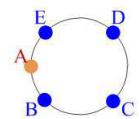

图表描述:
【图像类型】
几何示意图，展示圆周上的离散节点分布及拓扑标记。

【详细描述】
图中展示了一个由黑色细线绘制的圆形轮廓。圆周上分布着五个离散的节点，分别用大写字母 A、B、C、D、E 进行标记。
- 节点 A 位于圆周的左侧（约9点钟方向），颜色为橙色，与其他节点形成鲜明对比，可能表示起始点、目标点或当前处理对象。
- 节点 B、C、D、E 均为深蓝色实心圆点。
- 从空间分布来看，若按逆时针方向观察，节点顺序依次为 A、B、C、D、E，它们大致均匀地分布在圆周上，构成了一个内接于圆的五边形顶点布局。
- 该图常用于说明边界离散化、参数化映射或网格生成中的边界节点定义。

【可用于检索的关键词】
circular boundary, discrete nodes, boundary discretization, perimeter points, topological connectivity, geometric parameterization, mesh boundary, start node, uniform distribution, circular arc, vertex arrangement, boundary representation, CAD geometry, node indexing
【图表信息补充结束】

【图表信息补充开始】
图表ID: figure_34
原图路径: E:\python\research-copilot-main\storage\parsed\Optimizing\images\5c50e5ae23bbab7e29bc0d1cb501990b8d0b3b03872700009a130161b7a96d4b.jpg
相对路径: images/5c50e5ae23bbab7e29bc0d1cb501990b8d0b3b03872700009a130161b7a96d4b.jpg
原始引用: 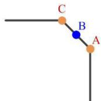

图表描述:
【图像类型】
几何结构示意图，展示了折线边界及关键节点分布。

【详细描述】
该图片展示了一个简单的几何折线结构，通常用于表示CAD模型的边界或网格生成的初始几何。结构主要由三部分组成：左侧的一条水平线段，右侧的一条垂直线段，以及连接两者的中间倾斜线段。
图中明确标注了三个关键点：
1.  **点C**（橙色圆点）：位于水平线段与倾斜线段的连接处，即上方的拐角节点。
2.  **点A**（橙色圆点）：位于倾斜线段与垂直线段的连接处，即下方的拐角节点。
3.  **点B**（蓝色圆点）：位于倾斜线段AC的中间位置，作为一个内部采样点或细分点。
所有点的标签（A, B, C）均以红色字体显示在对应点的右上方或右侧。这种图示常见于讨论几何拓扑、网格离散化或边界条件设置的论文中。

【可用于检索的关键词】
polyline geometry, boundary nodes, segment connectivity, corner vertices, internal node, geometric topology, mesh discretization, CAD boundary, discrete sampling, structural diagram, geometric modeling, boundary representation, node distribution, line segments
【图表信息补充结束】

【图表信息补充开始】
图表ID: figure_8
原图路径: E:\python\research-copilot-main\storage\parsed\Optimizing\images\0d3b7ffbfbc85d659e47d03b0bdf197626fe2efd0b6a43da3befb005c51fb1d7.jpg
相对路径: images/0d3b7ffbfbc85d659e47d03b0bdf197626fe2efd0b6a43da3befb005c51fb1d7.jpg
原始引用: 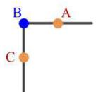

图表描述:
【图像类型】
几何拓扑结构示意图（CAD/B-rep 或网格节点示意）

【详细描述】
图片展示了一个简单的L形几何结构，由一条水平线段和一条垂直线段在左上角呈90度相交构成。图中包含三个关键节点及其标签：
1.  **节点 B**：位于两条线段的交汇拐角处，表现为一个蓝色的实心圆点，旁边标注有蓝色的字母“B”。这通常代表一个角点（corner vertex）或关键控制点。
2.  **节点 A**：位于水平向右延伸的线段上，表现为一个橙色的实心圆点，旁边标注有红褐色的字母“A”。
3.  **节点 C**：位于垂直向下延伸的线段上，表现为一个橙色的实心圆点，旁边标注有红褐色的字母“C”。

该图清晰地展示了点（Nodes/Vertices）与边（Edges）之间的拓扑连接关系，常用于说明网格划分中的节点分布、边界条件施加位置或B-rep模型中的顶点定义。

【可用于检索的关键词】
L-shape geometry, corner node, orthogonal edges, vertex labeling, boundary nodes, geometric topology, mesh node distribution, blue vertex, orange nodes, right-angle corner, edge connectivity, CAD boundary representation, grid point placement
【图表信息补充结束】

【图表信息补充开始】
图表ID: figure_35
原图路径: E:\python\research-copilot-main\storage\parsed\Optimizing\images\5df7d77deb8805f62167e7577d2ce7d1ebc68e80530e22809e97206e073357da.jpg
相对路径: images/5df7d77deb8805f62167e7577d2ce7d1ebc68e80530e22809e97206e073357da.jpg
原始引用: 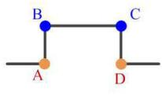

图表描述:
【图像类型】
几何拓扑结构示意图

【详细描述】
该图展示了一个由四个关键节点（A、B、C、D）和连接线段组成的几何拓扑结构。
- **节点特征**：图中包含两个橙色实心圆点（标记为 A 和 D）和两个蓝色实心圆点（标记为 B 和 C）。
- **连接关系**：
  - 节点 B 和 C 之间由一条粗黑色的水平线段连接。
  - 节点 A 和 B 之间由一条粗黑色的垂直线段连接。
  - 节点 C 和 D 之间由一条粗黑色的垂直线段连接。
  - 此外，从节点 A 向左延伸出一条水平线段，从节点 D 向右延伸出一条水平线段。
- **整体形态**：整体结构呈现为一个倒置的“U”形或门框状结构，底部两端向外水平延伸。这种结构通常用于表示特定的边界条件、路径规划或几何体的局部拓扑连接。

【可用于检索的关键词】
node A, node B, node C, node D, orange nodes, blue nodes, vertical segment, horizontal segment, inverted U-shape, topological connection, boundary representation, geometric path, frame structure, line connectivity, CAD sketch
【图表信息补充结束】

【图表信息补充开始】
图表ID: figure_83
原图路径: E:\python\research-copilot-main\storage\parsed\Optimizing\images\eb689d418ba2f3205ab46423e2042275b00360175dfe845dfdfa99c33e843b73.jpg
相对路径: images/eb689d418ba2f3205ab46423e2042275b00360175dfe845dfdfa99c33e843b73.jpg
原始引用: 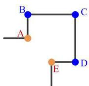

图表描述:
【图像类型】
几何拓扑结构示意图 / CAD边界表示图

【详细描述】
该图展示了一个几何边界或骨架结构的拓扑示意图，主要由黑色线段和五个标记点组成。
1.  **节点分类与颜色**：
    *   **蓝色节点**：点 B、C、D 被标记为蓝色实心圆，在几何建模中通常代表多边形的角点（corners）或主要顶点。
    *   **橙色节点**：点 A、E 被标记为橙色实心圆，位于线段路径上，可能代表边上的控制点、采样点或特殊特征点。
2.  **拓扑连接关系**：
    *   一条水平线段从左侧延伸至点 A。
    *   点 A 通过垂直线段向上连接到点 B。
    *   点 B 通过水平线段向右连接到点 C。
    *   点 C 通过垂直线段向下连接到点 D。
    *   点 E 通过水平线段向右连接到点 D。
    *   点 E 下方有一条垂直线段向下延伸。
3.  **整体结构**：整体呈现为一个非闭合的折线网络结构，类似于一个带有分支或开口的多边形边界轮廓。红色字母标签 A, B, C, D, E 清晰地标示了对应的位置。

【可用于检索的关键词】
geometric boundary, vertex labeling, corner points, edge points, polyline topology, CAD geometry, blue nodes, orange nodes, segment connectivity, boundary representation, structural skeleton, geometric modeling, non-closed loop, topological graph
【图表信息补充结束】

  
（c2）

【图表信息补充开始】
图表ID: figure_9
原图路径: E:\python\research-copilot-main\storage\parsed\Optimizing\images\10c54cd4539c160bd4675113e79c66f3a0d138b7d5e71e4977295ed3130c3f58.jpg
相对路径: images/10c54cd4539c160bd4675113e79c66f3a0d138b7d5e71e4977295ed3130c3f58.jpg
原始引用: 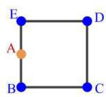

图表描述:
【图像类型】
几何拓扑结构示意图（CAD/B-rep 或网格生成前置图）

【详细描述】
图中展示了一个平面的四边形几何结构及其拓扑关系。
1. **主体框架**：由四个主要顶点（蓝色实心圆）构成一个闭合的四边形。这四个顶点分别标记为：
   - **E**：左上角顶点。
   - **D**：右上角顶点。
   - **C**：右下角顶点。
   - **B**：左下角顶点。
   这四个顶点通过黑色粗线段连接，形成了四条边：上边 ED、右边 DC、下边 CB 和左边 BE。
2. **附加节点**：在左侧垂直边 **BE** 上，存在一个额外的橙色实心圆点，标记为 **A**。
3. **拓扑关系**：点 A 位于点 E 和点 B 之间，表明它是边 EB 上的一个中间节点（vertex on edge）。这在计算几何中通常意味着边 EB 被点 A 分割，或者点 A 是该边界上的一个特定特征点（如控制点或采样点）。

【可用于检索的关键词】
quadrilateral, vertices, edges, point A, point B, point C, point D, point E, edge segmentation, planar geometry, topological structure, geometric primitives, boundary definition, node on edge
【图表信息补充结束】

  
(d2)

【图表信息补充开始】
图表ID: figure_32
原图路径: E:\python\research-copilot-main\storage\parsed\Optimizing\images\58a0909a756a7be16c87cabff79c9c8a9d699c36b02735b7ab083c5418ffa7ed.jpg
相对路径: images/58a0909a756a7be16c87cabff79c9c8a9d699c36b02735b7ab083c5418ffa7ed.jpg
原始引用: 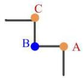

图表描述:
【图像类型】
几何拓扑结构示意图 / 图论节点连接示意图

【详细描述】
该图展示了一个由三个标记节点（A、B、C）和连接线段组成的简单几何拓扑结构。
- **节点特征**：图中包含三个圆形节点。节点 B 位于中心位置，呈现为蓝色实心圆；节点 A 和 C 呈现为橙色实心圆。
- **连接关系（边）**：
  - 一条水平线段从左侧延伸至节点 C。
  - 节点 C 通过一条垂直线段向下连接到节点 B。
  - 节点 B 通过一条水平线段向右连接到节点 A。
  - 节点 A 下方连接有一条垂直向下的线段。
- **整体结构**：这些点和边构成了一个正交（水平与垂直方向）的折线路径或图结构。节点 B 充当了连接左侧/上方路径与右侧/下方路径的枢纽节点。

【可用于检索的关键词】
graph topology, node connectivity, labeled vertices, path structure, geometric graph, edge connectivity, blue node, orange nodes, orthogonal connection, chain graph, branching topology, discrete structure, point A, point B, point C
【图表信息补充结束】

  
(e2)   
Fig. 5. Templates for classifying vertices during Submapping: (a1)geometry feature with a rounding feature(one-quarter circle) between A and C; (b1)geometry feature with a rounding feature(half an circle) between A and D; (c1)geometry feature with a round feature(three quarters of circle) between A and E; (d1)geometry feature with a rounding feature(full circle); (e1)a chamfer feature(a transitional edge) between A and C; (a2)parametric space for (a1); (b2)parametric space for (b1); (c2)parametric space for (c1); (d2)parametric space for (d1); (e2)parametric space for e(1)

using templates described in Sec.3.1. If the angle-based corner assignment is not valid, namely, it fails to satisfy the submapping constraint (4), the corner assignment problem is cast as an optimization problem based on the angle-based vertex classification and templates, and solved with a $L P$ solver.

# 3.1. Templates

For many mechanical parts, they have been chamfered and filleted to avoid the stress concentration. However, it is pretty difficult for classifying vertices due to facts that rounds and fillets spread discrete angles into continuous angle changes. For example, in Fig. 14, segments of $D E$ and $F G$ , instead of meeting at a right angle, meet at a fillet $E F$ . Therefore, extra preprocessing is required to deal with these features by relaxing or changing the anglebased constraints used to determine vertex types before generating structured quadrilateral meshes on these surfaces. Meanwhile, virtual vertices are needed to be added on those features where the optimized vertex types can be put. In order to automate these processes and extend capabilities of Submapping, some templates are proposed in this paper to get the correct vertex types around these features.

Figure 5 shows the round, fillet and chamfer features on the surface where each top row case can be resolved with corner arrangement in the bottom row. The corresponding structured quadrilateral meshes for those templates shown in Fig. 5 are shown in Fig. 6. If the heuristic method purely based on angles is applied, the invalid corner assignment will be produced since angles are ambiguous and discrete angles are spread into continuous angles. For example, a purely angle-based method would assign a corner type of SIDE to all vertices in Fig. 5(d1), and the surface would not be mappable. For the chamfer feature in Fig. 5(e1), the vertex A and $C$ can also be assigned as type-SIDE and the middle vertex can be assigned as type-END. Detection of those chamfer, fillet, round features can be done through curve type and angles between two tangent vectors which are obtained at the end point of two line segments. Automatically identifying features based on expected configurations will always be limited to “ideal” configurations. In spite of that limitation, the identification of chamfers and especially blends/rounds described in this paper can still save a large amount of user efforts, even if they don’t catch each and every such feature. A possible future enhancement is to separate the identification of these features from their treatment by the algorithm once they are identified, thus allowing users to add manually-identified features to the list. The user effort saved in these manually-identified cases would still be substantial, because of that effort still required to treat those features properly for sweeping.

The templates in Fig. 5 insert virtual vertices on the smooth curve and positions of those virtual vertices have great impacts on the resulting structured meshes. For the fillet and chamfer feature in Fig. 5(a1) and Fig. 5(e1), the virtual vertex $B$ can be simply inserted at the middle position between A and $C$ . For the half-circle feature in Fig. 5(b1), the

【图表信息补充开始】
图表ID: figure_39
原图路径: E:\python\research-copilot-main\storage\parsed\Optimizing\images\6efab5d28ed7d90cd90ed833dbcdfdc8aa0d8dee443808f3bfc492145d9e192b.jpg
相对路径: images/6efab5d28ed7d90cd90ed833dbcdfdc8aa0d8dee443808f3bfc492145d9e192b.jpg
原始引用: 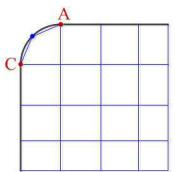

图表描述:
【图像类型】
几何网格示意图，展示带有圆角边界的结构化网格处理。

【详细描述】
图中展示了一个二维正交网格（structured rectangular grid）的左上角局部视图。
1.  **网格结构**：背景是由蓝色细线构成的规则矩形网格，呈现出典型的正交网格特征。
2.  **边界特征**：在左上角区域，有一个明显的圆角（rounded corner）或曲线边界。
    *   **点A**：位于顶部水平边界线上，是曲线边界的右端点。
    *   **点C**：位于左侧垂直边界线上，是曲线边界的左端点。
    *   **曲线**：一条粗黑色的曲线连接了点C和点A，描绘了圆角的几何形状。在这条黑线附近还有一条较细的蓝色曲线，两者非常接近，可能表示理论几何边界与离散化网格边界的对比，或者是不同精度的拟合曲线。
    *   **中间点**：在黑色曲线上有一个深蓝色的点，可能代表曲线上的某个特定采样点或控制点。
3.  **拓扑关系**：左上角的网格单元被该曲线边界所截断，展示了在处理具有圆角特征的几何形状时，结构化网格如何适应非直角的边界（boundary fitting）。

【可用于检索的关键词】
structured grid, boundary fitting, rounded corner, fillet, point A, point C, curve approximation, orthogonal mesh, grid generation, geometric modeling, corner treatment, parameterization, mesh refinement, CAD geometry
【图表信息补充结束】

  
(a3）

【图表信息补充开始】
图表ID: figure_43
原图路径: E:\python\research-copilot-main\storage\parsed\Optimizing\images\772ee71c5d1238a4a084e001827fc0b44829bb3cc9eca936f9beee7b7ca7abc2.jpg
相对路径: images/772ee71c5d1238a4a084e001827fc0b44829bb3cc9eca936f9beee7b7ca7abc2.jpg
原始引用: 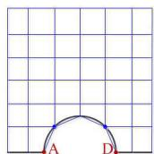

图表描述:
【图像类型】
计算几何与网格生成示意图，展示了带有半圆形边界的结构化四边形网格。

【详细描述】
该图像展示了一个二维平面上的结构化四边形网格（structured quadrilateral mesh）。
1.  **网格结构**：背景是一个由均匀分布的水平线和垂直线组成的正方形网格，呈现出规则的矩形单元阵列。
2.  **几何特征**：在网格的底部中央，叠加了一个半圆形的几何轮廓。该半圆的直径位于正方形的底边上，圆弧向上凸起，贯穿了底部的网格行。
3.  **边界处理**：半圆的弧线切断了底部的部分网格单元，显示出一种处理复杂边界的网格生成策略（如嵌入网格法或截断网格法），即网格线并不完全贴合几何边界，而是被几何形状“切割”。
4.  **标记点与文字**：
    *   在半圆弧线上有两个明显的蓝色实心点（blue nodes），分别位于圆弧与垂直网格线的交点附近，可能代表几何离散点或控制点。
    *   在半圆底部的两端（即直径与底边的交点处），有红色的字母标记。左侧标记清晰可见为“A”，右侧标记看起来像“D”（或类似字符），用于标识边界的关键顶点。

【可用于检索的关键词】
structured quadrilateral mesh, semi-circular boundary, cut cell method, embedded boundary, geometric discretization, grid intersection points, non-conforming mesh, computational geometry, mesh generation, boundary node marking, regular grid, polygonal mesh, finite element mesh, domain decomposition
【图表信息补充结束】

  
(b3）

【图表信息补充开始】
图表ID: figure_53
原图路径: E:\python\research-copilot-main\storage\parsed\Optimizing\images\a2d66dd946a158b602306faa0c358e88955170dfaf25d2eb429557b7a25ab5a3.jpg
相对路径: images/a2d66dd946a158b602306faa0c358e88955170dfaf25d2eb429557b7a25ab5a3.jpg
原始引用: 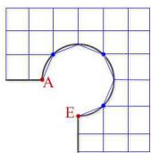

图表描述:
【图像类型】
几何曲线拟合与结构化网格示意图。

【详细描述】
图片展示了一个蓝色的结构化正方形网格（structured square grid）背景。在网格之上绘制了一条黑色的几何边界线，该边界从左侧标记为“A”的端点开始，呈圆弧状向上延伸，随后向下弯曲，最终到达下方标记为“E”的端点。在边界线上分布着四个明显的蓝色节点（blue nodes），这些节点似乎对应于网格的关键位置。一条细黑色的平滑曲线（smooth curve）精确地穿过了这四个蓝色节点，展示了基于离散网格点进行曲线拟合（curve fitting）或参数化重建的过程。粗黑色的边界线与细曲线紧密贴合，可能代表了原始几何边界与拟合曲线之间的对比或一致性验证。

【可用于检索的关键词】
structured grid, square mesh, curve fitting, circular arc, boundary reconstruction, grid nodes, spline interpolation, geometric modeling, CAD geometry, parameterization, discrete points, mesh alignment, path planning, geometric constraint
【图表信息补充结束】

  
（c3）

【图表信息补充开始】
图表ID: figure_26
原图路径: E:\python\research-copilot-main\storage\parsed\Optimizing\images\47590b124ab19a3e652c9f82182ab02a07e8c583efe88d405bcd8361fb427351.jpg
相对路径: images/47590b124ab19a3e652c9f82182ab02a07e8c583efe88d405bcd8361fb427351.jpg
原始引用: 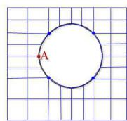

图表描述:
【图像类型】
带有圆孔的二维边界拟合网格（Boundary-Conforming Mesh）示意图。

【详细描述】
图中展示了一个包含中心圆孔的二维平面区域的网格划分细节。主体是一个深蓝色的圆形轮廓，代表圆孔或圆形边界。周围覆盖着蓝色的网格线，构成了以四边形为主（quad mesh）的网格结构。
关键特征包括：
1.  **边界拟合**：网格线在靠近圆形边界处发生了明显的弯曲变形，以精确贴合圆的几何形状，体现了 boundary-conforming（边界拟合）的特性。
2.  **节点约束**：圆周上分布着若干个蓝色的实心节点，表明这些网格节点被强制放置在边界上，实现了几何与网格节点的匹配。
3.  **特定标记**：在圆周的左侧边缘，有一个红色的字母“A”标记了一个特定的位置点。
4.  **网格形态**：远离圆孔的区域网格相对规整，呈现近似正交的结构化网格特征；而在圆孔附近，为了适应曲率，网格单元发生了拉伸和旋转。

【可用于检索的关键词】
circular hole, quad mesh, boundary-conforming mesh, circular boundary, node placement, mesh deformation, point A, structured grid, geometric modeling, finite element mesh, curved elements, grid generation, topology adaptation, computational geometry
【图表信息补充结束】

  
(d3)

【图表信息补充开始】
图表ID: figure_38
原图路径: E:\python\research-copilot-main\storage\parsed\Optimizing\images\627de1005eef925a7eb4ab3a49297c59cf28a9727763918357497047ef8a0977.jpg
相对路径: images/627de1005eef925a7eb4ab3a49297c59cf28a9727763918357497047ef8a0977.jpg
原始引用: 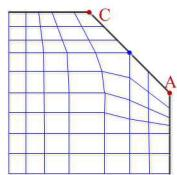

图表描述:
【图像类型】
二维结构化网格划分示意图（Boundary-conforming structured mesh）。

【详细描述】
该图展示了一个二维计算域的网格划分结果，具体细节如下：
1.  **几何边界与关键点**：计算域的主体轮廓接近矩形，但在右上方被一条斜线截断。斜边上标记有三个红色的关键点，分别标记为 **C**（左上）、**B**（中间）和 **A**（右下）。这三个点共同定义了该斜边的几何形状。
2.  **网格单元类型**：图中使用蓝色线条绘制网格，网格单元主要为**四边形（Quadrilateral elements）**。
3.  **网格分布与变形**：
    *   在区域的左侧和底部，网格线近似正交且间距相对均匀，呈现出规则的结构化网格特征。
    *   随着向右上方的斜边（A-B-C）靠近，网格线发生明显的弯曲和重排，以严格贴合边界（Boundary-conforming）。
    *   网格在靠近斜边的区域显示出为了适应几何边界而进行的局部变形，网格线不再平行，而是呈现出类似极坐标或映射后的曲线形态。
4.  **拓扑结构**：网格线从左侧垂直延伸并向右侧汇聚/弯曲，形成了与边界平行的曲线族，体现了参数化网格生成（如代数网格生成）的特点。

【可用于检索的关键词】
structured quadrilateral mesh, boundary-conforming mesh, grid generation, geometric parameterization, curved boundary, node distribution, algebraic meshing, mesh deformation, point A B C, regular grid, irregular boundary, quad mesh, mapped mesh, topology connection
【图表信息补充结束】

  
(e3)

【图表信息补充开始】
图表ID: figure_3
原图路径: E:\python\research-copilot-main\storage\parsed\Optimizing\images\0625fe6e40dbef757a218e1e0e9ee1dd07fe0e6b98f45e36d7ec1e6de09b9c81.jpg
相对路径: images/0625fe6e40dbef757a218e1e0e9ee1dd07fe0e6b98f45e36d7ec1e6de09b9c81.jpg
原始引用: 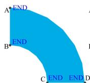

图表描述:
【图像类型】
几何示意图（展示由四条边界曲线/直线围成的二维四边形区域，常用于网格生成或参数化映射）。

【详细描述】
该图片展示了一个蓝色的二维几何区域，其形状类似于一个弯曲的矩形条带或扇形块。该区域由四个标记为端点（END）的关键顶点 A、B、C、D 定义，这四条边界共同围成一个闭合的四边形拓扑结构：
1.  **左边界 (A-B)**：一条垂直的直线段，连接左上角的顶点 A 和左侧中间的顶点 B。
2.  **下边界左段 (B-C)**：一条从 B 点向右下方延伸的曲线，连接到位于底部的顶点 C。
3.  **下边界右段 (C-D)**：一条近似水平的直线段（或微弯曲线），连接顶点 C 和右下角的顶点 D。图中 C 和 D 旁均标注有 "END"，表明它们是相邻边界段的端点。
4.  **上/右边界 (D-A)**：一条向外凸出的长曲线，从右下角的顶点 D 延伸至左上角的顶点 A，构成了区域的上边缘和右侧边缘的主体轮廓。

整体来看，这是一个典型的用于计算机图形学或计算几何中**结构化网格生成（Structured Mesh Generation）**或**参数化映射（Parameterization）**的源几何定义图。图中的 "END" 标签强调了这些点是构成区域边界的曲线段的起止点。

【可用于检索的关键词】
四边形域, 弯曲矩形, Coons Patch, 参数化网格, 结构化网格, 边界曲线, 几何定义, 拓扑四边形, 圆环扇区, 计算几何, CAD几何, 网格生成, 端点标记, 蓝色填充区域
【图表信息补充结束】

  
Fig. 6. Structured quadrilateral mesh for templates during Submapping: (a3)structured quad mesh for Fig. 5(a1) and Fig. 5(a2); (b3)structured quad mesh for Fig. 5(b1) and Fig. 5(b2); (c3)structured quad mesh for Fig. 5(c1) and Fig. 5(c2); (d3)structured mesh for Fig. 5(d1) and Fig. 5(d2); (e3)structured mesh for Fig. 5(e1) and Fig. 5(e2)

【图表信息补充开始】
图表ID: figure_48
原图路径: E:\python\research-copilot-main\storage\parsed\Optimizing\images\904894da8220233ca2b4551a2cda65185be245b56549e11808a91aff57e6901e.jpg
相对路径: images/904894da8220233ca2b4551a2cda65185be245b56549e11808a91aff57e6901e.jpg
原始引用: 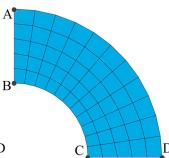

图表描述:
【图像类型】
计算几何与网格生成示意图（Structured Mesh Generation）

【详细描述】
图中展示了一个蓝色的四分之一圆环（quarter-annulus）几何区域，该区域被划分为黑色的结构化网格（structured mesh）。
1. **几何边界与关键点**：区域由四条边界围成，四个关键顶点分别标记为A、B、C、D。
   - 线段 AB 为左侧垂直直边。
   - 线段 CD 为底部水平直边。
   - 弧 BC 为内侧的圆弧边界。
   - 弧 AD 为外侧的圆弧边界。
2. **网格特征**：
   - 内部填充了规则的四边形单元（quadrilateral elements）。
   - 网格线呈曲线状，大致相互正交，从内边界向外边界延伸，同时也沿圆周方向分布。
   - 网格线紧密贴合所有边界（boundary-conforming），表明这是一种参数化（parameterization-based）或映射（mapping）生成的网格。
   - 网格单元尺寸在整个区域内看起来相对均匀，没有明显的局部加密（local refinement）现象。

【可用于检索的关键词】
quarter-annulus, structured quadrilateral mesh, parameterization-based meshing, boundary-conforming mesh, circular arc boundary, straight edge, grid generation, mapping method, geometric domain, mesh quality, computational geometry, points A B C D
【图表信息补充结束】

【图表信息补充开始】
图表ID: figure_63
原图路径: E:\python\research-copilot-main\storage\parsed\Optimizing\images\bd5596466e4784c312bc5bb9f510d3eb316b8bb4627e6c65b2d86c1406f20d2e.jpg
相对路径: images/bd5596466e4784c312bc5bb9f510d3eb316b8bb4627e6c65b2d86c1406f20d2e.jpg
原始引用: 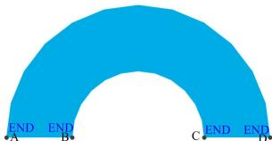

图表描述:
【图像类型】
几何模型示意图（带有边界标记的拱形区域）。

【详细描述】
图片展示了一个蓝色的二维拱形几何区域（arch-shaped domain）。该区域由外侧的大圆弧、内侧的小圆弧以及底部的水平直线段闭合围成。在底部的水平直线上，分布着四个明显的黑色关键点，从左至右依次标记为 A、B、C、D。每个关键点旁边均标注有蓝色的 "END" 文本，这通常用于指示边界条件的端点（endpoints）或特定的边界分段位置。该图形具有典型的内外圆弧和直线边界特征，常被用作网格生成算法（如参数化网格划分）或几何处理的基准测试案例。

【可用于检索的关键词】
arch-shaped geometry, circular arcs, straight boundary segment, labeled points A B C D, END text labels, 2D domain, geometric modeling, boundary definition, curved surface, inner radius, outer radius, geometric test case, parametric geometry, boundary condition markers
【图表信息补充结束】

  
(b1)

【图表信息补充开始】
图表ID: figure_60
原图路径: E:\python\research-copilot-main\storage\parsed\Optimizing\images\b84d8766d608256acf4379b8d11df559c616da28de44ced7e75f27cf64d4bde8.jpg
相对路径: images/b84d8766d608256acf4379b8d11df559c616da28de44ced7e75f27cf64d4bde8.jpg
原始引用: 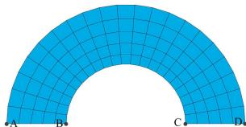

图表描述:
【图像类型】
计算几何中的结构化网格生成示意图（半圆环区域）。

【详细描述】
该图展示了一个半圆环（semi-annulus）区域的二维结构化四边形网格（structured quadrilateral mesh）。蓝色填充区域代表计算域，内部被黑色的网格线划分为规则的单元。网格线主要由两类构成：一类是从圆心发散的径向直线（radial lines），另一类是以圆心为中心的同心圆弧（concentric circular arcs）。这种网格布局具有明显的极坐标特征，表明其可能通过简单的参数化映射（parameterization-based mapping）生成。在图形的底部水平基线上，标注了四个关键拓扑节点：A和D分别位于外边界（outer boundary）的左右端点，而B和C位于内边界（inner boundary，即内侧半圆弧）的左右端点。网格单元在径向和切向均表现出良好的正交性和均匀性，没有明显的扭曲。

【可用于检索的关键词】
semi-annulus mesh, structured quadrilateral mesh, radial lines, concentric arcs, parameterization, topological nodes, boundary points, computational domain, mesh generation, geometric modeling, polar coordinate mapping, regular grid, annular sector, finite element pre-processing
【图表信息补充结束】

  
(b2)

【图表信息补充开始】
图表ID: figure_78
原图路径: E:\python\research-copilot-main\storage\parsed\Optimizing\images\e3b62c1922354b5a5b2fa75e1326f41e7460709b0548b8d150fe61be518072a0.jpg
相对路径: images/e3b62c1922354b5a5b2fa75e1326f41e7460709b0548b8d150fe61be518072a0.jpg
原始引用: 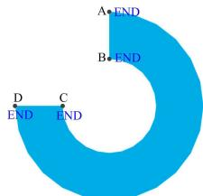

图表描述:
【图像类型】
几何模型示意图 / CAD边界表示图

【详细描述】
图中展示了一个蓝色的二维几何实体，形状呈现为开口的C形或圆环扇区（annular sector）。该区域由两条同心的圆弧（分别构成外边界和内边界）以及两条连接内外圆弧的直线段（径向边界）围合而成。

图中明确标记了四个关键顶点及其拓扑位置：
- 点 A 位于上方径向直线段的外侧端点。
- 点 B 位于上方径向直线段的内侧端点（靠近内圆弧）。
- 点 D 位于下方径向直线段的外侧端点。
- 点 C 位于下方径向直线段的内侧端点（靠近内圆弧）。

每个顶点（A, B, C, D）旁边均标注有紫色的“END”文本，表明这些点是几何边界曲线的端点。该图清晰地展示了该几何体的边界定义方式，即通过内外圆弧和两条径向线段构成的封闭环路。

【可用于检索的关键词】
C-shape geometry, annular sector, radial boundary, concentric arcs, boundary definition, end points, geometric topology, blue region, CAD model, vertex labeling, circular hole, rounded boundary, parametric curve, mesh boundary, geometric primitive
【图表信息补充结束】

  
(c1)

【图表信息补充开始】
图表ID: figure_57
原图路径: E:\python\research-copilot-main\storage\parsed\Optimizing\images\b3a1ad8ae30a9d61db2e1f17ffa7763b1fb0e1a56b2d31bc41b8bab5a42b487f.jpg
相对路径: images/b3a1ad8ae30a9d61db2e1f17ffa7763b1fb0e1a56b2d31bc41b8bab5a42b487f.jpg
原始引用: 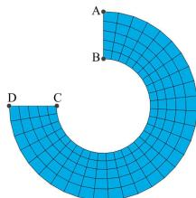

图表描述:
【图像类型】
几何网格图（CAD/计算几何领域的结构化四边形网格示意图）。

【详细描述】
该图片展示了一个二维结构化四边形网格（Structured Quadrilateral Mesh），覆盖在一个圆环扇区（Annular Sector）的几何域上。
1.  **几何域结构**：
    *   区域由两个同心圆弧（内圆弧和外圆弧）以及两条径向线段（Radial Lines）围成。
    *   外边界是一条较大的圆弧，连接点A和点D。
    *   内边界是一条较小的圆弧，连接点B和点C。
    *   左侧边界由两条径向线段组成：一条连接点A和点B，另一条连接点D和点C。
    *   从视觉上看，连接A和B的线段近似垂直，连接D和C的线段近似水平，暗示圆心可能位于右下方。
2.  **网格特征**：
    *   网格由黑色的四边形单元组成，填充色为浅蓝色。
    *   网格线分为两组正交族：一组是同心圆弧（Concentric arcs），另一组是径向线（Radial lines）。
    *   网格分布均匀，呈现出典型的极坐标网格特征，没有明显的局部加密（Local Refinement）或非结构化扭曲。
3.  **关键点标注**：
    *   **A**: 位于外圆弧与上方径向边的交点。
    *   **B**: 位于内圆弧与上方径向边的交点（在A的正下方）。
    *   **C**: 位于内圆弧与下方径向边的交点（在D的右侧）。
    *   **D**: 位于外圆弧与下方径向边的交点。

【可用于检索的关键词】
structured quadrilateral mesh, annular sector, radial lines, concentric arcs, boundary points A B C D, geometric domain, grid generation, topology, inner radius outer radius, orthogonal grid, polar coordinate mesh, CAD geometry, mesh quality, parameterization
【图表信息补充结束】

  
(c2)

【图表信息补充开始】
图表ID: figure_51
原图路径: E:\python\research-copilot-main\storage\parsed\Optimizing\images\9cb5b305f9ebc27f931e8488a3c52fed8f4078fc37159bcaade850dd2e8519a4.jpg
相对路径: images/9cb5b305f9ebc27f931e8488a3c52fed8f4078fc37159bcaade850dd2e8519a4.jpg
原始引用: 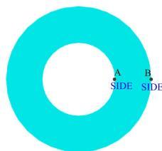

图表描述:
【图像类型】
几何示意图 / CAD基础几何体（带孔圆环）

【详细描述】
图中展示了一个二维的青色（cyan）圆环（annulus）区域，中心有一个圆形的白色空洞。在圆环右侧的外边缘上，标记了两个黑色的点，分别标记为 "A" 和 "B"。在这两个点的正下方，分别印有蓝色的英文单词 "SIDE"。该图通常用于表示计算几何中的测试域、网格划分的初始几何模型，或者用于说明边界条件（如指定侧边）。

【可用于检索的关键词】
annulus, circular hole, perforated plate, planar geometry, boundary nodes, point A, point B, SIDE label, cyan color, geometric domain, meshing test case, inner boundary, outer boundary, parametric surface
【图表信息补充结束】

  
(d1)

【图表信息补充开始】
图表ID: figure_14
原图路径: E:\python\research-copilot-main\storage\parsed\Optimizing\images\250573034e679e133eb548dcf4d270389d84dfc559369ad8e71209eaa2aca7a9.jpg
相对路径: images/250573034e679e133eb548dcf4d270389d84dfc559369ad8e71209eaa2aca7a9.jpg
原始引用: 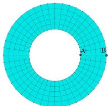

图表描述:
【图像类型】
计算几何/网格划分示意图（Structured Quadrilateral Mesh on an Annulus）

【详细描述】
图中展示了一个圆环区域（annulus）上的结构化四边形网格（structured quadrilateral mesh）。该网格通过径向（radial）和周向（circumferential）的分割线将圆环划分为规则的矩形/四边形单元阵列。
- **几何特征**：包含一个中心空洞（circular hole）和一个外圆边界。
- **网格结构**：网格呈现出明显的分层结构，径向方向分为多层，周向方向均匀分布着多个扇区，形成了典型的 O-grid 拓扑变体或简单的极坐标网格映射。
- **标记点**：在右侧水平半径方向上标注了两个黑色实心点。点 A 位于内圆边界（inner boundary）上，点 B 位于外圆边界（outer boundary）上。
- **视觉属性**：整个网格区域填充为均匀的浅青色（cyan），线条为深色。

【可用于检索的关键词】
structured quadrilateral mesh, annulus, circular hole, quad mesh, radial division, circumferential division, inner boundary, outer boundary, point A, point B, grid topology, mesh generation, parameterization, geometric modeling
【图表信息补充结束】

  
  
Fig. 7. Templates for concentric rings: (a1)one quarter of concentric ring; (a2)structured mesh for (a1); (b1)one half of concentric ring; (b2)structured mesh for (a2); (c1)three quarters of concentric ring; (c2)structured mesh for (c1); (d1)a full concentric ring; (d2)structured mesh for d(1)

virtual vertices $B$ and $C$ can be inserted at the one-quarter and three-quarter position between $A$ and $D$ , respectively. For the three-quarter circle feature in Fig. 5(c1), the virtual vertices $B$ , $C$ and $D$ are placed at the one-sixth, one-half, five-sixth position between A and $E$ , respectively. The virtual vertices $B , C , D$ and $E$ in Fig. 5(d1) are distributed with equal spacings on a full circle.

For those geometries with concentric ring features such as Fig. 7, the corner assignment is different from templates in Fig. 5: it is not necessary to insert any new vertex and vertex types are assigned directly based on templates. The details are shown in Fig. 7 where Fig. 7(a1), Fig. 7(b1), Fig. 7(c1) and Fig. 7(d1) show the corner assignment for one quarter, one half, three quarters and one full of concentric ring and their corresponding structured quadrilateral meshes are shown in Fig. 7(a2), Fig. 7(b2), Fig. 7(c2) and Fig. 7(d2), respectively.

# 3.2. Vertex Type Adjustment based on LP

During vertex classification purely based on angles, most vertices can get their correct vertex types. However, there are a few vertices whose vertex types need to be adjusted since internal angles between two consecutive edges are not always integers multiple of $0 . 5 \pi$ and Eqn. (4) constrains the corner assignment for submapping. Ruiz Girones’s method [4] fails to correct the vertex classification in some cases since the variation of vertex types is overly constrained: the maximum variation of vertex types is restricted to one in the Ruiz Girones’s method [4]. One fail case by Ruiz Girones’s method [4] is shown in Fig. 9: it is impossible to convert vertex type at $E$ from REVERSAL to SIDE. In order to deal with problems addressed above, a new vertex classification based on $L P$ is described in this paper. The key contribution is to generate a valid corner assignment for more geometries based on $L P$ by including the submapping constraint and constraining the vertex type variation within its geometric angle limits.

【图表信息补充开始】
图表ID: figure_37
原图路径: E:\python\research-copilot-main\storage\parsed\Optimizing\images\601979d3f4a32725027d556b3cadfa9447ac520706496e5a3affbdc962bec571.jpg
相对路径: images/601979d3f4a32725027d556b3cadfa9447ac520706496e5a3affbdc962bec571.jpg
原始引用: 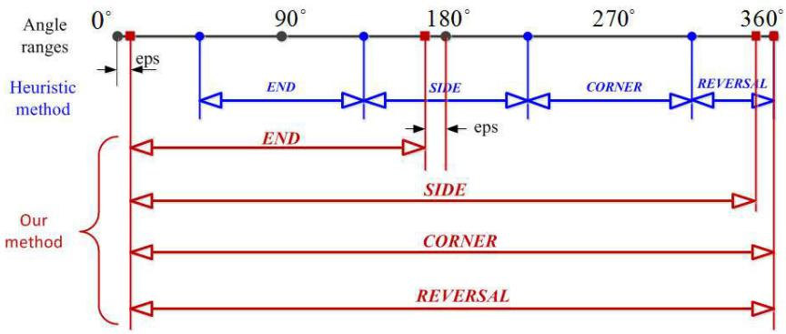

图表描述:
【图像类型】
算法逻辑对比图 / 角度范围判定示意图

【详细描述】
该图展示了 "Heuristic method"（启发式方法）与 "Our method"（本文方法）在处理角度范围（Angle ranges, $0^\circ$ 至 $360^\circ$）时的逻辑对比，主要用于区分不同的几何特征。
顶部横轴表示角度，标记了 $0^\circ, 90^\circ, 180^\circ, 270^\circ, 360^\circ$ 等关键节点。
图中定义了四种几何特征类别：`END`, `SIDE`, `CORNER`, `REVERSAL`。

1.  **Heuristic method (蓝色线条)**：
    *   采用分段的角度区间来识别特征，逻辑较为复杂且受限。
    *   `END`: 对应 $0^\circ$ 附近（有微小偏移 $\epsilon$）到 $180^\circ$ 之前的区间，箭头指向左。
    *   `SIDE`: 对应 $90^\circ$ 到 $180^\circ$ 附近的区间，双向箭头。
    *   `CORNER`: 对应 $180^\circ$ 到 $270^\circ$ 附近的区间，双向箭头。
    *   `REVERSAL`: 对应 $270^\circ$ 到 $360^\circ$ 附近的区间，双向箭头。
    *   该方法似乎依赖于严格的角度阈值，且不同特征对应不同的角度扇区。

2.  **Our method (红色线条)**：
    *   `END`: 对应 $0^\circ$ 到 $180^\circ$ 的区间，箭头指向左。
    *   `SIDE`, `CORNER`, `REVERSAL`: 均显示为覆盖 $0^\circ$ 到 $360^\circ$ 的全长区间，两端均有箭头。
    *   这表明本文方法放宽了对角度的限制，能够在更广泛（甚至全角度）的范围内识别这些几何特征，克服了启发式方法只能处理特定角度范围的局限性。

【可用于检索的关键词】
Angle ranges, Heuristic method, Our method, END, SIDE, CORNER, REVERSAL, angle threshold, geometric feature classification, boundary detection, corner detection, edge type identification, interval mapping, topological analysis, CAD geometry processing
【图表信息补充结束】

  
Fig. 8. Ranges of vertex types with respect to the geometric angles

Therefore, the following improved $L P$ model is proposed here: the objective is to minimize the maximum deviation between vertex internal angle and the ideal angle associated with assigned optimal vertex types.

$$
\text {O b j e c t i v e} \quad \min  \quad \max  _ {i} \left\{\left| \theta_ {i} - (1 - 0. 5 \alpha_ {i}) \pi \right| \right\} \tag {5}
$$

where the ideal angle for a vertex with vertex type $\alpha _ { i }$ is $( 1 - 0 . 5 \alpha _ { i } ) \pi$ and $\theta _ { i }$ is a real internal angle at vertex i. Since some REVERSAL vertices based on angles may be converted to be SIDE due to the submapping constraint (4) such as Fig. 9, our approach adjusts vertex types $\alpha _ { i }$ based on the following criteria which are described in Fig. 8:

(1) . If $e p s \leq \theta _ { i } \leq 1 8 0 ^ { \circ } - e p s$ , αi ∈ {1, 0, −1, −2}.   
(2) . If $1 8 0 ^ { \circ } - e p s \leq \theta _ { i } \leq 3 6 0 ^ { \circ } - e p s$ , αi 0, 1, 2 .   
(3) . If $3 6 0 ^ { \circ } - e p s \leq \theta _ { i } \leq 3 6 0 ^ { \circ }$ , αi ∈ {−1, −2}.

In order to add those three criteria into the $L P$ model, extra constraints by integrating those criteria are added as follows.

$$
\alpha_ {i} <   1 \quad \text {i f} \theta_ {i} \geq 1 8 0 ^ {\circ} - e p s \tag {6}
$$

$$
\alpha_ {i} <   0 \quad \text {i f} \theta_ {i} \geq 3 6 0 ^ {\circ} - e p s \tag {7}
$$

$$
\alpha_ {i} \in \{- 2, - 1, 0, 1 \} \tag {8}
$$

In order to make surfaces submappable, sum of vertex types must be equal to $4 - 4 * g$

$$
\sum_ {i = 1} ^ {N} \alpha_ {i} = 4 - 4 g \quad \alpha_ {i} \in \{- 2, - 1, 0, 1 \} \quad \alpha_ {i} \text {i s a n i n t e g e r a n d} g \text {i s t h e n u m b e r o f h o l e s} \tag {9}
$$

The $L P$ model described above contains some nonlinear constraints such as maximal absolute value in the objective function (5) and conditional constraints for Eqn.(6) and Eqn.(7). They can be converted into linear constraints as follows: based on the references[10,11], the absolute value in the objective function can be converted as follows by introducing two positive angle deviation variable: devAngle+ and devAngle−. Meanwhile, a new variable $\beta$ is introduced to denote maximal differences between internal angle and ideal assigned angle $\operatorname* { m a x } _ { i } \{ | \theta _ { i } - ( 1 - 0 . 5 \alpha _ { i } ) \pi | \}$

$$
\text {O b j e c t i v e} \quad \min  \beta \tag {10}
$$

s.t.

$$
\beta > = d e v A n g l e _ {i} ^ {+} + d e v A n g l e _ {i} ^ {-} \tag {11}
$$

【图表信息补充开始】
图表ID: figure_58
原图路径: E:\python\research-copilot-main\storage\parsed\Optimizing\images\b44394aecc2e5600534aef2ea82537014f336b75f7e1a0c3f3f2974af805d9ed.jpg
相对路径: images/b44394aecc2e5600534aef2ea82537014f336b75f7e1a0c3f3f2974af805d9ed.jpg
原始引用: 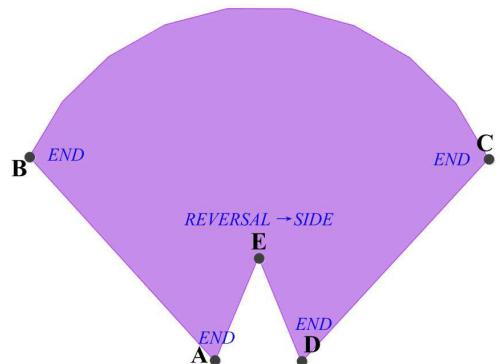

图表描述:
【图像类型】
几何拓扑示意图 / CAD 面定义图

【详细描述】
图中展示了一个紫色的二维几何面（Face），其边界由直线段和曲线段组成。
1.  **整体形状**：该区域大致呈扇形，但底部有一个明显的向内凹陷结构，使其成为一个非凸多边形。
2.  **边界与顶点**：
    *   **顶部**：是一条平滑的圆弧边界。
    *   **左侧**：有一个顶点标记为 **B**，旁边标注有蓝色文字 "END"。
    *   **右侧**：有一个顶点标记为 **C**，旁边标注有蓝色文字 "END"。
    *   **底部凹陷**：在图形下方中心位置有一个向内凹进的顶点，标记为 **E**。
    *   **底部外侧**：在凹陷结构的两侧下方，分别有两个顶点，左侧标记为 **A**，右侧标记为 **D**，这两个点旁边也都标注有蓝色文字 "END"。
    *   **连接关系**：从视觉上看，边界似乎由 B 经圆弧至 C，再经直线至 D，接着折向内部的 E 点，再折向外部的 A 点，最后回到 B 点（或者 A 与 B 相连，D 与 C 相连，形成闭合环路）。点 E 是一个典型的反射顶点（Reflex Vertex），导致多边形在该处内凹。
3.  **内部文本**：图形中央偏下位置写有蓝色文字 "REVERSAL → SIDE"，这可能指示了某种拓扑处理规则、网格生成算法中的方向反转操作，或者是对该几何特征的描述。

【可用于检索的关键词】
non-convex polygon, circular arc boundary, reflex vertex, geometric face, topological structure, labeled vertices, boundary definition, meshing domain, CAD geometry, planar shape, internal indentation, vertex labeling, REVERSAL operation, side transition, geometric modeling
【图表信息补充结束】

  
(a)

【图表信息补充开始】
图表ID: figure_10
原图路径: E:\python\research-copilot-main\storage\parsed\Optimizing\images\12d716b89dcf4f35827122f0811cadcae160c78c29c7259fe8152b29760b33e8.jpg
相对路径: images/12d716b89dcf4f35827122f0811cadcae160c78c29c7259fe8152b29760b33e8.jpg
原始引用: 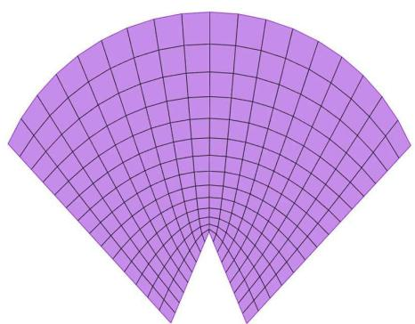

图表描述:
【图像类型】
计算几何中的极坐标结构化四边形网格示意图。

【详细描述】
图中展示了一个紫色的圆环扇区（annular sector）几何模型上的结构化四边形网格（structured quadrilateral mesh）。该网格呈现出典型的极坐标（polar coordinate）分布特征：
1.  **网格形态**：网格由沿径向（radial direction）的直线段和沿切向（tangential direction）的同心圆弧段交织而成，形成了规则的四边形单元（quad elements）。
2.  **拓扑结构**：这是一个高度规则的结构化网格（structured mesh）。在径向上，网格被分为多层（目测约10-12层），从内边界向外边界延伸；在切向上，网格也被均匀分割。
3.  **几何特征**：网格完全贴合圆环扇区的边界，包括内侧圆弧、外侧圆弧以及两侧的直线边界。这种网格通常通过参数化映射（parametric mapping）生成，常用于处理具有圆形或弧形边界的几何体。

【可用于检索的关键词】
structured quadrilateral mesh, polar coordinate grid, annular sector, radial discretization, tangential discretization, mapped meshing, parametric mesh, quad elements, geometric parameterization, boundary-conforming mesh, concentric arc mesh, regular grid topology, computational geometry mesh, finite element mesh generation
【图表信息补充结束】

  
(b)   
Fig. 9. An example of vertex classification by our method: (a)adjust vertex type at $E$ from REVERSAL to SIDE so that the surface becomes submappable; (b)structured quadrilateral mesh for (a)

$$
\left| \theta_ {i} - \left(1 - \frac {1}{2} \alpha_ {i}\right) \pi \right| = d e v A n g l e _ {i} ^ {+} + d e v A n g l e _ {i} ^ {-} \tag {12}
$$

$$
\operatorname {d e v A n g l e} _ {i} ^ {+} - \operatorname {d e v A n g l e} _ {i} ^ {-} = \theta_ {i} - \left(1 - \frac {1}{2} \alpha_ {i}\right) \pi \tag {13}
$$

$$
d e v A n g l e _ {i} ^ {+} \geq 0, \quad d e v A n g l e _ {i} ^ {-} \geq 0 \tag {14}
$$

Based on the reference[12], the conditional constraint (6) and (7) can be converted into the linear constraints by introducing a large enough integer $M$ and binary variables $x _ { i }$ and $z _ { i }$ .

$$
- \alpha_ {i} + M * x _ {i} \geq 0 \tag {15}
$$

$$
1 8 0 - e p s - \theta_ {i} + M * (1 - x _ {i}) \geq 0 \tag {16}
$$

$$
3 6 0 - e p s - \theta_ {i} + M * (1 - z _ {i}) \geq 0 \tag {17}
$$

$$
1 - \alpha_ {i} + M * z _ {i} \geq 0 \tag {18}
$$

Hence, by changing the objective function, keeping the submapping constraint and adding extra constraints for vertex type variation, the above $L P$ model can be summarized as follows and $L P$ model can be solved by a tool: lpsolve[9].

$$
\text {o b j e c t i v e} \quad \min  \beta \tag {19}
$$

s.t.

$$
\beta > = d e v A n g l e _ {i} ^ {+} + d e v A n g l e _ {i} ^ {-} \tag {20}
$$

$$
\theta_ {i} - \left(1 - \frac {1}{2} \alpha_ {i}\right) \pi = d e v A n g l e _ {i} ^ {+} - d e v A n g l e _ {i} ^ {-} \tag {21}
$$

$$
\operatorname {d e v A n g l e} _ {i} ^ {+} \geq 0, \quad \operatorname {d e v A n g l e} _ {i} ^ {-} \geq 0 \tag {22}
$$

$$
- \alpha_ {i} + M * x _ {i} \geq 0 \tag {23}
$$

$$
1 8 0 ^ {\circ} - e p s - \theta_ {i} + M * (1 - x _ {i}) \geq 0 \tag {24}
$$

$$
3 6 0 ^ {\circ} - e p s - \theta_ {i} + M * (1 - z _ {i}) \geq 0 \tag {25}
$$

$$
1 - \alpha_ {i} + M * z _ {i} \geq 0 \tag {26}
$$

$$
d _ {i} \in \{0, 1 \} \quad x _ {i}, z _ {i} \in \{0, 1 \} \quad i = 1, \dots , N \tag {27}
$$

$$
M \quad \text {a l a r g e e n o u g h i n t e g e r} \tag {28}
$$

$$
x _ {i}, z _ {i} \quad \text {b i n a r y v a r i a b l e s}. \tag {29}
$$

$$
\alpha_ {i} \in \{- 2, - 1, 0, 1 \} \tag {30}
$$

【图表信息补充开始】
图表ID: figure_15
原图路径: E:\python\research-copilot-main\storage\parsed\Optimizing\images\2c1181476704e8912420c842ece7a62c64666b6b01aeb5bc8ff70e20c30ccce3.jpg
相对路径: images/2c1181476704e8912420c842ece7a62c64666b6b01aeb5bc8ff70e20c30ccce3.jpg
原始引用: 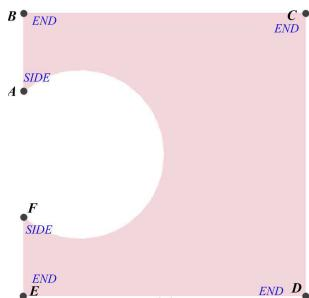

图表描述:
【图像类型】
二维几何模型示意图（带圆孔的正方形域）

【详细描述】
这是一张用于定义计算域或几何边界的二维示意图。
1.  **主体几何结构**：图像展示了一个粉红色的正方形区域，其左侧边缘中心位置有一个白色的圆形孔洞（circular hole）。这构成了一个典型的带孔平板（perforated plate）几何模型。
2.  **角点标记**：正方形的四个顶点被明确标记为黑色的实心点：
    *   左上角：点 **B**，旁边标注蓝色文字 "**END**"。
    *   右上角：点 **C**，旁边标注蓝色文字 "**END**"。
    *   右下角：点 **D**，旁边标注蓝色文字 "**END**"。
    *   左下角：点 **E**，旁边标注蓝色文字 "**END**"。
    这些标记通常暗示这些边界段具有特定的边界条件（如固定端或端部约束）。
3.  **侧边标记**：在正方形左侧的垂直边上，圆孔的上方和下方分别标记了两个点：
    *   圆孔上方：点 **A**，旁边标注蓝色文字 "**SIDE**"。
    *   圆孔下方：点 **F**，旁边标注蓝色文字 "**SIDE**"。
    这表明左侧边界可能被划分为不同的部分（如端部和侧面），或者A和F是圆孔与边界的接触点/切点。
4.  **视觉特征**：背景为统一的淡粉色，孔洞为纯白色，关键几何点为黑色，文字标签为蓝色。

【可用于检索的关键词】
square domain, circular hole, perforated plate, boundary definition, END boundary, SIDE boundary, geometric topology, mesh generation test case, 2D geometry, finite element domain, point labels, computational geometry, structural mechanics benchmark, hole in plate problem
【图表信息补充结束】

【图表信息补充开始】
图表ID: figure_90
原图路径: E:\python\research-copilot-main\storage\parsed\Optimizing\images\fe3cafc79989b402656b9baaada0565364a32ef0c058b0dbd23f800417f4d21f.jpg
相对路径: images/fe3cafc79989b402656b9baaada0565364a32ef0c058b0dbd23f800417f4d21f.jpg
原始引用: 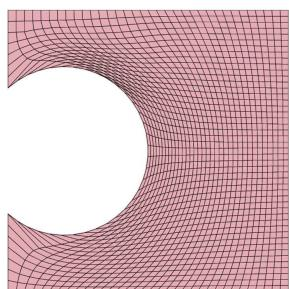

图表描述:
【图像类型】
计算几何/网格生成示意图

【详细描述】
图片展示了一个二维域的网格划分结果，背景为淡粉色，网格线为黑色。几何主体是一个矩形区域，其左侧包含一个显著的圆形孔洞（circular hole）。网格线在靠近圆形孔洞的区域发生明显的弯曲，紧密贴合孔洞的边界，呈现出同心圆状或放射状的拓扑特征；随着向右侧远离孔洞，网格线逐渐趋于平直和平行，显示出规则的结构化特征。这种布局表明该图演示了基于参数化方法（如共形映射或调和映射）生成的边界贴合结构化四边形网格（boundary-conforming structured quadrilateral mesh），网格单元在孔洞附近因几何曲率而发生变形。

【可用于检索的关键词】
structured mesh, quadrilateral mesh, circular hole, boundary-conforming, parameterization, quad mesh, mesh generation, grid lines, geometric domain, structured grid, conformal mapping, grid deformation
【图表信息补充结束】

  
(b)

【图表信息补充开始】
图表ID: figure_11
原图路径: E:\python\research-copilot-main\storage\parsed\Optimizing\images\15beefb883ea2fb25adff712a7354857f1179c10a1c4f8d54526bf6cc22713db.jpg
相对路径: images/15beefb883ea2fb25adff712a7354857f1179c10a1c4f8d54526bf6cc22713db.jpg
原始引用: 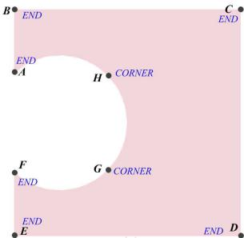

图表描述:
【图像类型】
几何拓扑示意图 / CAD边界表示关键点图

【详细描述】
该图片展示了一个带有中心圆形孔洞的正方形几何域（粉色区域），用于说明几何建模或网格生成中的拓扑关键点分布。
1.  **几何结构**：主体为一个正方形区域，中心有一个白色的圆形孔洞（circular hole）。
2.  **关键点标注**：图中明确标注了8个黑色的几何点（vertices/keypoints），分为两组：
    *   **外边界角点**：正方形的四个顶点分别标记为 B（左上）、C（右上）、D（右下）、E（左下）。这四个点旁边均标注有蓝色文字 "END"。
    *   **内边界特征点**：在圆形孔洞的边缘上分布着四个点。
        *   点 A 位于圆孔左侧。
        *   点 F 位于圆孔左下方。
        *   点 G 位于圆孔右下方，旁边标注有蓝色文字 "CORNER"。
        *   点 H 位于圆孔右上方，旁边标注有蓝色文字 "CORNER"。
3.  **拓扑含义**：这种布局通常用于定义带孔域（domain with hole）的拓扑结构。点 G 和 H 被特别标记为 "CORNER"（角点），尽管它们在几何上是光滑圆弧的一部分，但这可能暗示了在结构化网格划分（structured meshing）或几何分解（decomposition）中，这些点被用作拓扑分割的起始/终止点（seam points），将复杂的带孔域分解为多个四边形块（quadrilateral patches）。

【可用于检索的关键词】
circular hole, square domain, boundary vertices, topological keypoints, geometric modeling, structured meshing, corner markers, END labels, inner boundary loop, outer boundary loop, quadrilateral patches, mesh generation, feature points, CAD geometry
【图表信息补充结束】

【图表信息补充开始】
图表ID: figure_69
原图路径: E:\python\research-copilot-main\storage\parsed\Optimizing\images\c4e8e44a22e5e6b178b7b16d6c5317bf8ad8bd5ecf1b7fcae48a74f70372e5d0.jpg
相对路径: images/c4e8e44a22e5e6b178b7b16d6c5317bf8ad8bd5ecf1b7fcae48a74f70372e5d0.jpg
原始引用: 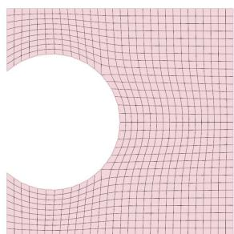

图表描述:
【图像类型】
计算几何中的带孔区域结构化网格生成示意图。

【详细描述】
该图展示了一个二维矩形区域被一个大圆形空洞切割后的网格划分结果。
1. **几何区域**：主体为一个矩形区域，其左侧边缘包含一个巨大的圆形切口（circular hole），使得有效计算域呈现为带孔的形状。
2. **网格分布**：
   - 在远离圆孔的右侧及上方区域，网格呈现出高度规则的正交四边形网格（regular orthogonal quadrilateral mesh），单元尺寸均匀且排列整齐。
   - 随着网格线向左侧圆孔方向延伸，网格线发生平滑的弯曲和扭曲，以严格贴合圆孔的边界轮廓。
   - 这种网格形态表明采用了某种参数化映射（parameterization-based mapping）或代数插值方法，将规则的计算域映射到了物理域的带孔区域上，实现了边界贴合（boundary-conforming）。
3. **视觉特征**：网格线为深红色，背景为淡粉色，圆孔内部留白无网格。

【可用于检索的关键词】
structured mesh, quadrilateral mesh, circular hole, rectangular domain, parameterization-based meshing, mapped mesh, mesh deformation, boundary-conforming, algebraic grid generation, smooth transition, computational geometry, geometric modeling, grid distortion, orthogonal grid, hole filling
【图表信息补充结束】

  
(d)

【图表信息补充开始】
图表ID: figure_70
原图路径: E:\python\research-copilot-main\storage\parsed\Optimizing\images\c80add174df25ae9467adaa213cde74dae969bec6ac12a3d9ede36160b9df3b0.jpg
相对路径: images/c80add174df25ae9467adaa213cde74dae969bec6ac12a3d9ede36160b9df3b0.jpg
原始引用: 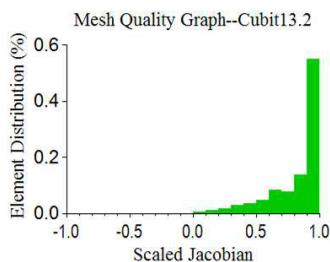

图表描述:
【图像类型】
实验结果统计图（直方图）

【详细描述】
该图片展示了一个名为“Mesh Quality Graph--Cubit13.2”的直方图，用于评估网格质量。
- **横轴（X-axis）**：标记为“Scaled Jacobian”（缩放雅可比），数值范围从 -1.0 到 1.0。
- **纵轴（Y-axis）**：标记为“Element Distribution (%)”（单元分布百分比），数值范围从 0.0 到 0.6。
- **数据分布**：图中使用绿色柱状图展示了单元的分布情况。数据显示，绝大部分单元的 Scaled Jacobian 值集中在 0.8 到 1.0 之间。特别是在接近 1.0 的位置出现了一个显著的峰值，其高度超过了 0.5（约 0.55 左右）。在 0.0 到 0.8 的区间内，分布呈现阶梯状缓慢上升，且在负值区域（-1.0 到 0.0）几乎没有任何分布。这表明使用 Cubit 13.2 生成的网格具有极高的质量，因为 Scaled Jacobian 越接近 1 通常代表单元形状越理想。

【可用于检索的关键词】
Mesh Quality Graph, Scaled Jacobian, Element Distribution, Cubit 13.2, Histogram, Mesh Quality Assessment, High Quality Mesh, Finite Element Mesh, Grid Generation, Unit Quality, Jacobian Determinant, Numerical Stability, Mesh Validation, Statistical Analysis
【图表信息补充结束】

  
Fig. 10. Structured grid generation of a surface with a three quarters of circle feature by submapping through templates: (a)corner assignment by Cubit 13.2; (b)structured grid for (a); (c)corner assignment based on templates in this paper; (d)structured grid for (c)

【图表信息补充开始】
图表ID: figure_56
原图路径: E:\python\research-copilot-main\storage\parsed\Optimizing\images\af68f956d15f5f23e6294b49953eb4dec038bec7eb0b04a45d8f7ed5642e9d2b.jpg
相对路径: images/af68f956d15f5f23e6294b49953eb4dec038bec7eb0b04a45d8f7ed5642e9d2b.jpg
原始引用: 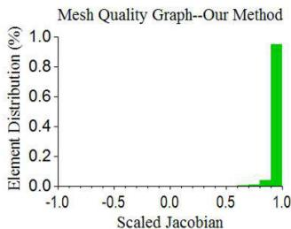

图表描述:
【图像类型】
实验结果图（网格质量分布直方图）

【详细描述】
该图展示了一张标题为 "Mesh Quality Graph--Our Method" 的统计图表，用于评估网格生成的质量。
- **横轴 (X-axis)**：标记为 "Scaled Jacobian"（缩放雅可比行列式），刻度范围从 -1.0 到 1.0。在计算几何和有限元分析中，该指标通常用于衡量单元的形状质量，1.0 代表理想状态（如正方形或立方体），负值代表单元翻转。
- **纵轴 (Y-axis)**：标记为 "Element Distribution (%)"（单元分布百分比），刻度范围从 0.0 到 1.0。
- **数据分布**：图中可见一个显著的绿色垂直柱状条，位于横轴的最右端，紧邻 1.0 的位置。该柱子的高度几乎达到了 1.0（即 100%）。
- **结论**：这一分布表明，使用该方法生成的网格具有极高的质量，几乎所有的单元（或极高比例的单元）都具有接近 1.0 的缩放雅可比值。这意味着网格中没有出现劣质的、扭曲的或翻转的单元，网格质量非常均匀且优异。

【可用于检索的关键词】
Mesh Quality, Scaled Jacobian, Element Distribution, Our Method, Jacobian Histogram, Mesh Generation, Finite Element Mesh, Grid Quality, Numerical Stability, Positive Jacobian, Mesh Validation, Computational Geometry, Algorithm Evaluation, Uniform Distribution, Optimal Jacobian
【图表信息补充结束】

  
(b)   
Fig. 11. Mesh quality histogram: (a)mesh quality histogram for Fig. 10(b); (b)mesh quality histogram for Fig. 10(d)

An example is shown in Fig. 9(a) where the vertex $E$ is classified as REVERSAL. However, the sum of vertex types is equal to 2, which fails to satisfy the submapping constraint. Our corner assignment optimization method can adjust the vertex type at $E$ from REVERSAL to SIDE and resulting structured quadrilateral mesh is shown in Fig. 9(b).

# 4. Boundary discretization and interior nodes’ interpolation

Since surface vertices have already been correctly classified at this point, the edge parameterization, edge discretization [13,14] and interior node’s placement can be done as the References[3,4]. Note that generally, interior nodes are embedded in 3D space based on the transfinite interpolation and 3D positions of boundary nodes. For the curved surfaces, the interpolated nodes may not be located on surfaces. Hence, extra geometric processing is needed by projecting the interpolated interior nodes onto surfaces based on the closest points/distances.

# 5. Examples

In order to assess the mesh quality of structured quadrilateral meshes by submapping with an improved corner assignment algorithm, several examples are provided. Users specify the mesh element size and the algorithm will classify vertices automatically. If there is a multi-connected geometry, it should be virtually decomposed[4] or a path connecting the outmost boundary and interior boundaries should be computed so that the consistent edge parameterization between the outmost boundary and internal holes can be generated. Here, we will skip the details for geometry decomposition in this paper(see reference [4] for details). Note that all the bounding surfaces in all the examples shown below are meshed with structured quadrilateral meshes by submapping.

The first example in Fig. 10 shows a surface with a three-quarters round feature, which makes it difficult to generate a valid corner assignment for submapping. Cubit 13.2 assigns corners for surface vertices as Fig. 10(a) and the resulting structured quadrilateral mesh is shown in Fig. 10(b). From Fig. 10(b) and Fig. 11(a), poor mesh quality is produced by submapping due to the lack of an optimal corner assignment. By applying templates described in this

【图表信息补充开始】
图表ID: figure_40
原图路径: E:\python\research-copilot-main\storage\parsed\Optimizing\images\6f11598b4ddea76b863d8274b980f999e7f5c55874f62d7240106a3f9f4d1fa7.jpg
相对路径: images/6f11598b4ddea76b863d8274b980f999e7f5c55874f62d7240106a3f9f4d1fa7.jpg
原始引用: 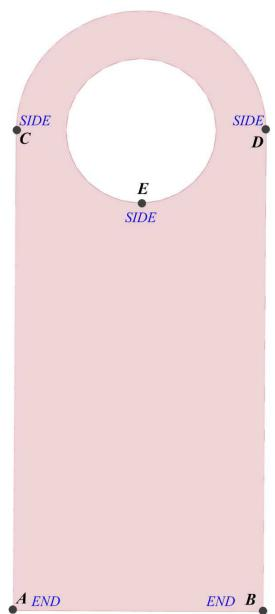

图表描述:
【图像类型】
几何模型示意图 / CAD边界定义图

【详细描述】
这是一张二维几何模型的示意图，展示了一个带有中心圆孔的板状结构。该结构整体填充为淡粉色，背景为白色。其外轮廓由底部的水平直线段和顶部的半圆弧平滑连接而成，两侧为垂直线段。几何体内部包含一个居中的圆形空洞（circular hole）。

图中用黑色实心点标记了五个关键位置，并配有蓝色的文字标签，用于指示特定的边界或区域：
1.  底部左端点标记为 "A END"。
2.  底部右端点标记为 "END B"。
3.  左侧垂直边缘的中上部标记为 "SIDE C"。
4.  右侧垂直边缘的中上部标记为 "SIDE D"。
5.  内部圆孔的最底端（最低点）标记为 "SIDE E"。

这些标签（"END" 和 "SIDE"）强烈暗示该图用于定义数值模拟（如有限元分析 FEA 或计算流体力学 CFD）中的边界条件（Boundary Conditions），其中 "END" 可能指代固定端或加载端，"SIDE" 可能指代侧面或对称面。

【可用于检索的关键词】
perforated plate, circular hole, boundary condition, geometric model, finite element analysis, point A, point B, point C, point D, point E, END, SIDE, semi-circular top, rectangular base, domain definition
【图表信息补充结束】

【图表信息补充开始】
图表ID: figure_68
原图路径: E:\python\research-copilot-main\storage\parsed\Optimizing\images\c3cfe5e1666d502c8c3f142422c36fcf155c91a0c83043bb260667d1cd041f35.jpg
相对路径: images/c3cfe5e1666d502c8c3f142422c36fcf155c91a0c83043bb260667d1cd041f35.jpg
原始引用: 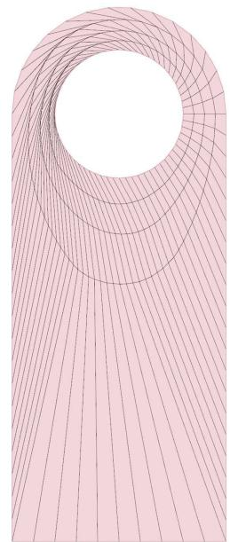

图表描述:
【图像类型】
计算几何与网格生成示意图（Mesh Generation Plot）

【详细描述】
该图展示了一个带有大型中心圆孔的二维几何区域的网格划分（meshing）结果。背景呈现淡粉色，网格由黑色细线构成，具有明显的结构化特征。
1. **几何形状**：主体为一个带有顶部大圆孔的板状结构（perforated plate），圆孔位于上方中央，下方延伸出矩形区域。
2. **孔周网格拓扑**：围绕圆孔的区域展示了复杂的网格拓扑结构。可以看到多层同心圆弧线（concentric rings）紧密环绕孔洞，同时有径向线（radial lines）从孔壁向外发散。这种结构通常用于处理孔洞周围的几何奇点或进行高精度的局部加密（local refinement）。
3. **主体网格分布**：在圆孔下方的主体区域，网格线逐渐过渡为平行的直线，且间距较为均匀。这表明网格可能通过某种参数化映射（parameterization-based mapping）或拉伸技术生成，实现了从孔周复杂网格到远处规则网格的平滑过渡（smooth transition）。
4. **边界贴合**：网格线严格贴合几何边界（boundary-conforming），特别是在圆孔边缘，网格节点分布密集以准确描述曲线边界。

【可用于检索的关键词】
circular hole, perforated plate, structured mesh, boundary-conforming mesh, O-grid topology, radial grid lines, concentric rings, mesh generation, parameterization, mapped mesh, quadrilateral elements, geometric modeling, finite element mesh, smooth transition, local refinement
【图表信息补充结束】

  
(b)

【图表信息补充开始】
图表ID: figure_52
原图路径: E:\python\research-copilot-main\storage\parsed\Optimizing\images\9d3dcb287382d9c90e06f22ad5a125d0662e6d63cfe33bf5718eaa19ce411e63.jpg
相对路径: images/9d3dcb287382d9c90e06f22ad5a125d0662e6d63cfe33bf5718eaa19ce411e63.jpg
原始引用: 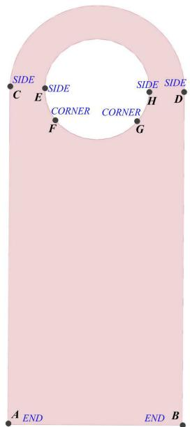

图表描述:
【图像类型】
几何建模与拓扑关系示意图（CAD 边界点分类图）

【详细描述】
图片展示了一个粉红色的二维几何实体，形状类似于一个带有大圆孔的拱形板或钥匙孔形状。该实体由底部的矩形区域和顶部的半圆环区域组成，中间有一个大的圆形通孔（白色区域）。图中用黑色实心圆点标记了边界上的关键特征点，并用蓝色文字标注了其拓扑属性（END, SIDE, CORNER），用于说明几何建模中的边界表示（B-rep）或特征点分类。

具体标注如下：
1.  **端点（END）：** 位于实体底部矩形区域的左下角点 `A` 和右下角点 `B`，标记为 `END`，代表边界线段的起止点。
2.  **边点（SIDE）：** 在中间的圆形孔洞边界上，点 `C`（左侧）、`E`（左上）、`H`（右上）和 `D`（右侧）均位于平滑的圆弧段上，被标记为 `SIDE`，表示它们是边上的普通点，几何曲率连续。
3.  **角点（CORNER）：** 点 `F`（左下）和点 `G`（右下）位于孔洞圆弧与两侧垂直直边的连接处（即切点或几何拐点），被标记为 `CORNER`。这表明在这些位置，几何形状发生了从直线到圆弧（或反之）的过渡，属于曲率不连续的特征角点。孔洞内部上方也标注了两个 `CORNER` 字样，进一步强调 F 和 G 处的拓扑特征。

【可用于检索的关键词】
geometric modeling, boundary representation, B-rep, topology classification, corner point detection, edge point, end point, circular hole, tangent connection, feature points, smooth curve, sharp corner, CAD geometry, mesh generation, parameterization
【图表信息补充结束】

【图表信息补充开始】
图表ID: figure_7
原图路径: E:\python\research-copilot-main\storage\parsed\Optimizing\images\0a42f4a28c938602f421ba8994b669193f9959f152ff79ca4a1b244c6c72ce28.jpg
相对路径: images/0a42f4a28c938602f421ba8994b669193f9959f152ff79ca4a1b244c6c72ce28.jpg
原始引用: 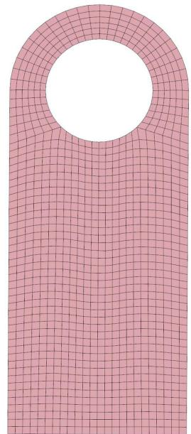

图表描述:
【图像类型】
计算几何与网格划分示意图，展示了一个带圆孔的二维几何域的网格化结果。

【详细描述】
图片展示了一个垂直放置的、顶部为半圆形的长条形几何域（类似带圆头的矩形条或钥匙形状）。该几何域的中心偏上位置包含一个大的圆形空洞（circular hole）。整个实体区域被划分为细密的网格，主要呈现为四边形网格（quad mesh）。
在圆孔周围，网格表现出明显的拓扑结构调整，形成了围绕圆孔的环形结构（O-grid topology），网格线从圆孔边缘向外辐射并逐渐平滑过渡，这是一种典型的边界贴合网格（boundary-conforming mesh）处理方式，旨在提高孔附近的网格质量。
远离圆孔的区域（如下方长条部分及两侧），网格趋于规则的正交排列，显示出结构化网格（structured mesh）的特征。整体背景为淡粉色，网格线为深色，清晰地展示了从复杂几何特征（圆孔）到简单几何特征的网格过渡。

【可用于检索的关键词】
perforated plate, circular hole, quad mesh, structured quadrilateral mesh, O-grid topology, boundary-conforming mesh, mapped meshing, rounded top geometry, geometric discretization, mesh generation, grid lines, structural grid pattern, smooth transition
【图表信息补充结束】

【图表信息补充开始】
图表ID: figure_44
原图路径: E:\python\research-copilot-main\storage\parsed\Optimizing\images\7808bb3abef15e91a7d538ab39869f603d8da924b927558f3f2a41bc6468c513.jpg
相对路径: images/7808bb3abef15e91a7d538ab39869f603d8da924b927558f3f2a41bc6468c513.jpg
原始引用: 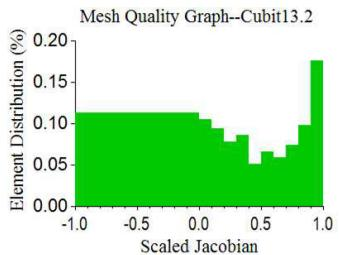

图表描述:
【图像类型】
实验结果统计图（网格质量分布直方图）

【详细描述】
该图是一张展示网格质量分布的直方图，标题为 "Mesh Quality Graph--Cubit13.2"。
横轴表示 "Scaled Jacobian"（缩放雅可比行列式），数值范围从 -1.0 到 1.0，用于衡量网格单元的质量，通常越接近 1 质量越好。
纵轴表示 "Element Distribution (%)"（单元分布百分比），数值范围从 0.00 到 0.20。
图中绿色填充区域展示了单元质量的分布特征：
1. 在 Scaled Jacobian 为 -1.0 到 0.0 的区间内，分布呈现为一个相对平坦的平台，高度约为 0.11%，表明有一定比例的单元质量较低或存在翻转（负值）。
2. 在 0.0 到 0.5 的区间内，分布呈阶梯状逐渐下降。
3. 在 Scaled Jacobian 接近 1.0 的右侧区域，分布曲线急剧上升并达到峰值，最高值超过 0.17%，表明网格中存在大量高质量单元。

【可用于检索的关键词】
Mesh Quality Graph, Scaled Jacobian, Element Distribution, Cubit 13.2, Mesh Quality Analysis, Negative Jacobian, High Quality Mesh, Grid Discretization, Finite Element Mesh, Mesh Refinement, Jacobian Determinant, Computational Geometry, Mesh Generation Software, Histogram Analysis, Tetrahedral/Hexahedral Elements
【图表信息补充结束】

  
Fig. 12. Structured grid generation of a surface with a half concentric ring and a half circle feature by submapping through templates: (a)corner assignment by Cubit 13.2; (b)structured grid for (a); (c)corner assignment based on templates in this paper; (d)structured grid for (c)

【图表信息补充开始】
图表ID: figure_85
原图路径: E:\python\research-copilot-main\storage\parsed\Optimizing\images\f28eca4f0da05bdd90f5086e68b6ea488f467ada4c19fd16ec15c5cd8a8b5671.jpg
相对路径: images/f28eca4f0da05bdd90f5086e68b6ea488f467ada4c19fd16ec15c5cd8a8b5671.jpg
原始引用: 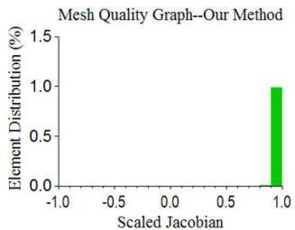

图表描述:
【图像类型】
实验结果统计图（网格质量分布直方图）

【详细描述】
这是一张名为“Mesh Quality Graph--Our Method”（网格质量图——我们的方法）的二维柱状图。
- **横轴（X轴）**：标记为“Scaled Jacobian”（缩放雅可比行列式），刻度范围从 -1.0 到 1.0。在网格划分领域，该指标用于衡量单元的质量，1.0 通常代表理想的单元形状（如完美的正方形或立方体）。
- **纵轴（Y轴）**：标记为“Element Distribution (%)”（单元分布百分比），刻度范围从 0.0 到 1.5。
- **数据表现**：图中仅显示了一个显著的绿色垂直条形。该条形位于横轴的最右端，即 Scaled Jacobian = 1.0 的位置。其高度对应纵轴的 1.0（即 100%）。
- **结论**：该图表明，使用本文提出的方法生成的网格中，几乎所有单元（约100%）的缩放雅可比值都达到了理论最大值 1.0，说明生成的网格具有极高的质量，没有劣质或退化的单元。

【可用于检索的关键词】
Mesh Quality Graph, Scaled Jacobian, Element Distribution, Grid Quality Analysis, Jacobian Determinant, Perfect Mesh, High-quality Meshing, Finite Element Mesh, Mesh Validation, Unit Jacobian, Green Bar Chart, Numerical Simulation, Computational Geometry, Mesh Generation Algorithm, Ideal Element Shape
【图表信息补充结束】

  
  
Fig. 13. Mesh quality histogram: (a)mesh quality histogram for Fig. 12(b); (b)mesh quality histogram for Fig. 12(d)

paper, two new vertices are virtually inserted and surface vertices are classified as Fig. 10(c). The corresponding structured quadrilateral mesh is shown in Fig. 10(d) with good mesh quality, which is illustrated in Fig. 11(b).

Figure 12 shows a surface with an half concentric ring feature and an half round feature, which is challenging for current existing automatic submappers. What is more, it is a multiply-connected surface and it is difficult to generate consistent edge parameterization for the outmost and interior boundaries. The most intuitive way to generate a valid corner assignment is to convert the vertex A and $B$ from END in Fig. 12(a) to SIDE where the resulting structured quadrilateral mesh is shown in 12(b) by Cubit 13.2 with the mesh quality histogram plotted in Fig. 13(a). Our method can classify surface vertex types as Fig. 12(c). The corresponding structured quadrilateral mesh is shown in Fig. 12(d) with better mesh quality (Fig. 13(b)) compared to the one in Fig. 12(b). There are two reasons why Cubit 13.2 fails to generate structured meshes by Submapping with good mesh quality: (a) the geometry is a multiply-connected surface and there is no good method for matching boundary nodes between the outmost boundary and interior boundary; (b) poor corner assignment results in poor structured mesh quality.

The third example in Fig. 14(a) shows a surface with a combination of chamfer, fillet and round features, which present difficulties for current existing submapping methods. By applying templates described in this paper, the corner assignment can be generated as Fig. 14(b) with virtually inserted vertices. The resulting structured quadrilateral mesh

【图表信息补充开始】
图表ID: figure_64
原图路径: E:\python\research-copilot-main\storage\parsed\Optimizing\images\c01f04d2d487eb0d200f446b76047260f47100f1baabe2aac4337080d4d84765.jpg
相对路径: images/c01f04d2d487eb0d200f446b76047260f47100f1baabe2aac4337080d4d84765.jpg
原始引用: 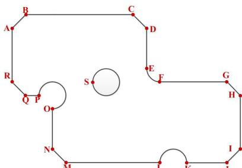

图表描述:
【图像类型】
二维几何轮廓图（2D Profile / CAD Boundary Representation）

【详细描述】
这是一张展示复杂二维平面几何轮廓的示意图，通常用于计算机辅助设计（CAD）或计算几何中的网格生成预处理阶段。图中主要包含以下要素：

1.  **顶点与标记**：图中使用红色实心圆点标记了关键的几何顶点（Vertices），并使用大写英文字母（A, B, C, D, E, F, G, H, I, K, M, N, O, P, Q, R, S）对关键位置进行了索引标注。
2.  **外部边界拓扑**：
    *   **上部与右侧**：边界由一系列直线段连接而成，路径大致为 A → B → C → D → E → F → G → H → I。其中 A-B 为垂直线段，B-C 为水平线段，C-D 和 D-E 构成倒角或斜坡结构，F-G 为水平线段。
    *   **左侧特征**：左侧边界包含一个明显的半圆形凹陷（semi-circular notch/cutout）。该特征位于点 N 和点 R 之间，由点 O、P、Q 定义其圆弧形态。
    *   **底部特征**：底部边界（M 到 I 之间）包含一个半圆形的凸起（semi-circular arch/protrusion）。点 K 标记在该凸起右侧的直线段上。
    *   **左侧边缘**：点 R 与点 A 通过垂直线段连接，封闭了左侧边缘。
3.  **内部特征**：
    *   图形中央独立存在一个圆形孔洞（circular hole）。
    *   点 S 位于该圆孔的几何中心。
4.  **视觉表现**：几何边界由黑色细实线绘制，顶点以醒目的红色圆点突出显示，便于识别拓扑连接关系。

【可用于检索的关键词】
2D profile, polygonal boundary, circular hole, semi-circular notch, semi-circular arch, vertex labeling, CAD geometry, B-rep topology, internal hole, geometric constraints, mesh generation input, planar geometry, labeled vertices, topological structure
【图表信息补充结束】

【图表信息补充开始】
图表ID: figure_4
原图路径: E:\python\research-copilot-main\storage\parsed\Optimizing\images\065201b78266ce105095e19331a3d6553ef2eb6843f7dda340d18dcc6dd485f4.jpg
相对路径: images/065201b78266ce105095e19331a3d6553ef2eb6843f7dda340d18dcc6dd485f4.jpg
原始引用: 

图表描述:
【图像类型】
CAD几何拓扑结构与网格生成示意图

【详细描述】
该图片展示了一个复杂的二维几何域的边界定义，主要用于说明计算机辅助设计（CAD）中的边界表示（B-rep）或计算流体力学/有限元分析中的网格生成预处理。

1.  **外部边界**：
    *   图像的主体是一个非凸的多边形区域，由一系列直线段和圆弧连接而成。
    *   顶点使用红色大写字母进行标记，从左至右、从上到下依次为：A, B, C, D, F, G, H, I, J, K, L, M, N 等。
    *   左上角展示了直角转折（A-B-C），右上角展示了斜角转折（C-D-E）。
    *   右下角展示了较长的边界序列（G-H-I-J-K-L-M-N），其中 J-K-L 段呈现为圆弧过渡（rounded boundary）。

2.  **内部特征（孔洞/障碍物）**：
    *   **左侧圆环（Annulus）**：位于图像中部偏左，由内外两个同心圆（或近似同心圆）组成。
        *   外圆上标记有蓝色字母 C, E 和红色顶点。
        *   内圆上标记有红色顶点 P, Q, O。
        *   该结构暗示了环形区域的几何定义，常用于 O-grid 拓扑的网格划分。
    *   **右侧圆形（Circular Hole）**：位于图像中部偏右，是一个独立的圆形特征。
        *   圆周上标记有蓝色字母 C。
        *   圆心或内部标记有红色字母 S。

3.  **标注信息**：
    *   图中混合使用了红色和蓝色的字母。红色字母（A-S）主要作为几何顶点（Vertices）的标识符。
    *   蓝色字母（C, E, S）重复出现在几何元素旁，可能代表几何元素的类型属性（如 Curve 曲线, Edge 边, Surface 面）或特定的拓扑连接点。例如，E 常出现在直线段附近，C 常出现在圆弧或角点附近。

4.  **拓扑连接**：
    *   点 N 通过直线连接到圆环的内侧（点 O 附近）。
    *   点 M 连接到点 N。
    *   整体结构展示了一个包含内部孔洞的复杂平面域，适合进行结构化网格（Structured Mesh）的参数化映射。

【可用于检索的关键词】
CAD geometry modeling, B-rep topology, vertex labeling, annular region, circular hole, structured meshing, O-grid topology, geometric boundary, rounded corner, perforated domain, curve segmentation, topological connectivity, parameterization-based meshing, quad mesh generation
【图表信息补充结束】

  
(b)

【图表信息补充开始】
图表ID: figure_47
原图路径: E:\python\research-copilot-main\storage\parsed\Optimizing\images\82ca8dc7d2a66be2e258900c14880f4f0abfda57ddf5ff87fa5b8a6bd9685c33.jpg
相对路径: images/82ca8dc7d2a66be2e258900c14880f4f0abfda57ddf5ff87fa5b8a6bd9685c33.jpg
原始引用: 

图表描述:
【图像类型】
二维几何区域的四边形网格划分示意图（Quad Mesh Generation）。

【详细描述】
该图片展示了一个具有复杂边界的二维几何区域的网格划分结果。
1.  **几何特征**：主体为一个不规则的板状区域。其边界包含多种几何特征：
    *   中心位置有一个完整的圆形孔洞（circular hole）。
    *   左侧边缘有两个半圆形的切口（semi-circular notches）。
    *   右下角边缘有一个半圆形的切口。
    *   左上角和右上角为斜切角（chamfered corners）。
2.  **网格结构**：
    *   **网格类型**：整个区域被划分为四边形网格（quad mesh / quadrilateral mesh）。
    *   **拓扑分布**：网格表现出明显的边界贴合特性（boundary-conforming）。
        *   在直线边界处，网格线大致平行于边界延伸。
        *   在中心圆孔周围，网格呈现出辐射状或环状的拓扑结构，类似于O型网格（O-grid topology）或极坐标映射，单元尺寸在靠近孔壁处较小，向外逐渐变大。
        *   在半圆形切口处，网格同样进行了局部加密和适应性调整以贴合圆弧边界。
    *   **视觉表现**：区域内部填充为淡粉色，网格线为深红褐色，线条清晰，展示了从几何域到计算域的离散化过程。

【可用于检索的关键词】
quad mesh, quadrilateral mesh, circular hole, semi-circular notch, chamfered corner, boundary-conforming mesh, O-grid topology, structured mesh, mesh generation, geometric domain, parameterization, finite element mesh, irregular geometry, grid refinement
【图表信息补充结束】

【图表信息补充开始】
图表ID: figure_29
原图路径: E:\python\research-copilot-main\storage\parsed\Optimizing\images\4ff32fb0f8da6f4364a1b1833d5582caaad0e34b8b523aa53e1e6eafbd4c8e27.jpg
相对路径: images/4ff32fb0f8da6f4364a1b1833d5582caaad0e34b8b523aa53e1e6eafbd4c8e27.jpg
原始引用: 

图表描述:
【图像类型】
CAD/B-rep 几何模型图

【详细描述】
图中展示了一个绿色的三维实体CAD模型，呈现为一个机械连接件或连杆机构组件。该模型具有明显的特征建模痕迹：
1. 左侧为一个较大的块状基座，顶部有两个圆孔（可能是安装孔），边缘带有倒角（chamfer）。
2. 主体从左侧向右下方延伸，形成一个弯曲的悬臂结构，底部呈弧形过渡。
3. 右侧连接着一个垂直的平板结构，板上同样有一个圆孔。
4. 在悬臂结构的上方，放置或穿插着一个圆柱形的销轴（cylindrical pin）或滚子，该销轴似乎与右侧的垂直板存在位置关联，可能构成铰接或滑动配合。
5. 整个模型表面光滑，展示了典型的边界表示（B-rep）实体特征，包括面、边和顶点的清晰定义，无网格线显示。

【可用于检索的关键词】
green CAD model, mechanical linkage, cylindrical pin, mounting holes, chamfered edges, filleted corners, B-rep solid, parametric design, hinge mechanism, structural component, 3D rendering, assembly visualization, offset surface, boundary representation, bent arm, vertical plate
【图表信息补充结束】

  
Fig. 14. Structured grid generation of a surface with fillets, rounds and chamfers by submapping using optimization and templates: (a)geometry model; (b)corner assignment; (b)structured quadrilateral meshes   
（a）

【图表信息补充开始】
图表ID: figure_27
原图路径: E:\python\research-copilot-main\storage\parsed\Optimizing\images\4b7ab888eef83a5b3f7631d346f018bcdff330545a7b1bf73c3864cb48631d19.jpg
相对路径: images/4b7ab888eef83a5b3f7631d346f018bcdff330545a7b1bf73c3864cb48631d19.jpg
原始引用: 

图表描述:
【图像类型】
CAD模型表面网格化示意图（Surface Mesh / Finite Element Mesh）。

【详细描述】
图片展示了一个复杂机械零件的三维表面网格模型，主要用于展示几何离散化效果。
1.  **几何结构**：该零件具有典型的自由曲面特征。左侧为一个带有大圆角的块状基座；中间部分通过一个弯曲的悬臂梁结构连接，梁上方有一个圆柱形的凸台（cylindrical boss）或轴；右侧延伸出一个矩形平板区域，板上分布有两个圆形的安装孔（mounting holes）。
2.  **网格特征**：整个几何表面被高密度地离散化为四边形网格（quad mesh）。网格线呈现出较强的规律性和正交性，特别是在平坦区域和圆柱面上，这表明该网格很可能是通过参数化方法生成的结构化网格（structured mesh）或映射网格（mapped mesh）。
3.  **细节观察**：在曲率变化剧烈的区域（如圆角过渡处），网格依然保持了较好的贴合度（boundary-conforming），没有明显的扭曲或畸变，显示了高质量的网格划分算法。

【可用于检索的关键词】
quad mesh, structured mesh, surface discretization, CAD model, finite element mesh, curved geometry, cylindrical feature, mounting holes, mesh generation, geometric modeling, boundary-conforming, dense mesh, topological structure, B-rep visualization
【图表信息补充结束】

  
（b）  
Fig. 15. Structured all-quad mesh of a mechanical part generated by submapping: (a)geometry Model; (b)all-quad mesh for all the surfaces on a mechanical part generated by submapping

is shown in Fig. 14(c). Cubit 13.2 fails to generate structured quadrilateral mesh for this case due to incapabilities of producing interval matching, which is indirectly caused by invalid corner assignment, namely, meshability caused by bad corner assignment.

The remaining three examples are real-application examples from industry. Figure 15 shows a mechanical part whose bounding surfaces are to be meshed by submapping. The geometry contains several chamfer, fillet, round and concentric ring features, which results in an invalid corner assignment by current existing submapping methods. By applying templates described in this paper and vertex type adjustment based on optimization, an optimal corner assignment can be generated and resulting structured quadrilateral mesh is shown in Fig. 15(b). The fifth example in Fig. 16 shows a mechanical gear with a bond structure. The gear contains several concentric ring features. By applying templates described in Fig. 7, an optimal corner assignment can be generated by our method and subsequent structured quadrilateral mesh is shown in Fig. 16(b). Figure 17 shows another mechanical part with several round and concentric ring features. Our method can generate a valid vertex classification for surface vertices and structured quadrilateral mesh for all the bounding surfaces as Fig. 17(b). The last example in Fig. 18 is a blade-like structure and the resulting structured quadrilateral mesh is shown in Fig. 18(b).

# 6. Discussion, Conclusions, and Future Work

In this paper, a method for corner assignment during the submapping process is described, which uses optimization and a carefully-chosen set of constraints to arrive at an acceptable submap solution. Our method uses a templatebased approach to recognize features like rounds, fillets, chamfers and concentric rings commonly found on realworld models (and on which current angle-based corner assignment tends to fail). Corner assignment based on a combination of angles and templates tends to do better than that based on the angle alone, as showed by a set of realworld example models. For those problems where the template plus angle-based corner assignment does not result in

【图表信息补充开始】
图表ID: figure_13
原图路径: E:\python\research-copilot-main\storage\parsed\Optimizing\images\1b1d9f9fdb9f7ddd38fccea7d1f0f1f5126d639b0395126fbc04dc30eb7887cb.jpg
相对路径: images/1b1d9f9fdb9f7ddd38fccea7d1f0f1f5126d639b0395126fbc04dc30eb7887cb.jpg
原始引用: 

图表描述:
【图像类型】
CAD/B-rep 几何模型图（直齿圆柱齿轮）

【详细描述】
图中展示了一个绿色的直齿圆柱齿轮（spur gear）的三维实体模型。该几何体具有明显的旋转对称特征，主要包含以下结构：
1.  **外缘齿部**：齿轮外周均匀分布着矩形截面的轮齿（teeth），呈现出典型的直齿圆柱齿轮拓扑结构。
2.  **轮毂/盘体**：齿部内侧连接着一个较大的圆盘状结构，构成了齿轮的主体部分。
3.  **中心轴孔与键槽**：在几何体正中心有一个垂直的通孔（central through-hole），孔壁上可见一个矩形的凹槽，即键槽（keyway），这是用于传递扭矩的标准机械结构特征。
4.  **渲染风格**：模型采用纯绿色实体渲染，通过明暗光影表现了物体的立体感和边缘轮廓，属于典型的计算机辅助设计（CAD）或边界表示（B-rep）模型可视化结果。

【可用于检索的关键词】
spur gear, cylindrical gear, central hole, keyway, gear teeth, mechanical part, CAD model, solid geometry, rotational symmetry, shaft connection, parametric design, boundary representation, green rendering, isometric view
【图表信息补充结束】

  
（a)

【图表信息补充开始】
图表ID: figure_21
原图路径: E:\python\research-copilot-main\storage\parsed\Optimizing\images\3e2ef207798fdc61671bfade727fd34e96fb3596201813f2b62effa7fb704c58.jpg
相对路径: images/3e2ef207798fdc61671bfade727fd34e96fb3596201813f2b62effa7fb704c58.jpg
原始引用: 

图表描述:
【图像类型】
CAD几何模型及其结构化网格划分示意图。

【详细描述】
该图片展示了一个直齿圆柱齿轮（cylindrical gear）的三维几何模型及其表面网格划分结果。
1.  **几何特征**：模型主体为一个标准的齿轮，具有均匀分布的外齿（teeth）。中心位置有一个圆形的轴孔（central bore），轴孔内部可见一个纵向的矩形凹槽，即键槽（keyway），这是典型的机械传动件特征。
2.  **网格结构**：模型表面被密集的网格完全覆盖。网格呈现出显著的结构化（structured）特征，网格线在大部分区域（如轮毂、齿顶、齿侧）保持平行和正交关系。
3.  **拓扑与边界**：网格表现出良好的边界贴合性（boundary-conforming），网格节点紧密分布在齿轮的轮廓线上，包括齿根圆角（fillet）和轴孔边缘。这种网格布局通常暗示使用了基于参数化（parameterization-based）或映射（mapped）的网格生成算法，能够在保持网格质量的同时适应复杂的几何边界。

【可用于检索的关键词】
gear mesh, structured mesh, boundary-conforming mesh, cylindrical gear, keyway, central bore, quadrilateral mesh, mapped meshing, mesh generation, CAD geometry, tooth profile, fillet region, hexahedral mesh, geometric modeling
【图表信息补充结束】

  
(b）

【图表信息补充开始】
图表ID: figure_12
原图路径: E:\python\research-copilot-main\storage\parsed\Optimizing\images\179d56f45726da1547a792aff313a88719fc23f92eda6c8c8e11d19f35015018.jpg
相对路径: images/179d56f45726da1547a792aff313a88719fc23f92eda6c8c8e11d19f35015018.jpg
原始引用: 

图表描述:
【图像类型】
CAD/B-rep 几何实体模型图

【详细描述】
图中展示了一个绿色的三维机械零件模型，采用典型的CAD软件渲染风格，表现为线框与实体着色结合的效果。该模型是一个长条形的支架或连接件，具有明显的工业零件特征。
从左至右观察其几何结构：
1.  **左侧部分**：是一个垂直的块状结构，具有复杂的轮廓，包含垂直的壁面和水平连接部，顶部有一个小型的圆柱形特征（可能是销孔或定位柱）。
2.  **中部部分**：是一个长条形的基座，基座上方有阶梯状的凸起结构，形成了不同高度的平面层级，显示出明显的边界和边缘线。
3.  **右侧部分**：是一个显著的环形结构（类似法兰盘或轴承座），中心有一个垂直的圆柱体突起，外围环绕着圆环形的凹槽或凸缘。
整体来看，该模型由多个平面（Planar faces）、圆柱面（Cylindrical surfaces）和倒角面组成，展示了完整的边界表示（B-rep）拓扑信息，包括顶点、边和面的连接关系。

【可用于检索的关键词】
CAD model, B-rep representation, mechanical bracket, cylindrical feature, flange structure, step geometry, solid modeling, green shading, wireframe overlay, topological edges, planar faces, filleted edges, assembly component, isometric view
【图表信息补充结束】

  
Fig. 16. Structured quadrilateral meshes of a gear generated by submapping: (a)geometry Model; (b) all-quad mesh for gears   
(a)

【图表信息补充开始】
图表ID: figure_2
原图路径: E:\python\research-copilot-main\storage\parsed\Optimizing\images\05c7b1b4102b9a484672761c34d165990ee5a267fd2dfa74cbe6f9d1342c115d.jpg
相对路径: images/05c7b1b4102b9a484672761c34d165990ee5a267fd2dfa74cbe6f9d1342c115d.jpg
原始引用: 

图表描述:
【图像类型】
CAD模型的结构化四边形网格（Structured Quad Mesh）可视化图。

【详细描述】
该图片展示了一个具有复杂几何特征的三维机械零件及其表面的离散化网格。
1.  **几何结构**：模型主体呈长条状，左侧包含两个高低错落的阶梯状凸台（stepped blocks）；中间位置有一个显著的圆柱形结构（cylindrical feature），其内部似乎也是空心的或具有厚度；右侧连接着一个较窄的矩形块以及一个末端为圆弧形的弯曲延伸臂（curved extension）。
2.  **网格特征**：整个几何表面被密集且规则的四边形网格（quad mesh）完全覆盖。网格呈现出明显的结构化特征（structured grid），网格线紧密贴合几何边界（boundary-conforming），表明这是一个高质量的贴体网格。
3.  **局部细节**：在圆柱体周围，网格呈现出环状分布，暗示了可能采用了O-grid拓扑结构以更好地处理曲面曲率变化。整体网格密度较高，单元尺寸相对均匀，未见明显的局部加密（local refinement）区域。

【可用于检索的关键词】
structured quadrilateral mesh, quad mesh, boundary-conforming mesh, cylindrical protrusion, stepped geometry, surface discretization, O-grid topology, CAD model, finite element mesh, geometric modeling, parametric meshing, isometric view, complex mechanical part, mesh quality visualization
【图表信息补充结束】

  
(b)

【图表信息补充开始】
图表ID: figure_42
原图路径: E:\python\research-copilot-main\storage\parsed\Optimizing\images\738b986560bdc972bd1d212177eefaa47c6482747db76edfb8761d306e6717ce.jpg
相对路径: images/738b986560bdc972bd1d212177eefaa47c6482747db76edfb8761d306e6717ce.jpg
原始引用: 

图表描述:
【图像类型】
三维几何模型可视化图（CAD/B-rep或Mesh渲染）。

【详细描述】
该图片展示了一个绿色的三维几何结构，呈现出类似风车或螺旋桨的辐射状形态。
1.  **整体结构**：模型由多个细长的叶片状几何体组成，这些叶片围绕一个中心枢纽向外延伸。从视角来看，大约有四个主要的突出部分，它们以一定的角度交错排列。
2.  **几何特征**：每个叶片主要由平坦的多边形面（faces）构成，边缘清晰。中心区域是一个复杂的连接节点，多个叶片在此处交汇。
3.  **视觉表现**：图像使用了不同深浅的绿色进行着色。朝向观察者的外表面呈现较亮的绿色，而侧面或背光面呈现较深的墨绿色，这种明暗对比增强了立体感。
4.  **线条细节**：图中包含了明显的实线和虚线。实线勾勒出可见的外部轮廓和边缘；虚线则描绘了被遮挡的内部边缘或背面的几何结构，这表明该模型可能是一个半透明的壳体，或者旨在展示其完整的拓扑连接关系（包括隐藏线）。

【可用于检索的关键词】
green 3D geometry, radial structure, windmill shape, radiating blades, dashed edges, hidden lines, polygonal mesh, central hub, non-planar faces, geometric modeling, CAD visualization, surface reconstruction, boundary representation, multi-faceted structure
【图表信息补充结束】

  
Fig. 17. Structured all-quad mesh of a mechanical part generated by submapping: (a)geometry Model; (b) structured quadrilateral meshes for all the surfaces on a mechanical part by submapping

【图表信息补充开始】
图表ID: figure_6
原图路径: E:\python\research-copilot-main\storage\parsed\Optimizing\images\0a233caf9e27427ee4a014b78b68ac910b2d605f79e2184627940c43f929ae4d.jpg
相对路径: images/0a233caf9e27427ee4a014b78b68ac910b2d605f79e2184627940c43f929ae4d.jpg
原始引用: 

图表描述:
【图像类型】
这是一个三维螺旋桨叶片的表面计算网格（computational mesh）示意图。

【详细描述】
图片展示了一个具有四个叶片的螺旋桨（propeller）或类似旋转机械部件的三维表面网格模型。
1.  **几何结构**：该物体由中心的轮毂（hub）区域和四个向外延伸的叶片（blades）组成。叶片呈现出明显的空间扭曲（twisted）和弯曲形态，具有典型的空气动力学或水动力学外形特征。
2.  **网格特征**：
    *   整个表面被离散化为网格单元。
    *   观察网格单元的形状，主要由四边形（quadrilateral elements）构成，这表明这是一个四边形网格（quad mesh）。
    *   网格排列具有高度的规则性和方向性，显示出结构化网格（structured mesh）的特征，很可能采用了多块结构化网格划分技术（multi-block structured meshing）或基于参数化的映射网格技术（parameterization-based mapped meshing）。
    *   网格紧密贴合叶片的复杂曲面边界，表现出良好的边界贴合性（boundary conformity）。
3.  **视觉表现**：图像采用线框渲染（wireframe rendering），仅显示黑色的网格线，背景为白色，清晰地展示了网格在曲面上的分布情况。

【可用于检索的关键词】
propeller blade, quad mesh, structured mesh, surface mesh, twisted geometry, boundary-conforming mesh, multi-block meshing, computational mesh, mapped mesh, parametric surface, grid generation, finite element mesh, airfoil profile, hub region
【图表信息补充结束】

  
Fig. 18. Structured all-quad mesh of a mechanical part generated by submapping using optimization: blade part (a)geometry model; (b)structured quadrilateral meshes for curved surfaces

meeting the $s u m = 4 - 4 * g$ submapping constraint, optimization is used to adjust vertex classification to meet the constraint that also seeks to minimize the maximum change in any one vertex type. The examples described above show a variety of cases where current tools fail and our approach succeeds.

For current meshing problems, the approach described in this paper can improve both the time to mesh and the quality of the resulting mesh. However, this capability will be of increasing importance as more capable sweeping algorithms[5–8] become more widespread. In particular, the introduction of multiple source to multiple target sweeping (multisweeping) capability[7,8] can dramatically increase the need for better submapping corner assignment. To cite just three examples: previous work has been done to mesh pipe networks [15] and networks of blood vessels [16]; cylindrical through-holes are also quite commonly found in models that would otherwise be sweepable in a direction orthogonal to the through-hole. Automatic handling of the setup for submapping problems of this type, along with multisweeping, could drastically reduce user time required to mesh these models.

One part of this combination of submap setup and multi-sweeping that has not been addressed in the context of our work is automatic decomposition of connected surfaces after corner assignment. To illustrate this problem, consider the model shown in Figure 10, but swept into the third dimension perpendicular to the page (sweeping from the top to

the bottom). Template-based corner assignment results in vertices $G$ and $H$ shown in Figure 10(c). In order to sweep the 3D model, one would also have to decompose the surface adjacent to edge AHGF and perpendicular to the page, resulting in a new target surface (adjacent to $A H$ ), a new side or linking surface (adjacent to HG) and a new source surface (adjacent to $G F$ ). Given that one of those surfaces would need to be submappable for sweeping to be possible, it would likely not be difficult to compute the splitting lines and to perform that split following the corner detection.

Another extension of this work is to generate structured hexahedral meshes by submapping where all the bounding surfaces are meshed by structured quadrilateral meshes and every interior node is shared by exactly eight hexahedra. When meshing the bounding surfaces with structured quadrilateral meshes, our method described in this paper can be applied directly. For the volume submapper, one more thing to be resolved is to classify edges shared by two adjacent surfaces so that structured hexahedra can be embedded into the geometry. During this process, templates and corner assignment optimization method described in this paper should be able to be directly applied as well.

# Acknowledgement

This work was funded under the auspices of the Nuclear Energy Advanced Modeling and Simulation (NEAMS) program of the Office of Nuclear Energy, and the Scientific Discovery through Advanced Computing (SciDAC) program funded by the Office of Science, Advanced Scientific Computing Research, both for the U.S. Department of Energy, under Contract DE-AC02-06CH11357. We also thank all the Fathom members (from both Univ. of Wisconsin-Madison and Argonne National Lab) for their efforts on the CGM[17], MOAB[18], Lasso[19] and MeshKit[20] libraries, which were used heavily to support this work. Finally, I’d like to thank my current employer CD-adapco for supporting my attendance for 24th IMR.

# References

[1] White, David R., and Timothy J. Tautges. ”Automatic scheme selection for toolkit hex meshing.” International Journal for Numerical Methods in Engineering 49.1 (2000): 127-144.   
[2] Shepherd, Jason F., Mitchell, Scott A., Knupp, Patrick, White, David R. Methods for Multisweep Automation. Proceedings of the 9th International Meshing Roundtable, Sandia National Laboratories Report SAND2000-2207, September 2000.   
[3] Whiteley, M., White, D., Benzley, S., Blacker, T. Two and three-quarter dimensional meshing facilitators. Engineering with Computers, 1996(12):144-154.   
[4] Ruiz-Girones, E., Sarrate, J. Generation of structured meshes in multiply-connected surfaces using submapping. Advances in Engineering Software, 41.2(2010):379-387.   
[5] Cai, S. and Tautges T.J. Robust One-to-One Sweeping with Harmonic ST Mappings and Cages. Proceedings of the 22nd International Meshing Roundtable, Springer International Publishing, 2014: 1-19.   
[6] Cai, S. and Tautges T.J. One-to-one sweeping based on harmonic ST mappings of facet meshes and their cages. Engineering with Computers, 2014: 1-14.   
[7] Cai, S. and Tautges T.J. Surface Mesh Generation based on Imprinting of S-T Edge Patches. Procedia Engineering, 2014(82): 325-337.   
[8] Cai, S. Algorithmic Improvements to Sweeping and Multi-Sweeping Volume Mesh Generation. University of Wisconsin-Madison, PhD dissertation, 2015(4).   
[9] Eikland, K. lpsolve. http://sourceforge.net/projects/lpsolve, 2010   
[10] Eiselt, H., Sandblom, C. Linear Programming and its Applications. Springer Science & Business Media, 2007   
[11] Gass, S.I., Linear Programming: Methods and Applications. Courier Corporation, 2003   
[12] Nicholson, T.A.J. Optimization in Industry: Optimization Techniques. Transaction Publishers, 2007.   
[13] Mitchell, S.A. High Fidelity Interval Assignment. Proceedings of 6th International Meshing Roundtable, 1997(33):44.   
[14] Mitchell, S. A. Simple and fast interval assignment using nonlinear and piecewise linear objectives. In Proceedings of the 22nd International Meshing Roundtable, 2014: 203-221.   
[15] Miyoshi, K, and Blacker, T. Hexahedral Mesh Generation Using Multi-Axis Cooper Algorithm. Proceedings of the 9th International Meshing Roundtable, Sandia National Laboratories Report SAND2000-2207, September 2000.   
[16] Verma, Chaman Singh, Fischer, Paul F., Lee, SE, and Loth, F. An all-hex meshing strategy for bifurcation geometries in vascular flow simulation. Proceedings of the 14th international meshing roundtable. Springer Berlin Heidelberg, 2005.   
[17] T. J. Tautges: CGM: A geometry interface for mesh generation, analysis and other applications. Engineering with Computers, 17(3):299-314 (2001)   
[18] T. J. Tautges: MOAB: a mesh-oriented database. Sandia National Laboratories, (2004)   
[19] Lasso: https://trac.mcs.anl.gov/projects/ITAPS/wiki/Lasso   
[20] T. J. Tautges and R. Jain: Creating geometry and mesh models for nuclear reactor core geometries using a lattice hierarchy-based approach. Engineering with Computers, 28(4):319-329 (2012)